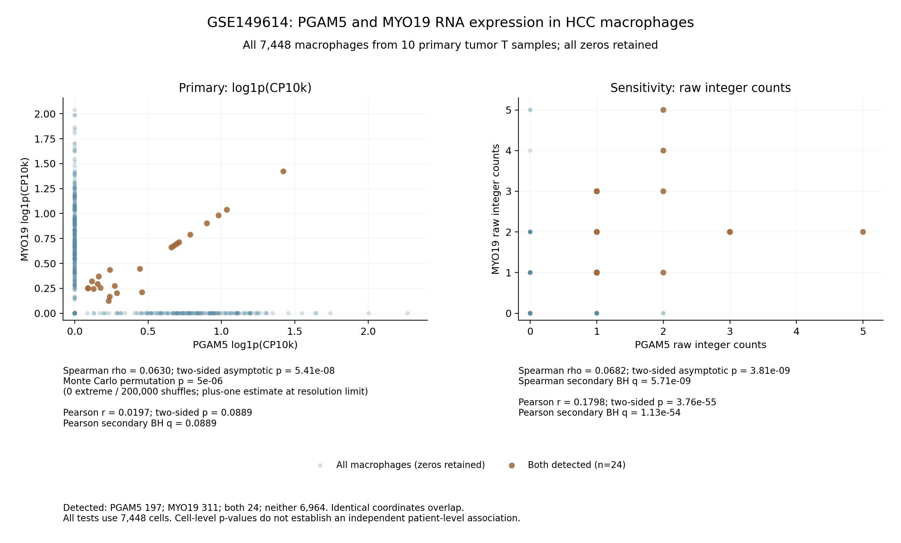

# GSE149614：保留全部零值的PGAM5–MYO19巨噬细胞表达相关性

在既有GSE149614分析范围内，纳入10个原发HCC肿瘤T样本的全部 **7,448个巨噬细胞**。PGAM5为0、MYO19为0或两基因同时为0的细胞均保留；每项相关性检验的n均为7,448。

**归一化表达呈很弱的正向秩相关：Spearman ρ=0.06295，双侧渐近p=5.41×10⁻⁸，200,000次置换的Monte Carlo p=5.00×10⁻⁶。Pearson r=0.01972、p=0.08886，未达到0.05。** 这些是合并细胞层面的探索性结果，不能据此断言强共表达、患者层面稳定关联或两基因存在调控/蛋白互作关系。

## 细胞范围与零值

沿用此前末尾编号为T的原发HCC肿瘤样本：HCC01T–HCC10T。来源QC计数矩阵含34,414个细胞，以最新已有`harmonized_group == Macrophage`注释筛选巨噬细胞，并按`cell_id`与v4逐细胞注释交叉核对。520个既有`cycling_flag=True`巨噬细胞也纳入；未因增殖或基因检出状态进一步删除细胞。来源矩阵已有的QC仍保留。

| PGAM5原始计数 | MYO19原始计数 | 纳入细胞数 |
|---|---|---:|
| 0 | 0 | 6,964 |
| >0 | 0 | 173 |
| 0 | >0 | 287 |
| >0 | >0 | 24 |
| **合计** | | **7,448** |

PGAM5检出197个细胞（2.65%），MYO19检出311个（4.18%）；93.50%的细胞两基因均未检出。0表示该RNA在本次测序中未检出，不解释为生物学绝对不表达或蛋白阴性。全部0值在原始计数、CP10k和log1p(CP10k)尺度中均保持为0。

| 样本 | 巨噬细胞数 |
|---|---:|
| HCC01T | 1,530 |
| HCC02T | 444 |
| HCC03T | 1,046 |
| HCC04T | 650 |
| HCC05T | 971 |
| HCC06T | 471 |
| HCC07T | 235 |
| HCC08T | 1,187 |
| HCC09T | 372 |
| HCC10T | 542 |

## 表达单位与统计检验

主分析使用符号合并后的原始整数计数，以此前保存的**完整文库**`total_counts`归一化，再取自然对数：

```text
CP10k = 基因原始计数 / 该细胞完整文库total_counts × 10000
表达值 = log1p(CP10k)
```

两基因共享一个文库分母。Spearman对单调log变换不敏感，Pearson依赖表达尺度。未做测序深度匹配、协变量回归、偏相关或患者配对。

| 检验 | 表达尺度 | n | ρ或r | 双侧渐近p | 次要BH q |
|---|---|---:|---:|---:|---:|
| **Spearman主分析** | **log1p(CP10k)** | **7,448** | **0.062951** | **5.41157×10⁻⁸** | — |
| Pearson | log1p(CP10k) | 7,448 | 0.019716 | 0.0888641 | 0.0888641 |
| Spearman敏感性 | 原始整数计数 | 7,448 | 0.068209 | 3.80635×10⁻⁹ | 5.70953×10⁻⁹ |
| Pearson敏感性 | 原始整数计数 | 7,448 | 0.179801 | 3.75625×10⁻⁵⁵ | 1.12687×10⁻⁵⁴ |

仅第一项Spearman为指定主分析；对其余三项的渐近p进行一次BH校正。原始计数敏感性分析同样保留全部细胞和零值。原始计数Pearson结果与归一化尺度不同，且计数稀疏、非正态；其极小名义p依赖常规Pearson检验假设，不作为稳健生物学结论。

主分析中存在大量并列秩和零值，因此另做固定随机种子20261010的200,000次置换：每次在全部7,448个细胞之间打乱MYO19的秩，比较`|ρ置换| ≥ |ρ观察|`。本次极端置换次数为0，采用加一估计：

```text
Monte Carlo p = (0 + 1) / (200000 + 1) = 4.999975×10⁻⁶
```

该估计达到本次模拟的最小分辨率，**不能解释为p恰好等于5×10⁻⁶或p=0**。置换尾概率的Clopper–Pearson二项抽样95%区间为[0, 1.84442×10⁻⁵]。该区间描述模拟尾概率的不确定性，不是相关系数的置信区间。

渐近和置换检验均以细胞为单位。细胞嵌套于10位既有患者标签、样本间细胞数不均；全细胞置换假设细胞可交换，无法消除同一患者内细胞相关性。因此，这些p值不能等同于以10名独立患者为单位的统计证据。大量零值、低计数及共享归一化分母也限制解释。

## 图表



左侧为归一化主分析，右侧为原始计数敏感性分析。两个面板均绘制全部7,448个细胞；橙色仅用于标出24个双检出细胞，图中的检验仍使用全部细胞。相同坐标会重叠，尤其(0,0)包含6,964个细胞。全部零值轴保持可见；统计标注位于绘图区外，避免遮挡数据点。PNG和PDF均包含相关系数及p值。

## 下载内容与复现

- `macrophage_expression.csv.gz`：全部7,448个细胞的ID、样本/患者标签、完整文库分母、两个基因的原始计数/CP10k/log1p及检出标注。
- `correlation_statistics.csv`：全部四项检验的n、系数、渐近p、次要BH q和主分析置换p/极端次数。
- `sample_summary.csv`、`detection_summary.json`、`raw_count_pairs.csv`：样本汇总、零值/检出数量及全部原始计数组合频数。
- `PGAM5_MYO19_all_macrophages.png/pdf`：可下载和用于分享的图。
- `protocol.json`、`source_provenance.json`、`environment_versions.json`、`requirements.txt`、`manifest.json`：方法、输入SHA256及环境记录。
- `extract_expression.py`、`analyze_correlation.py`、`plot_correlation.py`、`audit_correlation.py`：提取、统计、单独重绘和独立核对代码。

安装`requirements.txt`后，在解压后的结果目录运行：

```bash
python3 analyze_correlation.py
python3 audit_correlation.py --saved-results-only
```

以上使用包内逐细胞表达文件复算统计和图表，无须下载大矩阵。仅重绘图可运行`python3 plot_correlation.py`。

若需重新提取源矩阵计数：

```bash
python3 extract_expression.py --h5ad /path/to/GSE149614_harmonized_counts_QC.h5ad --annotation /path/to/GSE149614_all_cell_annotation.csv.gz
python3 analyze_correlation.py
python3 audit_correlation.py --h5ad /path/to/GSE149614_harmonized_counts_QC.h5ad
```

默认输入路径来自既有工作区。原h5ad约192MiB，不包含在小型结果包中；来源矩阵和注释表的SHA256已记录。v4注释来源为仓库提交`a7bf04f34197b3b888a59fc74bbbbfb187c99769`的`results/PGAM5_RNA_annotation_deconvolution_v4/GSE149614_all_cell_annotation.csv.gz`。

独立核验33项通过：直接解析源h5ad的HDF5 CSR，核对全部14,896个基因–细胞原始计数、完整细胞集合和元数据，重算归一化及全部相关系数/解析p、核对BH和置换p公式。`audit.json`为源数据核验记录。这是计算与数据保留核验，不是独立生物学验证。

可在GitHub打开结果ZIP后点击 **Download raw file** 下载。
