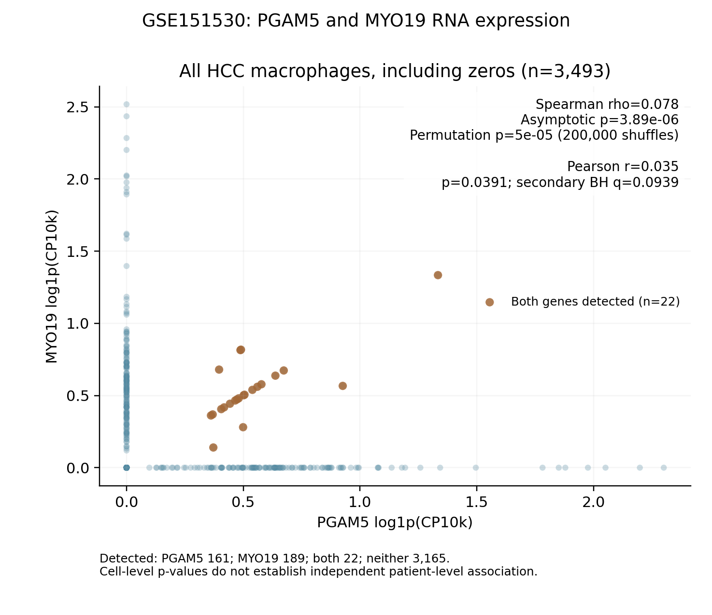
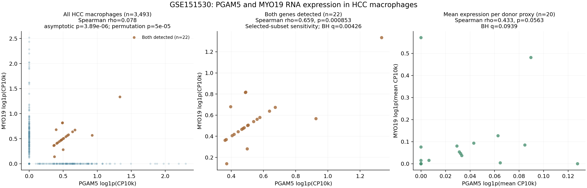

# GSE151530 HCC巨噬细胞中PGAM5与MYO19 RNA表达相关性

已在此前确认的3,493个GSE151530 HCC巨噬细胞中进行逐细胞相关性分析，包括增殖巨噬细胞和两基因未检出细胞。输入范围沿用之前的HCC分析，不包含ICC或其他谱系。

**全体巨噬细胞中，PGAM5与MYO19表达呈很弱的正相关：Spearman ρ=0.07803，常规双侧渐近p=3.89×10⁻⁶；200,000次置换检验p=5.00×10⁻⁵。统计显著不等于强共表达，也不能证明两基因存在调控、蛋白互作或因果关系。**

## 主分析与表达单位

使用符号合并后的原始整数计数，各细胞以已保存的完整文库`total_counts`计算CP10k，随后取自然对数`log1p(CP10k)`。Spearman对单调log变换不敏感；Pearson结果依赖表达尺度。保留全部0值，未做深度匹配、深度协变量回归或偏相关，不使用反卷积系数代替单细胞表达。

| 检验/范围 | 分析单位数 | ρ或r | 渐近p | 次要分析BH q |
|---|---:|---:|---:|---:|
| **Spearman：全部巨噬细胞，log1p(CP10k)** | **3,493细胞** | **0.07803** | **3.89×10⁻⁶** | — |
| Pearson：全部巨噬细胞，log1p(CP10k) | 3,493细胞 | 0.03491 | 0.03908 | 0.09386 |
| Spearman：PGAM5检出细胞，log1p(CP10k) | 161细胞 | −0.13788 | 0.08113 | 0.10141 |
| Spearman：两基因均检出，log1p(CP10k) | 22细胞 | 0.65895 | 0.0008526 | 0.004263 |
| Spearman：两基因均检出，原始计数 | 22细胞 | 0.06918 | 0.75966 | 0.75966 |
| Spearman：每供者代理标签平均CP10k | 20标签 | 0.43332 | 0.05632 | 0.09386 |

只有第一个固定基因对的Spearman检验为主分析；其余五项为固定敏感性/次要分析，对五个渐近p一起进行BH校正。Pearson未经校正p=0.0391，但次要检验校正后q=0.0939，未达到0.05。不根据子集的p值替换主分析。

主分析存在大量并列秩和零值，因此另用200,000次固定随机种子置换MYO19秩，比较`|ρ置换|≥|ρ观察|`。有9次极端置换，Monte Carlo p=(9+1)/(200,000+1)=4.999975×10⁻⁵。置换尾概率的二项抽样95%区间约2.06×10⁻⁵至8.54×10⁻⁵；不将其当作无限精度的精确p值。此处的置换和渐近检验均为**细胞层面**，都不能消除同一供者内细胞相关性。

## 零值和子集结果

- PGAM5检出161个细胞（4.61%），MYO19检出189个（5.41%）。
- 两基因同时检出22个（0.63%），同时未检出3,165个（90.61%）。
- 仅PGAM5检出139个，仅MYO19检出167个。

检出定义为该基因原始计数>0；0为未检出，不解释为生物学绝对不表达或蛋白阴性。

22个双检出细胞中的归一化表达相关性较强，但这个子集经过两基因阳性筛选，不能代表全部巨噬细胞。15个双检出细胞的原始计数组合为(1,1)，其余组合也只有1–3个计数；该子集中原始计数相关性不显著，归一化时两基因共享同一个文库分母可影响相关性。因此不能仅用这22个细胞的归一化结果宣称稳定强共表达。

共有27个样本文库和20个既有`donor_id`供者代理标签。H34a/b/c等后缀文库归入同一既有代理标签，不把27个文库解释为27名独立患者。对每个标签的所有巨噬细胞线性CP10k求均值后，ρ=0.4333、p=0.0563、q=0.0939，未达到0.05。所有20个标签均纳入，没有根据表达或相关性删除低细胞数标签；各标签1–1,195个细胞，均值精度不均。代理标签不能替代已确认的临床独立患者身份。该敏感性结果尚不支持已确认的供者层面相关性。

## 图表



主图包含全部3,493个细胞，图中标注Spearman和Pearson统计量及p值；橙色为双检出细胞。坐标为log1p(CP10k)，0轴上的细胞均保留；相同坐标可能重叠，零值数量由上面的计数明确给出。



第二张图分别展示全部细胞、22个双检出细胞，以及20个供者代理标签的均值。第三面板坐标显示log1p(平均线性CP10k)；Spearman与未取log的平均CP10k结果相同。这三个面板不是相互独立的验证队列。

## 输出、复现与核验

- `macrophage_expression.csv.gz`：每细胞ID、样本文库、供者代理、完整文库分母、两基因原始计数/CP10k/log1p表达及检出状态。
- `correlation_statistics.csv`：全部检验、细胞/标签数、系数、渐近p、主置换p、极端计数及次要BH q。
- `donor_proxy_mean_expression.csv`、`detection_summary.json`：各供者代理表达均值和检出汇总。
- `PGAM5_MYO19_all_macrophages.png/pdf`、`PGAM5_MYO19_correlation.png/pdf`：主图与敏感性分析图。
- `protocol.json`、`source_provenance.json`、`environment_versions.json`、`manifest.json`：方法定义、来源、哈希和环境。
- `audit_correlation.py`、`audit.json`：直接解析原h5ad的HDF5 CSR计数、重算表达归一化、秩相关/解析p及BH校正。独立核验40项通过，包括3,493个细胞×2基因的全部6,986个原始计数；实现核验不是独立生物学验证。

安装`requirements.txt`后，用包内逐细胞表达文件即可复算统计与全部图表，不需要原始大矩阵：

```bash
python analyze_correlation.py
python audit_correlation.py --saved-results-only
```

若需重新从原始QC计数提取，使用`extract_expression.py --h5ad /path/to/GSE151530_harmonized_counts_QC.h5ad --annotation /path/to/GSE151530_all_cell_annotation.csv.gz`；默认原始路径来自之前的工作区。该h5ad约186MiB，不随小型结果包发布；输入SHA256在来源记录中。`audit_correlation.py --h5ad /path/to/input.h5ad`可独立复核原始CSR计数。`plot_main_correlation.py`可单独重绘主图，无须重新运行置换。

此次结果支持**弱的、探索性的逐细胞RNA表达关联**。大量未检出、低计数、共享归一化分母、细胞嵌套于供者及样本间细胞数不均限制推断；不据此断言PGAM5/MYO19功能关系。此前参考、分期和生存结果均保留。
