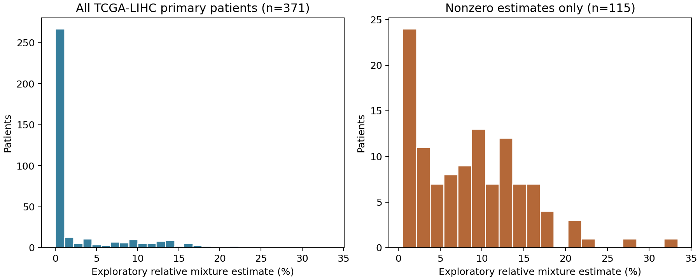

# 仅GSE151530筛选基因并应用于TCGA-LIHC的PGAM5检出巨噬细胞探索性反卷积

**已按要求执行：基因筛选和参考表达构建只使用GSE151530。TCGA-LIHC只用于匹配并计算估计值，没有用于选基因。当前估计是探索性相对混合系数，未验证为组织细胞丰度。**

## GSE151530训练与目标signature

输入为此前独立处理的GSE151530_harmonized_counts_QC.h5ad：44,776个HCC QC细胞、3,493个保守标记一致巨噬细胞，其中161个PGAM5 RNA检出巨噬细胞，来自11个供者标签。全部参考有25个供者标签。目标定义为Macrophage且PGAM5原始计数>0；RNA零不是蛋白阴性，正值亦非PGAM5活性。已采用单数据集内PGAM5-free髓系聚类/标记规则；这些规则此前曾跨队列审阅，不能把本轮称为全新盲法发现。

此次新的未配对、细胞层面Wilcoxon分析采用tie correction与全18,661基因BH校正，FDR<.05、Scanpy近似log2FC>=1、目标检出率>=10%，得到559个上调候选。没有深度匹配/协变量、没有患者配对DE。保留核编码代谢基因，剔除MT-/RPL/RPS特征；按目标供者等权CP10k均值高于其他参考组最大均值的条件及固定class-contrast排序，取最多50个目标基因，并保留定义基因PGAM5。实际目标候选50个，其中PGAM5的分组关联是定义所致，不是独立特异性证据。描述性的其他细胞均值对比不是新的FDR检验。

GSE151530_target_candidate_signature.csv提供候选基因、FDR、log2FC及各组表达证据；GSE151530_target_signature_with_TCGA_coverage.csv按选择分数排序并标记bulk覆盖。这个50基因表尚不是已验证的PGAM5特异signature，也不能独自当作完整反卷积参考。

## 完整参考

在同一GSE151530内构建700基因×14组分的供者等权CP10k参考：目标/未检出巨噬细胞、增殖未检出巨噬细胞、单核、DC、pDC、T/NK、B、内皮、CAF、肿瘤/肝细胞代理、未知组及支持的增殖竞争组。低支持群并入父群或Unknown_other，未强行创建151530不存在的Mixed_APC。所有群共同拟合；其他组的top50描述性区分特征并非目标DE候选，不能把完整700基因都叫目标signature。没有读取其他GSE表达或基因目录做本轮训练。

原有各队列DE表和前两轮参考均未覆盖；新结果单独保存。

## TCGA-LIHC应用结果

沿用GSE62944 TCGA24 Rsubread2015原始计数镜像和既定371例原发01 RNA aliquot选择；不是新下载GDC STAR或TPM。全部23,368个基因计数总和作分母，线性CP10k，未取log或zscore。原参考700基因中636直接符号匹配（90.86%），64从参考与bulk两端同时剔除，未做零表达填补或按结局选行。目标50个候选中46可测，缺失EMC1和3个RP11旧符号。PGAM5本身可测。

固定NNLS，保留训练rowRMS尺度，全部14组分同时拟合，系数除以系数总和。主输出exploratory_target_fraction是目标占全部拟合组分的相对系数；exploratory_target_percent=前者×100是混合系数百分形式，不是校准的细胞百分比。exploratory_target_within_macrophage_fraction为目标在模型总巨噬细胞组分内部的相对占比，不能与主输出混用。

371例患者中115例非零、256例为0，范围0–0.33416（百分形式0–33.42%）。零估计不证明组织里不存在该群。中位数0的High/Low字段仅供描述，没有在本轮进行新的OS/PFI检验；此前联合参考的KM曲线不能直接当作新参考结果。输出全部患者及14组分系数，不只保留预测为正的人。

## 内部留出诊断与解释限制

5位供者符合>=5目标、>=20未检出巨噬细胞、>=20肿瘤代理、>=20T/NK的完整混合测试要求。每折重新做DE、选特征、计算参考均值/尺度，完全不使用留出供者。固定2000细胞伪bulk，目标0/0.5/1/2/5%，总巨噬细胞25%，额外单核/DC/pDC及增殖零目标挑战；2次抽样不是独立患者重复。

| 单位 | 标准混合MAE百分点 | Pearson r | 零目标估计95分位% |
|---|---:|---:|---:|
| equal_RNA_cell_fraction | 2.016 | 0.060 | 3.914 |
| pooled_count_RNA_fraction | 2.732 | 0.045 | 7.297 |

诊断未通过此前研究门槛（MAE<=1百分点、r>=.7、零目标95分位<=.5%）。完整结果/供者覆盖、折内目标特征及未通过项保留。此轮没有外部队列验证；虽然用户明确要求直接应用，仍不能据此认定PGAM5⁺巨噬细胞丰度准确。bulk/单细胞平台、RNA量、基因长度、谱系混淆及掉零未充分校准；没有环境RNA/双细胞校正或蛋白金标准。

## 文件与复现

- TCGA_LIHC_PGAM5_macrophage_estimates.csv：371例主估计、百分形式、总巨噬细胞系数和群内比例。
- all_reference_component_estimates.csv：所有14组分。
- GSE151530_ONLY_EXPLORATORY_REFERENCE_CP10k.tsv、reference_row_scales.csv：锁定700基因参考及尺度。
- USED_EXPLORATORY_REFERENCE_CP10k.tsv、used_reference_row_scales.csv：实际636基因拟合矩阵。
- GSE151530_target_signature_with_TCGA_coverage.csv：50基因候选证据及46基因bulk覆盖。
- *_DE_full/strict_upregulated_candidates.csv：全新DE与559候选。
- internal_validation_predictions/summary.csv：严格折内重新选基因的诊断。
- independent_DE/reference_mean/bounded_solver_checks.csv及implementation_audit.json：独立核验。

实现核验：独立Mann–Whitney/秩和公式检查70个基因（包含全部目标50基因），全18,661基因BH重新计算；14组参考均值独立重建；20个精确参考混合恢复；8例TCGA×636基因原始计数独立读取；371例CP10k/系数归一化/分组核查和19例独立有界求解器均通过。这是计算核验，不是生物学验证。

复现顺序：build_reference.py → apply_TCGA.py → audit_report.py，Python/依赖见requirements.txt和environment_versions.json。build_reference.py可通过PGAM5_GSE151530_H5AD指定151530输入；TCGA步骤默认读取/workspace/scratch/TCGA_LIHC_candidate30_survival下原始计数与RNA_aliquot_selection.csv，换机器需改路径。大型h5ad及原始pan-cancer计数矩阵不随结果包发布；所有输入哈希保留。
