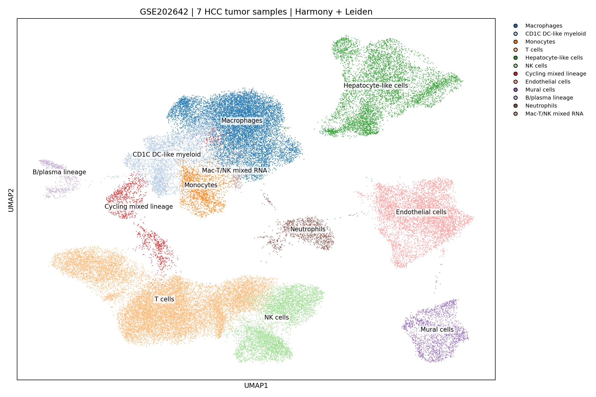
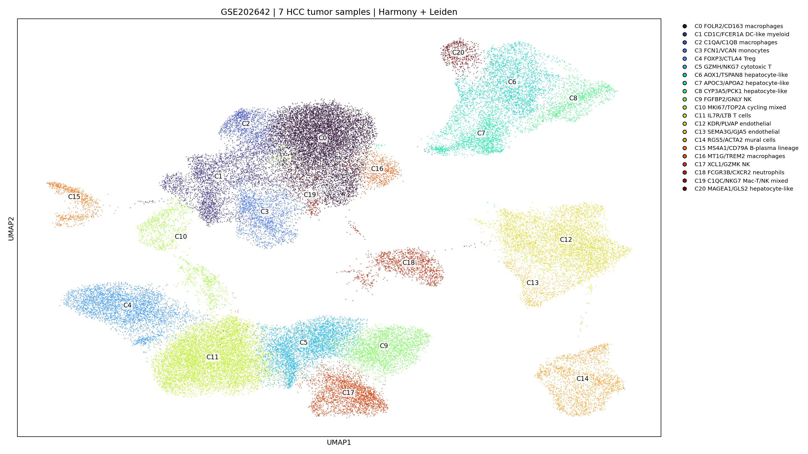
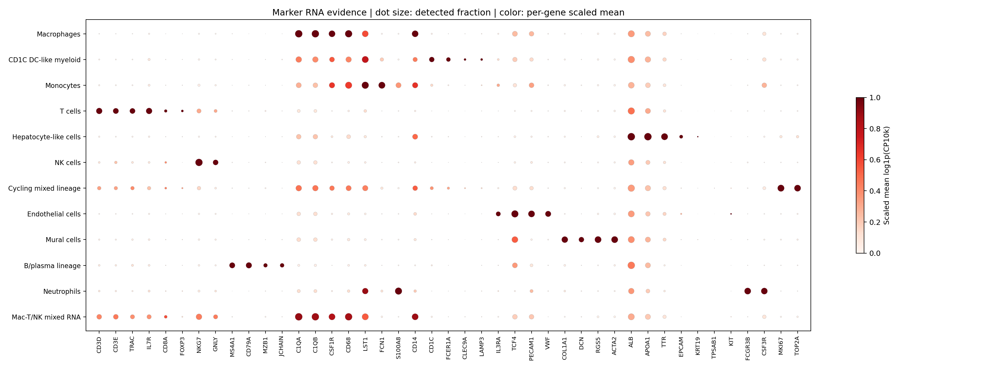
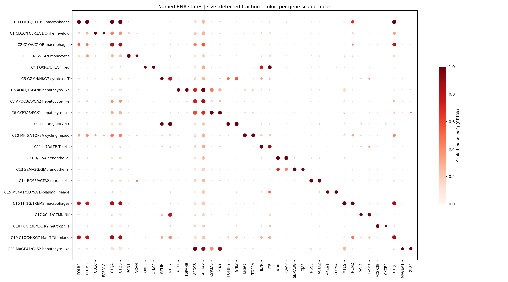

# GSE202642：7个HCC肿瘤样本的全细胞聚类和RNA注释

**已完成56,719个质控后细胞的降维聚类，得到21个Leiden群，并标注12类细胞/限定RNA类别。** 仅纳入GSM6127499–GSM6127505的HCC_tumor样本；4个邻近肝组织样本不在本轮范围。7个sample_name沿用此前用户确认的患者标签。

## 样本与方法

|GSM|HCC样本|原始细胞|QC后细胞|
|---|---|---:|---:|
|GSM6127499|2a-0706|15,938|12,174|
|GSM6127500|1a-0618|15,647|8,139|
|GSM6127501|1a-0629|15,820|12,736|
|GSM6127502|1a-0706|8,314|6,633|
|GSM6127503|1a-0707|9,844|7,370|
|GSM6127504|1a-0727|8,536|6,357|
|GSM6127505|1a-0831|4,336|3,310|

- 原始矩阵36601个特征行；同名基因求和后为36,591个唯一基因。保留n_genes≥500、pct_mt＜20%的细胞，不依据PGAM5表达选细胞。逐细胞全基因总计数与此前记录精确一致。
- CP10k归一化、log1p；按样本选择目标3,000个Seurat高变基因，PGAM5不参与聚类特征选择；高变基因标准化，50维PCA。PGAM5仍保存在完整表达矩阵和便携标志物矩阵中。
- Harmony校正sample_name，使用前40个PC；20邻居，Leiden resolution=0.8，随机种子202642，UMAP使用同一随机种子。原始PCA邻接图对应的未经校正UMAP另行保留。
- 两个Leiden随机种子的ARI=0.8745；这是算法划分的技术一致性，不代表21个群均为已验证生物学亚群。
- 对全基因使用带平局校正的Wilcoxon排序得到每群前40个富集标记；细胞身份结合经典组合标志的检出率、平均归一化表达、相对富集、患者覆盖人工核定。单个差异基因或UMAP孤岛均不单独作为身份依据。

## 细胞类别

|RNA类别|细胞数|
|---|---:|
|T细胞|16,123|
|巨噬细胞|11,536|
|肝细胞样细胞|6,773|
|内皮细胞|5,582|
|NK细胞|5,117|
|CD1C树突样髓系细胞|3,822|
|血管壁细胞|2,035|
|单核细胞|1,925|
|增殖混合谱系群|1,386|
|中性粒细胞|1,322|
|B/浆细胞谱系群|788|
|巨噬/T-NK混合RNA群|310|

## 21个群的名称

|聚类|名称|细胞数|注释状态|
|---|---|---:|---|
|C0|FOLR2/CD163巨噬细胞|9,370|supported_RNA|
|C1|CD1C/FCER1A树突样髓系细胞|3,822|qualified_RNA|
|C2|C1QA/C1QB巨噬细胞|1,460|supported_RNA|
|C3|FCN1/VCAN单核细胞|1,925|supported_RNA|
|C4|FOXP3/CTLA4调节性T细胞|3,703|supported_RNA|
|C5|GZMH/NKG7细胞毒性T细胞|4,194|supported_RNA|
|C6|AOX1/TSPAN8肝细胞样细胞|2,746|supported_RNA|
|C7|APOC3/APOA2肝细胞样细胞|2,178|supported_RNA|
|C8|CYP3A5/PCK1肝细胞样细胞|1,270|supported_RNA|
|C9|FGFBP2/GNLY NK细胞|2,677|supported_RNA|
|C10|MKI67/TOP2A增殖混合谱系群|1,386|mixed_RNA|
|C11|IL7R/LTB T细胞|8,226|supported_RNA|
|C12|KDR/PLVAP内皮细胞|4,885|supported_RNA|
|C13|SEMA3G/GJA5内皮细胞|697|supported_RNA|
|C14|RGS5/ACTA2血管壁细胞|2,035|supported_RNA|
|C15|MS4A1/CD79A B/浆细胞谱系群|788|qualified_RNA|
|C16|MT1G/TREM2巨噬细胞|706|supported_RNA|
|C17|XCL1/GZMK NK细胞|2,440|supported_RNA|
|C18|FCGR3B/CXCR2中性粒细胞|1,322|supported_RNA|
|C19|C1QC/NKG7巨噬/T-NK混合RNA群|310|mixed_RNA|
|C20|MAGEA1/GLS2肝细胞样细胞|579|patient_dominated_RNA|

## 必须保留的注释限定

- C1：CD1C/FCER1A/CLEC10A支持树突样髓系程序，同时C1Q/CSF1R明显，标为CD1C DC-like myeloid，不宣称纯cDC2。
- C10：MKI67/TOP2A增殖程序突出，但同时包含髓系和T细胞RNA，标为增殖混合谱系，不将1386个细胞全部归为增殖巨噬细胞。
- C15：MS4A1/CD79A支持B谱系，同时MZB1/JCHAIN支持浆细胞程序，本层级未分离纯浆细胞群。
- C19：巨噬和T/NK标志共同出现，明确保留混合RNA标签；这不等于经过双细胞检测确认的双细胞。
- C20：约98%来自单个患者，保留患者主导标记，不宣称跨患者独立亚型。
- 肝细胞样名称表示RNA身份，不等于已通过CNV等验证的恶性HCC细胞。没有进行正式双细胞过滤、背景RNA校正或恶性细胞判定。ALB等肝转录本在多类免疫群中广泛检出，组合标志和相对表达比单一ALB检出更适合本轮注释。
- Harmony可削弱部分患者真实差异，未校正UMAP及样本构成图一并提供；归一化表达和差异标志计算仍来自未做Harmony改写的RNA表达。

新C0–C20属于本轮全细胞聚类，不能与此前巨噬细胞内部C0–C14编号互换；previous_macrophage_cluster仅保留旧编号映射，不参与本轮命名或坐标计算。

## 文件与复现

- cell_annotations.csv.gz：完整逐细胞注释，含cluster、cell_type_EN/CN、subtype_EN/CN、annotation_confidence、boundary_or_mixed_flag、sample_name和既有巨噬群映射。
- cluster_annotations.csv：每群名称、经典标志、判定理由、患者构成及限定。
- UMAP_coordinates.csv.gz：Harmony和未经校正的UMAP坐标，可按cell_id回填Seurat或AnnData。
- cluster_marker_evidence.csv / cluster_top40_markers.csv.gz：经典及命名标志物的检出率/均值，以及全基因差异排序的前40标志。
- HCC_annotation_marker_subset.h5ad：便携AnnData，56,719个细胞×110个标志基因，含原始counts层、原始全基因总计数归一化后的log1p(CP10k)、注释及两套UMAP。**这是标志基因子集，不是全转录组矩阵；不要按子集重新计算全基因测序深度。**
- 全基因HCC_annotated_full.h5ad已保存在运行环境，因体积较大未随GitHub结果包分发。
- analysis.ipynb：已执行的注释和原始计数/归一化表达独立复核，以及图表展示。

复现完整降维：安装requirements.txt，在本目录运行python download_matrix.py（下载官方约667 MiB压缩矩阵并验证SHA256），然后依次python cluster.py、python annotate.py、python extract_named_markers.py、python plot_annotation.py、python plot_named_markers.py、python write_report.py。需要约32 GiB内存配置，当前4 CPU运行已完成。source_inputs包含之前核验的样本/条形码对应、特征、细胞质控元数据；重新运行时全基因总计数将与这些输入逐细胞核对。

## 回填既有对象

AnnData：以cell_id与obs_names精确连接cell_annotations.csv.gz；Seurat：以同一细胞编号连接metadata。若对象包含邻近组织或尚未质控细胞，应只对匹配编号赋予本轮标签，不能将未匹配细胞默认标为任一群。所有PNG另附PDF版本。
