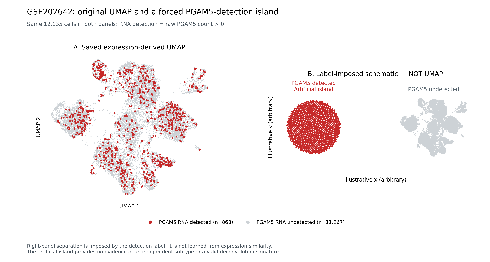

# GSE202642：人为指定PGAM5检出细胞岛的示意对照

**右图是按标签指定坐标的示意布局，不是UMAP、监督UMAP或无监督聚类结果。** 它回答“若将PGAM5检出细胞强制放进一个岛，图会是什么效果”，不能用来证明这些细胞是独立亚群。



- 左图使用此前保存的真实表达UMAP坐标：12,135个推定巨噬细胞，其中868个PGAM5原始计数>0，11,267个未检出，零值全部保留。
- 右图将同样的868个检出细胞人为安排到一个圆盘内；位置仅由细胞编号排序决定，与转录组相似性无关。未检出细胞的原UMAP按统一比例缩放并平移到另一侧。两类之间的间隔是人为设定。
- 868个检出细胞在原UMAP中来自14个RNA群。右侧的一个岛不改变这一原始分群结果，也不消除原集合内已标记的混合谱系RNA身份不确定性。

此图可以展示人为合并的表达状态，但应保留“标签指定示意布局，非UMAP”的标注；不应截取右图后将其作为真实UMAP聚类、稳定谱系、PGAM5特异功能或TCGA反卷积有效性的证据。原始自然聚类的结果见[原分析报告](../GSE202642_PGAM5_subpopulation_assessment/README.md)。

`schematic_coordinates_NOT_UMAP.csv.gz`保留原UMAP坐标、原群与功能标签，以及新示意坐标，便于追溯。`illustration_provenance.json`记录源文件校验和与位置规则。PNG用于查看，PDF用于矢量排版。

复现可使用原分析环境，在仓库中执行：

```bash
OPENBLAS_NUM_THREADS=1 OMP_NUM_THREADS=1 python plot_label_imposed_illustration.py
```

脚本默认读取相邻原结果目录的`PGAM5_merged_group_cell_annotations.csv.gz`；也可通过`--source /path/to/PGAM5_merged_group_cell_annotations.csv.gz`指定该文件。此处没有拟合新的UMAP、改变原始数据或筛选新signature。
