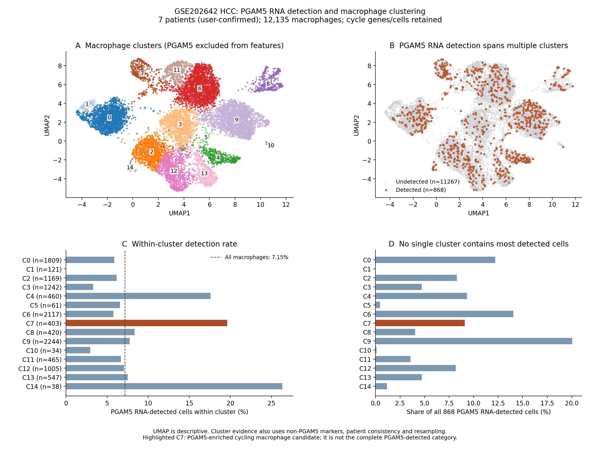
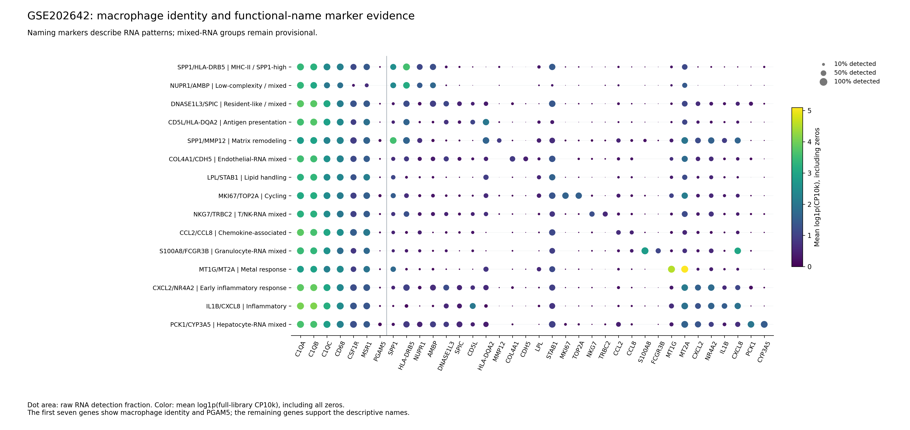
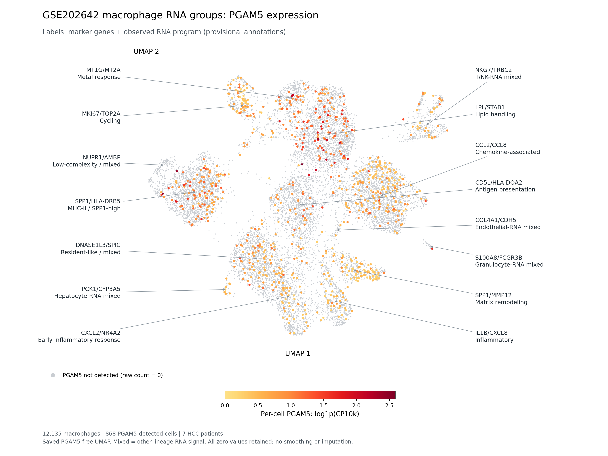
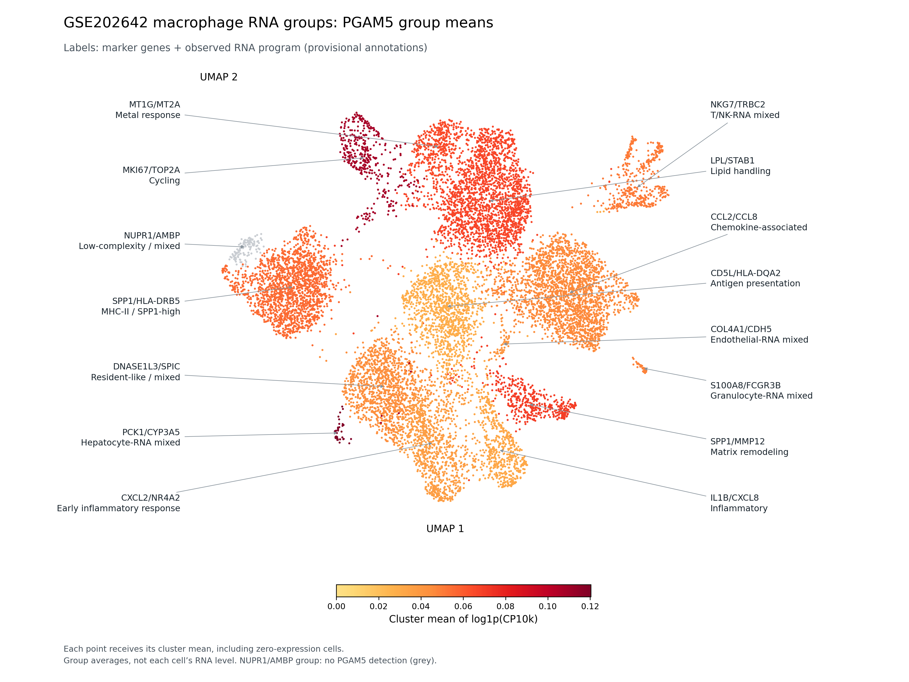
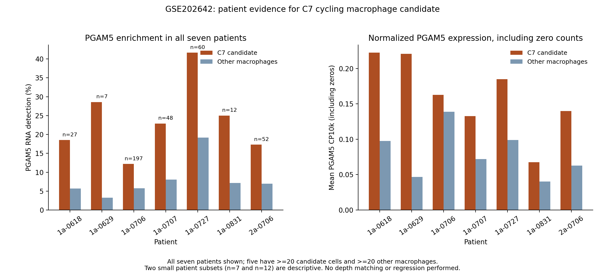
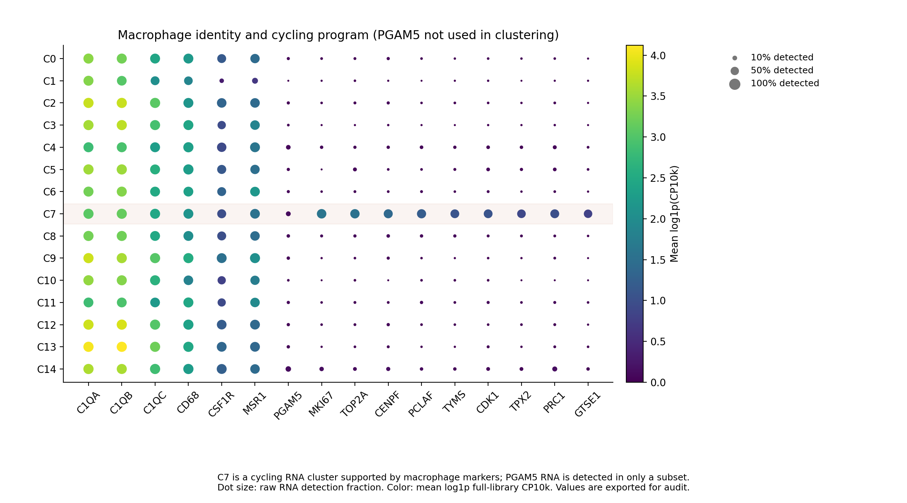

# GSE202642：PGAM5 RNA检出巨噬细胞能否构成独立亚群

**结论：支持一个可重复的“PGAM5富集的增殖型巨噬细胞”RNA候选亚群；当前证据不支持把所有PGAM5 RNA检出巨噬细胞统一定义成一个独立亚群。**

按本轮用户确认，7个样本标签作为7位独立HCC患者。保留增殖相关基因和全部增殖细胞，不要求亚群在去除增殖程序后仍分开；没有蛋白或跨队列要求。仅使用GSE202642肿瘤样本，未重新运行TCGA分析。

## 主要证据

沿用v8的目标基因无关、标记一致的巨噬细胞集合：**12,135个巨噬细胞，868个PGAM5原始RNA计数>0，11,267个未检出**。该集合是原12907个推定巨噬细胞中经后续标记复核保留的12135个，与当前探索性参考使用的细胞完全一致；这解释了与早期919个PGAM5检出细胞统计的差别。

在完全不使用PGAM5作为分群特征的2000高变基因、30PC空间中得到15个RNA算法群。868个PGAM5检出细胞跨**14个群**，任何单群最多包含全部检出细胞的**20.05%**。PGAM5检出标签的阳性细胞平均silhouette为-0.070，标签与15群的ARI仅0.0034。这些数值说明检出标签与单一独立表达群的对应关系很弱，不是证明不存在PGAM5相关生物学。

| 项目 | C7候选群结果 |
|---|---|
| 群内总细胞 | 403 |
| PGAM5 RNA检出/未检出 | 79/324 |
| 群内PGAM5检出率 | 19.60% |
| 其他巨噬细胞检出率 | 6.73% |
| 检出率比 | 2.91 |
| Fisher p；15群BH q | 6.6418e-17；9.96271e-16 |
| 占全部868个检出细胞 | 9.10% |
| 患者覆盖 | 7位；其中5位有足够细胞可评估 |
| 可评估患者检出富集方向一致率 | 100% |
| 群匹配Jaccard：2个随机种子＋3次80%重抽样 | 0.838–0.928 |
| 前10个标志基因患者内方向重复 | 10/10，在5位可评估患者中均上调 |

候选群以 **MKI67, TOP2A, CENPF, PCLAF, NUSAP1, TYMS, CDK1, TPX2, PRC1, GTSE1** 为特征，同时保留C1QA/B/C、CD68、CSF1R、MSR1等巨噬细胞RNA身份标记。其增殖特征是该群的生物学特征，并未作为排除理由。resolution 0.4和1.2仍可找到相应PGAM5富集增殖群：分别397细胞/77检出、480细胞/88检出；5位可评估患者检出富集方向均一致。

Fisher/BH是合并细胞层面的描述性检验，同一患者的细胞不构成独立生物学重复；患者方向一致和技术重抽样是另外两类证据，不能以极小的细胞p值代替患者级验证。前10标志基因是分群之后的表达对比结果，存在分群选择效应，未包装为独立确认性DE或已验证的反卷积signature。



## 标志基因和功能程序命名

以下名称是基于本队列RNA表达的**描述性、暂定注释**。每群两个命名基因都在该群前25个描述性标志中，并用原始计数重新核对平均CP10k和检出率。名称中的“高表达”是群层面的相对表达特征，不表示群内每个细胞都同时检出这两个基因；也不表示基因表达已经证明功能活性。没有使用PGAM5表达高低决定这些名称。

| 原编号 | 标志基因＋功能相关名称 | 细胞数 |
|---|---|---:|
| C0 | SPP1/HLA-DRB5高表达、抗原呈递相关巨噬细胞（伴肝源/肿瘤RNA） | 1809 |
| C1 | NUPR1/AMBP高表达、低复杂度混合RNA群（待复核） | 121 |
| C2 | DNASE1L3/SPIC高表达、驻留样巨噬细胞（伴肝源RNA） | 1169 |
| C3 | CD5L/HLA-DQA2高表达、抗原呈递相关巨噬细胞 | 1242 |
| C4 | SPP1/MMP12高表达、基质重塑相关巨噬细胞 | 460 |
| C5 | COL4A1/CDH5高表达、内皮RNA混合群（待复核） | 61 |
| C6 | LPL/STAB1高表达、脂质处理相关巨噬细胞 | 2117 |
| C7 | MKI67/TOP2A高表达、增殖型巨噬细胞 | 403 |
| C8 | NKG7/TRBC2高表达、T/NK RNA混合群（待复核） | 420 |
| C9 | CCL2/CCL8高表达、趋化因子相关巨噬细胞 | 2244 |
| C10 | S100A8/FCGR3B高表达、粒细胞RNA混合群（待复核） | 34 |
| C11 | MT1G/MT2A高表达、金属应答相关巨噬细胞 | 465 |
| C12 | CXCL2/NR4A2高表达、早期炎症应答相关巨噬细胞 | 1005 |
| C13 | IL1B/CXCL8高表达、炎症相关巨噬细胞 | 547 |
| C14 | PCK1/CYP3A5高表达、肝细胞RNA混合群（待复核） | 38 |

C5存在COL4A1/CDH5/FLT1/KDR内皮信号；C8存在NKG7/TRBC2/CD2/CD3G的T/NK信号；C10存在S100A8/FCGR3B/CSF3R/CXCR2粒细胞信号；C14存在PCK1/CYP3A5/ACSM2A/B/ONECUT1肝细胞信号。因此这些群以“混合RNA、待复核”标注，不能直接称为内皮样、细胞毒性或糖异生型巨噬细胞。环境RNA、双细胞、吞噬来源RNA及身份误注释均可能贡献，目前未区分来源，未据此删除细胞。

C0、C1、C2也有肝源/肿瘤RNA背景；C1仅121细胞且文库复杂度低。C2使用“驻留样”表达相似性名称，不宣称已证明组织驻留身份。C10与C14分别只有34、38细胞。许多群由单一患者主导，编号与功能名称不意味着15个经过独立验证的稳定生物学亚群；患者占比、混合RNA标记及逐群限定说明均保留在名称对照表中。C7仍对应此前的PGAM5富集增殖型候选群。



功能命名附加到新的逐细胞文件`functional_subgroup_cell_annotations.csv.gz`，保留原群编号、原RNA候选注释和PGAM5检出状态。历史概览、稳定性与统计表保留编号便于追溯；本次两张PGAM5表达UMAP使用功能名称显示，坐标、表达值和原群成员不因名称变化而改变。

## PGAM5连续表达量UMAP

在原有UMAP坐标上叠加PGAM5的连续表达量，图中原C0–C14编号已替换为“两个标志基因＋功能相关RNA程序”的名称，并用引线指向原群中心。灰色为原始计数0的未检出细胞；黄至红表示每个细胞的`log1p(CP10k)`表达量升高。CP10k以原始全基因文库总计数为分母，不用下载包内部分基因计数的行和作为分母。保留全部零值，不做表达插补、平滑或分位数截断，色阶覆盖完整观察范围；非零细胞按表达量升序绘制于灰色背景之上。



另提供各群均值图：先对每个细胞计算`log1p(CP10k)`，再对群内所有细胞（包括零值）取算术平均，将这一群均值赋给该群所有UMAP点。它便于比较群间平均表达强弱，不能据此认为每个着色细胞都检出了PGAM5。两图各有自己的色阶范围，应读取各自色条；均值图不是`log1p(群内平均CP10k)`。C1的121个细胞均未检出PGAM5，显示为灰色。



这两张表达图复用原坐标和原分群，未重新聚类或重新计算UMAP。`PGAM5_expression_by_cluster.csv`同时提供各群细胞数、检出率、包含零值的平均CP10k及平均log1p(CP10k)。`PGAM5_UMAP_expression_values.csv.gz`保存逐细胞实际绘图值和坐标。

## 七位患者的候选群证据

| 患者标签 | C7细胞 | C7内PGAM5检出 | 群内检出率 | 其余巨噬细胞检出率 | 可评估 |
|---|---:|---:|---:|---:|---|
| 1a-0618 | 27 | 5 | 18.52% | 5.70% | 是 |
| 1a-0629 | 7 | 2 | 28.57% | 3.27% | 仅描述 |
| 1a-0706 | 197 | 24 | 12.18% | 5.73% | 是 |
| 1a-0707 | 48 | 11 | 22.92% | 8.03% | 是 |
| 1a-0727 | 60 | 25 | 41.67% | 19.19% | 是 |
| 1a-0831 | 12 | 3 | 25.00% | 7.19% | 仅描述 |
| 2a-0706 | 52 | 9 | 17.31% | 6.97% | 是 |

七位患者均存在候选群细胞，群内PGAM5检出率及包括零值的平均CP10k均高于其余巨噬细胞。1a-0629和1a-0831分别只有7和12个群细胞，其结果保留展示，但不计入需群内≥20、群外≥20且总PGAM5检出≥3的正式“可评估患者”方向统计。此细胞数标准是避免稀少群误判的本轮操作规则，不是生物学亚群的通用门槛。



## 可直接回填的RNA注释

逐细胞文件`RNA_subgroup_cell_annotation.csv.gz`导出三个不同含义的字段：

- `PGAM5_macrophage_RNA_annotation`：原始计数>0的868细胞标为RNA检出；其余未检出。该字段记录表达状态。
- `RNA_subgroup_annotation`：C7的403细胞标为`Cycling_macrophage_PGAM5_enriched_candidate`。该群基于不含PGAM5的多基因结构定义，包含79个检出和324个未检出细胞。
- `PGAM5_detected_within_candidate`：C7内同时检出PGAM5的79细胞。它是候选亚群中的RNA检出子集，本轮没有单独证明这79细胞又构成新的独立亚群。

因此，推荐在本数据集采用“PGAM5富集的增殖型巨噬细胞候选群”这一名称，保留PGAM5 RNA检出作为附加状态标签。不能把候选群全部细胞命名成字面意义上的PGAM5 RNA检出细胞，也不能把868个检出细胞统称为同一个独立亚群。

`candidate_RNA_annotation_gene_panel.csv`同时保留PGAM5、典型巨噬细胞身份基因及10个候选群程序基因。该清单用于解释RNA注释，不是已验证的TCGA反卷积signature。



## 补充结构检查与其他群

不使用PGAM5的近邻图中，PGAM5检出细胞的加权阳性邻居比例约10.72%，高于在患者内随机置换标签的均值8.39%；500次单侧置换p=1/501≈0.001996。这说明存在一定局部聚集，但没有形成统一独立PGAM5检出群。它是条件于既有图及患者标签的描述性置换，不是独立患者随机抽样检验，也未控制深度。

其他群不能只依据检出率排名命名。C4的PGAM5细胞层面富集显著，但86.3%群细胞来自单一患者，2位可评估患者均未显示相对于本患者其他巨噬细胞的检出富集；C14只有38细胞、1位可评估患者，并含明显肝细胞背景程序。它们尚不具备与C7同样的多患者支持。多数其余算法群也受患者来源影响，不能把每个UMAP岛都视为经过确认的生物学亚群。

另以不含PGAM5的固定增殖定义（MKI67/TOP2A/UBE2C/CENPF/CDK1/BIRC5中≥2个RNA检出）识别649个增殖状态细胞，含132个PGAM5检出，检出率20.34%，相对其余细胞3.17倍；7位患者平均PGAM5 CP10k方向一致。该规则识别的649细胞与算法C7不是同一集合，不合并当作一个重复计数的目标群。主候选注释采用算法C7。

## 方法与范围

使用目标基因无关的标记一致巨噬细胞原始计数，完整每细胞文库CP10k＋log1p。HVG在七个患者标签内选择并平衡跨患者出现次数，2000特征经逐基因z标准化、SD下限0.1、截断±10，再做30PC随机化PCA和20近邻；Scanpy模糊邻接图、igraph Leiden resolution=0.8、seed0、4轮作为主分析。PGAM5、线粒体/核糖体/Ig/血红蛋白及明确列出的非巨噬背景基因不参与几何特征；没有删除对应细胞，也没有进行环境RNA校正。

主分析保留增殖/应激程序。另在同图用两个随机种子、resolution0.4/1.2，以及每位患者80%细胞抽样三次重新计算PCA和邻居，检查群重复性。技术重复不是留患者验证；本轮没有宣称未见过患者的分类性能。PGAM5的原始计数、零值以及归一化表达均保留，未按生存或PGAM5富集挑选主分辨率。

不设某个PGAM5原始计数、FDR或log2FC作为“独立亚群”的充分条件。这里综合RNA聚类、多基因共同特征、患者覆盖和群重复性作出候选判定。未进行深度匹配/回归或患者配对DE；PGAM5检出细胞文库计数中位数11851、未检出细胞7474，该因素按既定用户范围未控制。

源注释偏向C1Q高表达巨噬细胞，可能遗漏C1Q低表达巨噬细胞；未做doublet或环境RNA校正。7位独立患者的对应关系采用用户本轮确认，来源写入`patient_identity_source`；上游曾标为样本代理的字段保留为`upstream_donor_*`，不作为本轮患者定义。RNA层面的候选群不证明永久稳定谱系或PGAM5特异功能。

**对TCGA用途：本轮提供更明确的候选RNA群注释，但尚未构建并验证其新的全细胞竞争参考、混合物恢复或真实丰度单位；不能将本轮结果直接解释为可靠PGAM5⁺巨噬细胞浸润丰度。此前TCGA结果不因这一步而被验证或自动替换。**

## 下载与复现

- `RNA_subgroup_cell_annotation.csv.gz`：可按cell_id回填Seurat/AnnData的完整逐细胞注释。
- `PGAM5_expression_UMAP.png/.pdf`、`PGAM5_cluster_mean_expression_UMAP.png/.pdf`：逐细胞连续表达和各群平均表达图；PNG用于浏览，PDF用于论文排版。
- `PGAM5_expression_by_cluster.csv`、`PGAM5_UMAP_expression_values.csv.gz`、`PGAM5_expression_UMAP_validation.json`：表达汇总、绘图数值及原始计数/归一化/坐标复核。
- `functional_subgroup_names.csv`、`functional_subgroup_marker_evidence.csv`、`functional_subgroup_naming_validation.json`：15群编号/中英文功能名称对照、30个命名基因的表达证据及复核。
- `functional_subgroup_cell_annotations.csv.gz`：全部12135细胞的功能名称、原编号、PGAM5状态及混合RNA标记，可按cell_id回填。
- `functional_subgroup_marker_dotplot.png/.pdf`、`functional_subgroup_marker_dotplot_values.csv`：巨噬细胞身份、PGAM5和命名标志的36基因点图及540个实际绘图值。
- `candidate_cluster_descriptive_markers.csv`、`candidate_RNA_annotation_gene_panel.csv`：候选群表达标志和身份/锚点/程序基因。
- `cluster_PGAM5_association.csv`、`cluster_PGAM5_by_sample.csv`：主及两个分辨率所有群、七位患者完整结果。
- `cluster_marker_patient_consistency.csv`、`cluster_marker_directions_by_patient.csv`：前10标志在患者内的描述性表达方向。
- `cluster_stability.csv`、`global_clustering_stability.csv`、重抽样逐细胞标签：技术重复数值。
- `portable_raw_feature_counts.npz`、`portable_feature_genes.csv`：2102个拟合特征/标志/面板基因的原始计数，及`cell_annotations.csv.gz`中的原始全库分母。大型全36591基因h5ad不随包发布。
- `primary_PCA_model.npz`、`primary_PCA_loadings.csv.gz`、`primary_neighbor_graph.npz`、`UMAP_coordinates.csv.gz`：实际模型、图和坐标。PCA的训练坐标为随机SVD的`fit_transform`（U×S）；线性X×V投影会有约2%近似差异，包内审计重现实际训练坐标，不把二者当成精确恒等。
- `original_source_audit.json`、`portable_audit.json`、`independent_audit_checks.csv`：数值复核；包含完整原始矩阵与可下载计数的一致性、零值、分母、群/患者人数、Fisher/BH、Jaccard、图和点图数据。
- `protocol.json`、`source_provenance.json`、`environment_versions.json`、`SHA256_manifest.csv`：方法、来源、依赖和校验。

下载后，可仅用包内数据核查与重画，不需要原始大矩阵：

```bash
python3 -m venv .venv
source .venv/bin/activate
python -m pip install -r requirements.txt
python verify_package.py
OPENBLAS_NUM_THREADS=1 OMP_NUM_THREADS=1 python check_patient_marker_consistency.py
OPENBLAS_NUM_THREADS=1 OMP_NUM_THREADS=1 NUMBA_NUM_THREADS=2 python plot_assessment.py
OPENBLAS_NUM_THREADS=1 OMP_NUM_THREADS=1 python name_functional_subgroups.py
OPENBLAS_NUM_THREADS=1 OMP_NUM_THREADS=1 python plot_PGAM5_expression_umap.py
OPENBLAS_NUM_THREADS=1 OMP_NUM_THREADS=1 python plot_functional_subgroup_markers.py
OPENBLAS_NUM_THREADS=1 OMP_NUM_THREADS=1 python audit_results.py
python write_report.py
```

上述重算会覆盖生成文件。完整重做HVG/聚类需要原始`GSE202642_marker_consistent_macrophages.h5ad`（来源hash已保存）；它可以从GSE202642官方matrix、旧分析的样本映射和标记一致巨噬细胞准备脚本重建。完整主脚本以`--source`参数指定该文件，放入新的输出目录执行；有限细胞周期来源json路径在脚本中有明确默认值。下载包中的部分基因计数不能冒充完整文库用于HVG重筛选或重新计算全库分母。

GEO：[GSE202642](https://www.ncbi.nlm.nih.gov/geo/query/acc.cgi?acc=GSE202642)。上游巨噬细胞准备代码：[prepare_additional_macrophages.py](https://github.com/183285068-droid/codex/blob/main/results/PGAM5_reproducible_macrophage_states/prepare_additional_macrophages.py)。RNA注释来源：[v8结果](https://github.com/183285068-droid/codex/tree/main/results/PGAM5_RNA_identity_v8)。
