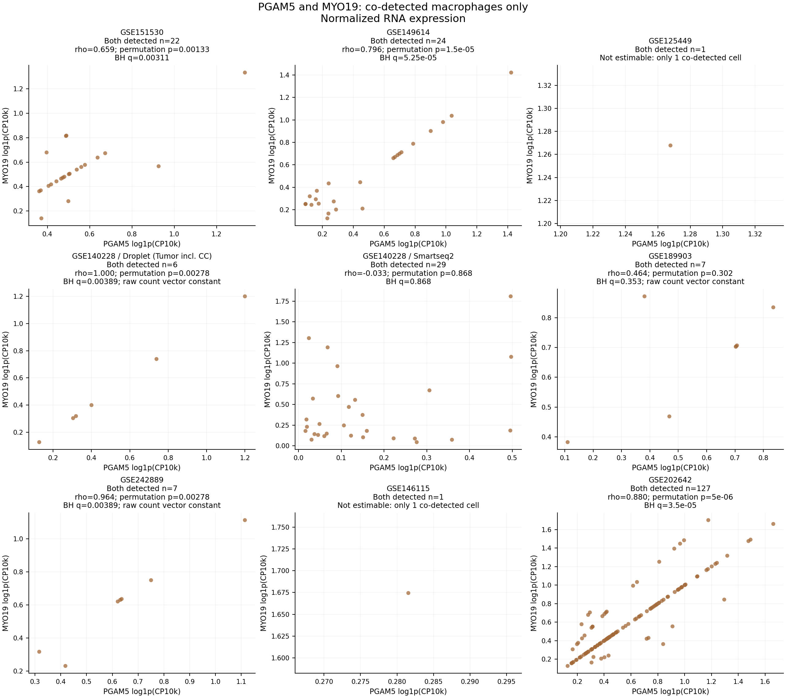
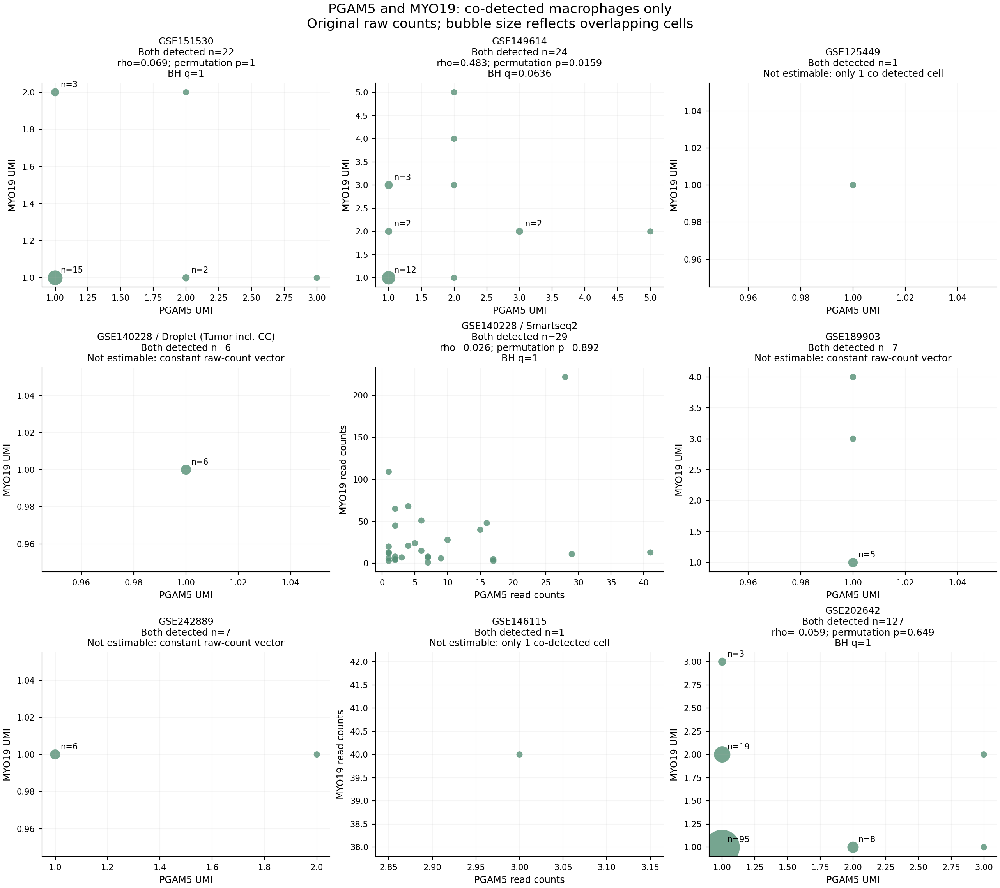
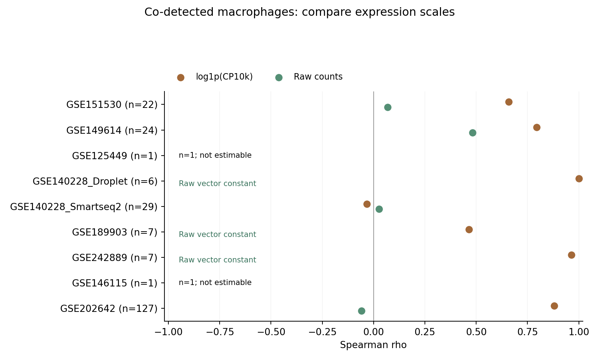

# 所有已完成队列：仅双检出巨噬细胞的PGAM5–MYO19相关性

已按要求，仅保留既有巨噬细胞注释中**PGAM5原始计数>0且MYO19原始计数>0**的细胞。纳入此前已完成的8个数据集；GSE140228的Droplet和Smart-seq2分别分析，共9组。没有将未检出细胞加入相关性检验或散点图，也没有重新构建巨噬细胞注释。

34,011个既有QC巨噬细胞中，共有224条双检出细胞记录。这个总数是各队列记录之和，不代表224个独立患者或已去重跨数据集细胞；GSE125449与GSE151530存在细胞重叠。GSE125449和GSE146115各仅1个双检出细胞，无法估计相关性。

**归一化表达的Spearman检验中，7个可检验组有5组经BH校正后显著；原始计数的Spearman或Pearson敏感性分析均没有经BH校正后显著的组。结果对表达尺度非常敏感，不能直接认定PGAM5与MYO19稳定强共表达。**

## 主分析结果

主表达尺度为与之前一致的自然对数`log1p(CP10k)`，分母为已保存的完整文库`total_counts`。没有只用这两个基因作分母。仅在每个队列/技术内部进行检验，没有跨平台合并p值。

| 数据集/技术 | 双检出细胞数 | Spearman ρ | 双侧置换p | BH q |
|---|---:|---:|---:|---:|
| GSE151530 | 22 | 0.65895 | 0.001335 | **0.003115** |
| GSE149614 | 24 | 0.79565 | 1.50×10⁻⁵ | **5.25×10⁻⁵** |
| GSE125449 | 1 | — | — | — |
| GSE140228 Droplet | 6 | 1.00000 | 0.002778 | **0.003889** |
| GSE140228 Smart-seq2 | 29 | −0.03251 | 0.867821 | 0.867821 |
| GSE189903 | 7 | 0.46429 | 0.302381 | 0.352778 |
| GSE242889 | 7 | 0.96429 | 0.002778 | **0.003889** |
| GSE146115 | 1 | — | — | — |
| GSE202642 | 127 | 0.88028 | 5.00×10⁻⁶ | **3.50×10⁻⁵** |

p为按绝对相关系数定义的双侧置换检验，BH在主分析7个可检验组之间校正。1个细胞的组不计算系数或p值，保留NA，未当成p=0或“无相关”。

细胞数≤8时，枚举所有n!个带标签的MYO19置换（包括原顺序），p=极端置换数/总置换数。细胞数>8时，固定200,000次随机置换，p=(极端置换数+1)/(200,000+1)，固定队列/方法/尺度随机种子。GSE202642主检验的随机置换没有观察到极端值；5.00×10⁻⁶是该公式下的最小可报告Monte Carlo值，不能解释为无限精度的真实p恰好等于此数。渐近p也完整导出，但本轮表格和BH使用置换p。

GSE151530的22个细胞与上一轮双检出子集完全一致，ρ未改变。此前子集的0.0008526是SciPy渐近p，本轮0.001335是置换p；检验和本轮跨队列校正族不同，不是更改表达数据以得到不同结果。

## 原始计数敏感性与共有分母

| 数据集/技术 | 原始计数Spearman ρ | 双侧置换p | BH q或原因 |
|---|---:|---:|---|
| GSE151530 | 0.06918 | 1.000000 | 1.000000 |
| GSE149614 | 0.48252 | 0.015905 | 0.063620 |
| GSE125449 | — | — | n=1，无法估计 |
| GSE140228 Droplet | — | — | 两条计数向量均为常数 |
| GSE140228 Smart-seq2 | 0.02596 | 0.892396 | 1.000000 |
| GSE189903 | — | — | PGAM5计数向量为常数 |
| GSE242889 | — | — | MYO19计数向量为常数 |
| GSE146115 | — | — | n=1，无法估计 |
| GSE202642 | −0.05853 | 0.648677 | 1.000000 |

原始计数Spearman的BH族只有4个非恒定且细胞数足够的组。由于离散计数和重复值，按绝对相关系数的置换p可以与常规连续近似p相差较大；例如GSE151530原始计数置换p=1，不应替换成该行另行保存的渐近p=0.7597。

共有分母问题在这里有直接证据：

- **GSE140228 Droplet：全部6个双检出细胞的原始计数均为(PGAM5=1, MYO19=1)。** 归一化后两列都是`log1p(10,000/total_counts)`，两列相同，ρ=1由共同分母产生；原始计数根本没有可估计的变化。
- GSE242889的7个双检出细胞中，MYO19全部为1，6个细胞两基因均为1；归一化ρ=0.964不能证明原始RNA计数共同变化。
- GSE202642的127个双检出细胞有95个两基因计数均为1；归一化ρ=0.880，但原始计数ρ=−0.059，未显著。
- GSE151530的22个双检出细胞有15个两基因计数均为1。所有原始计数组合和频数见`raw_count_patterns.csv`。

因此，不能只展示归一化显著的队列，也不能把未检出细胞排除后的结果等同于全部巨噬细胞的关联。原始计数结果同样受测量与文库因素影响，它是对尺度敏感性的检查，不能单独证明不存在生物学关系。

另外提供Pearson相关的归一化与原始计数检验。Pearson归一化表达同样有5组通过各自BH校正；原始计数没有组通过。全部36行（9组×2方法×2尺度）包括NA原因，见`correlation_statistics_full.csv`。四个方法/尺度组合各自构成校正族：主Spearman/log1p(CP10k)有7项，Spearman/raw有4项，Pearson/log1p(CP10k)有7项，Pearson/raw有4项。没有把所有次要方法p值混为主分析p值。

## 样本范围与注释

| 数据集 | 本轮沿用范围及巨噬细胞来源 |
|---|---|
| GSE151530 | HCC肿瘤；最新保守髓系注释，3,493个巨噬细胞 |
| GSE149614 | 原发肿瘤末尾T；最新保守髓系注释，7,448个 |
| GSE125449 | 原9例HCC，作者TAM标签；QC后298个 |
| GSE140228 Droplet | 原全部Tumor，作者Mφ亚型；QC后2,508个，包含HCC/CC |
| GSE140228 Smart-seq2 | 原全部Tumor，作者Mφ亚型；QC后531个，均为HCC |
| GSE189903 | HCC肿瘤核心及边缘；最新保守髓系注释，3,467个 |
| GSE242889 | 全5例HCC、不按MVI排除；最新marker一致注释，3,990个 |
| GSE146115 | HCC1/HCC2/HCC5/HCC9；之前探索性marker推定141个 |
| GSE202642 | 已确认HCC肿瘤库编号5–11；最新marker一致注释，12,135个 |

GSE140228 Droplet的6个双检出细胞中，5个为HCC、1个为CC，不能把该组称为纯HCC结论。Smart-seq2和Droplet存在共享供者，read counts与UMI不跨平台混合。GSE125449与GSE151530存在样本及条形码重叠，不能视为独立重复验证。GSE202642库标签为样本代理，不能自动解释为已确认独立患者。取消的GSE154906不纳入，也没有重启其分析。

五个已做v4注释的队列采用既有最新保守巨噬细胞身份；其余队列沿用先前作者/marker推定注释。这些注释来源不同，不保证完全相同的细胞类型纯度或亚型覆盖。包含原有巨噬细胞范围内的增殖细胞，没有根据两基因相关性重新挑选亚群。

## 图表



所有面板严格只有双检出细胞；每个面板标注n、Spearman ρ、置换p及BH q。1个细胞的组仅显示该观测，并标注无法估计。主图同时标注原始计数恒定的组，提醒其尺度问题。



原始计数图以气泡大小和n标签表示同坐标重叠细胞，没有为了显示重叠而改变用于检验的计数。



## 复现与核验

结果包包含224条双检出表达记录、各队列检测覆盖、36行完整统计、逐队列汇总、原始计数组合频数、PNG/PDF图及脚本；不包含大型全转录组h5ad。

```bash
python -m pip install -r requirements.txt
python analyze_correlations.py
python audit_correlations.py --saved-results-only
```

仅用包内文件即可复算相关统计和所有图。`plot_correlations.py`可单独从保存CSV重绘。若需要从原矩阵重新提取，修改`cohorts.json`各h5ad与既有注释路径，然后运行`extract_codetected.py`。`audit_correlations.py`不带`--saved-results-only`时会直接读取所有原h5ad。

独立核验**142项全部通过**：直接解析HDF5 CSR并复核34,011个候选巨噬细胞的两基因共68,022个计数/筛选，确认224个双检出观测、原始计数和完整文库分母，手工重建Spearman/Pearson系数与解析p、用独立去重置换验证小样本精确p、按四个校正族重算BH，以及核对GSE151530的22个细胞与上一轮一致。原始输入及产物SHA256见`source_provenance.json`、`manifest.json`。

输出关键文件：`correlation_summary.csv`、`correlation_statistics_full.csv`、`codetected_macrophage_expression.csv.gz`、`cohort_detection_summary.csv`、`raw_count_patterns.csv`、`protocol.json`、`audit.json`、`cohorts.json`。

这些检验假设细胞可交换，不消除同一供者内依赖；样本数少、低计数、共同分母、阳性筛选和跨研究重叠均限制推断。没有深度匹配、协变量回归或患者配对，也未把统计相关解释为蛋白互作或因果关系。此前注释、单队列相关性、分期和生存结果均保留。
