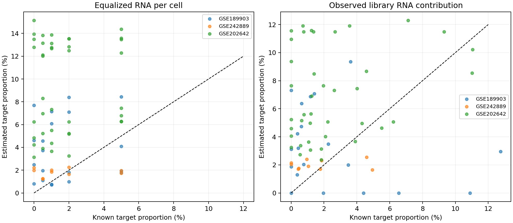

# PGAM5 RNA检出巨噬细胞注释与反卷积验证

**已完成可复现的RNA检出状态注释；当前参考未通过外部验证，不能作为TCGA-LIHC的PGAM5⁺巨噬细胞丰度工具。**

## 注释定义与覆盖

目标标签`Macrophage_PGAM5_detected`=已有保守谱系标记确认的巨噬细胞且符号合并后的PGAM5原始RNA计数>0；对应未检出标签不是蛋白阴性。5个*_all_cell_annotation.csv.gz可按cell_id回填Seurat/AnnData。保留cell_type、PGAM5_RNA_status、PGAM5_macrophage_annotation和cycling_flag四个独立字段。

| 数据集 | HCC QC细胞 | 巨噬细胞 | PGAM5检出巨噬细胞 | 未检出巨噬细胞 |
|---|---:|---:|---:|---:|
| GSE151530 | 44776 | 3493 | 161 | 3332 |
| GSE149614 | 34414 | 7448 | 197 | 7251 |
| GSE189903 | 44287 | 3467 | 85 | 3382 |
| GSE242889 | 19872 | 3990 | 102 | 3888 |
| GSE202642 | 56719 | 12135 | 868 | 11267 |

GSE202642限定末尾库编号5–11的7个HCC肿瘤样本，编号映射沿用已核实的上一轮来源记录；7个样本不等于已确认7名独立患者。GSE149614只纳入原发T样本，GSE189903仅HCC core/border，GSE242889含所有5例HCC且不按MVI筛选。取消的GSE154906未重启。

## 参考与锁定验证

沿用GSE151530+GSE149614联合训练的donor_equal_50参考：850基因、17组分，包含目标/未检出巨噬细胞、增殖组分、单核、DC/pDC、Mixed_APC及肿瘤/其他谱系与Unknown_other。低支持组会回退到Unknown_other；部分组跨患者支持有限。特征和配置来自之前发现集内验证，此次没有使用新增外部性能选基因或算法。固定NNLS与非负岭回归alpha=.01，后者不是CIBERSORTx/MuSiC/BayesPrism。所有队列此前被探索过，不是前瞻性盲法验证。

新增加242889/202642完整HCC细胞的外部伪bulk。其非目标群以已有大簇和PGAM5以外标记保守注释；未知细胞全部保留而未丢弃。未知比例高、恶性上皮没有CNV确认，竞争标签是推断参考而非金标准。目标巨噬细胞成员沿用上一轮PGAM5-free髓系身份筛选，不能用其他PGAM5表达细胞替代目标。每位合格患者/样本必须有>=5目标、>=20未检出巨噬细胞、>=20肿瘤/上皮代理及>=20 T/NK；不合格者仍保留注释并记录覆盖，但不能贡献完整剂量验证。

GSE242889全部850特征可测；GSE202642缺少7个旧符号，对查询拟合只使用可测的843个，未把缺失特征当表达0。特征可测率要求>=95%；不根据表达/性能选择保留行。缺失名见*_missing_reference_genes.csv，未来TCGA也必须处理基因版本匹配。

固定2000细胞伪bulk，总巨噬细胞25%，目标0/0.5/1/2/5%，其余50%肿瘤/上皮代理、25%其他谱系；每情形重复2次。额外测试无目标时单核/DC/pDC/Mixed_APC、增殖及PGAM5检出非巨噬细胞富集。抽样重复不是独立患者。内部固定配置LODO是补充诊断，不替代之前嵌套NNLS验证。

预设外部门槛沿用之前参考验证：MAE<=1百分点、相关>=.7、零目标预测95分位<=.5%；每个主要外部队列>=3独立患者，单核/DC等关键挑战>=2可测试患者。缺失的挑战不算通过。

## 外部标准混合物结果

| 队列 | 算法 | 单位 | 可测试患者/样本 | MAE百分点 | Pearson r | 零目标预测95分位% |
|---|---|---|---:|---:|---:|---:|
| GSE189903 | NNLS | equal_RNA_cell_fraction | 2 | 3.001 | 0.090 | 7.233 |
| GSE189903 | NNLS | pooled_count_RNA_fraction | 2 | 4.220 | -0.274 | 6.685 |
| GSE189903 | nonnegative_ridge_alpha0.01 | equal_RNA_cell_fraction | 2 | 3.001 | 0.090 | 7.233 |
| GSE189903 | nonnegative_ridge_alpha0.01 | pooled_count_RNA_fraction | 2 | 4.220 | -0.274 | 6.685 |
| GSE202642 | NNLS | equal_RNA_cell_fraction | 4 | 7.684 | 0.069 | 14.725 |
| GSE202642 | NNLS | pooled_count_RNA_fraction | 4 | 4.849 | 0.257 | 11.347 |
| GSE202642 | nonnegative_ridge_alpha0.01 | equal_RNA_cell_fraction | 4 | 7.684 | 0.069 | 14.724 |
| GSE202642 | nonnegative_ridge_alpha0.01 | pooled_count_RNA_fraction | 4 | 4.850 | 0.257 | 11.346 |
| GSE242889 | NNLS | equal_RNA_cell_fraction | 1 | 1.444 | 0.095 | 2.203 |
| GSE242889 | NNLS | pooled_count_RNA_fraction | 1 | 1.493 | 0.117 | 2.146 |
| GSE242889 | nonnegative_ridge_alpha0.01 | equal_RNA_cell_fraction | 1 | 1.444 | 0.096 | 2.204 |
| GSE242889 | nonnegative_ridge_alpha0.01 | pooled_count_RNA_fraction | 1 | 1.494 | 0.117 | 2.147 |

两种固定求解器的主要外部综合门槛：{"NNLS": false, "nonnegative_ridge_alpha0.01": false}。完整失败项见predeclared_gate_checks.csv，不能只选择表现最好的队列/单位/算法。

## 丰度单位和TCGA用途

equal_RNA_cell_fraction是每细胞CP10k等权平均的理想化细胞混合比例；pooled_count_RNA_fraction真值是观测文库计数贡献。后者不是已校准的真实细胞RNA含量，两者都不能直接当作临床组织细胞比例。没有测序深度匹配/协变量，没有患者配对DE，没有环境RNA/双细胞校正。

本轮没有生成TCGA丰度，也没有用既有30/31基因生存评分替代丰度。EXPLORATORY_REFERENCE_NOT_VALIDATED.tsv仅供研究复核；拟合时必须应用reference_row_scales.csv并使用同时拟合组分，不能取一个目标列单独打分。即使算法拟合门槛通过，仍需bulk平台和RNA/细胞丰度校准，以及独立PGAM5蛋白联合巨噬细胞标记的生物学确认。当前结果支持RNA检出注释，尚不支持PGAM5特异细胞亚群或TCGA细胞丰度。

## 复现与实现核验

独立核验100个细胞的原始PGAM5计数/注释，48个保存混合输入的有界求解器复算，20个精确参考恢复，以及92行汇总复算均通过。这证明抽查范围内实现一致，不证明生物学注释准确。

安装requirements.txt（Python版本见environment_versions.json），调整源码默认/workspace/scratch路径。先运行analyze.py再audit_report.py。legacy_reference_core.py来自前一轮联合参考工作流，默认依赖/workspace/scratch/PGAM5_myeloid_reference_v2的validation_protocol.json和三个harmonized_counts_QC.h5ad；可通过PGAM5_REFERENCE_SOURCE_ROOT改路径。新增输入依赖242/202全细胞QC计数和簇标签，以及前一轮状态注释metadata。包内包含结果、代码和审计用小型混合输入；不包含大型h5ad原始矩阵。此前DE、生存结果均未修改。

## 全患者补充压力测试与注释导入

另外对3个外部队列所有可用患者/样本的纯竞争细胞池进行388次固定求解器/单位测试，不要求该患者有足够目标或肿瘤细胞。结果见all_donor_pure_competitor_tests.csv；所有池的目标注释缺失和细胞数已独立复核，不能把标签缺失认定为蛋白阴性。all_external_donor_test_coverage.csv列出每个供者完整混合测试的资格。GSE242889仅1位有足量明确肿瘤/上皮代理，另外4位这类细胞大多未得到保守标签；GSE202642仅4个样本符合完整测试条件。细胞注释覆盖五个队列，但完整外部剂量验证覆盖有限，未检测出的细胞类型不能解释为生物学不存在。

在AnnData中回填：`python attach_annotations.py --input-h5ad input.h5ad --annotation-csv GSE151530_all_cell_annotation.csv.gz --output-h5ad annotated.h5ad`。要求原对象每个cell_id均有精确匹配且不重复，遇到未匹配会停止；需先核对样本前缀/条形码命名，不能按行号拼接。Seurat可用cell_id与colnames匹配后通过AddMetaData添加上述四个字段。
