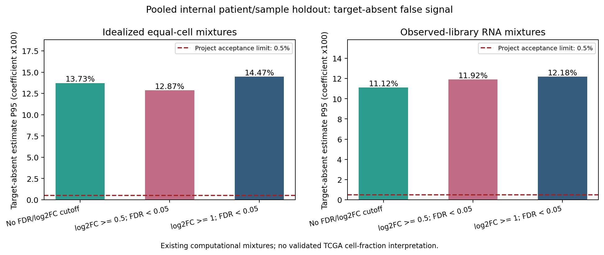
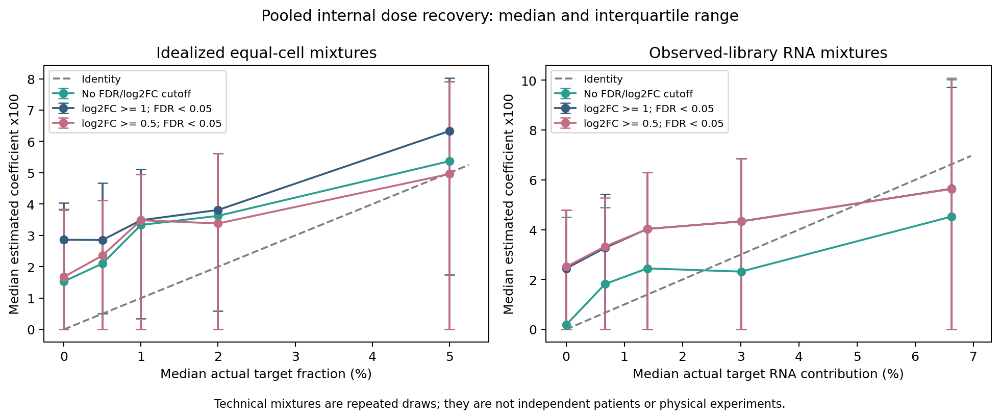

# 五主队列合并的PGAM5 RNA检出巨噬细胞注释与探索性参考

**RNA层面的逐细胞注释已完成；当前参考仍不能可靠推算TCGA-LIHC中的目标细胞比例。** 本轮按最新要求合并五个主队列，不要求蛋白证据、不要求跨队列复现，并将无FDR/log2FC硬阈值的连续排序设为主方案。两个原有差异筛选版本作为对照全部报告。

主方案的完整参考为两套各 **395基因×20组分**，其中包含PGAM5、巨噬谱系与竞争细胞标志，以及各50个候选状态特征。内部留出混合评估的目标缺失假信号P95为 **13.73%（理想等细胞）和11.12%（观测文库RNA贡献）**，未达到项目预设0.5%上限。取消FDR/log2FC硬阈值增加了候选基因，未使丰度恢复通过验证。

下载本目录的`PGAM5_RNA_identity_v8_results.zip`，在GitHub文件页面点击 **Download raw file**。ZIP包含逐细胞CSV、候选基因、参考、图表、代码及实际计算输入的审计例子；大型原始矩阵不在包中。

## 纳入范围与RNA注释

| 主队列 | 范围 | QC细胞 | 巨噬细胞 | PGAM5 RNA检出巨噬细胞 | 其中谱系标志共检出支持 |
|---|---|---:|---:|---:|---:|
| GSE151530 | HCC样本 | 44,776 | 3,493 | 161 | 161 |
| GSE149614 | 原发肿瘤，样本末尾T | 34,414 | 7,448 | 197 | 195 |
| GSE189903 | HCC核心和边缘 | 44,287 | 3,467 | 85 | 85 |
| GSE242889 | 全部5例HCC，不按MVI筛选 | 19,872 | 3,990 | 102 | 102 |
| GSE202642 | HCC库5–11 | 56,719 | 12,135 | 868 | 865 |
| **合计** | | **200,068** | **30,533** | **1,413** | **1,408** |

沿用独立于PGAM5的既往谱系身份、精确细胞ID及全部既定QC成员。PGAM5原始计数>0标注`Macrophage_PGAM5_RNA_detected`；0标注`Macrophage_PGAM5_RNA_undetected`。不依据候选基因分数把零计数改为阳性，保留所有巨噬细胞与增殖细胞，没有患者配对DE或深度匹配/回归。

谱系共检出支持的操作规则为8个核心基因CD68、CD163、CSF1R、C1QA/B/C、MERTK、MSR1中检出至少2个，且6个广谱髓系基因LST1、TYROBP、FCER1G、AIF1、SPI1、CTSS中检出至少1个。这是描述性证据，不是经过验证的谱系分类器或剔除规则。5个缺少该共检出组合的PGAM5检出巨噬细胞仍保留原标签。广谱髓系标志不能单独区分巨噬、单核和DC。

同时记录单核、DC/pDC、上皮/肝细胞、淋巴、增殖和应激标志的RNA检出数及表达分数。`other_lineage_RNA_review_flag`只是上皮/肝细胞或淋巴标志共检出的审查提示，不能据此诊断双细胞、环境RNA或改变谱系身份。该共检出现象在多个队列很常见，不能将提示数解释为已确认错误注释数。

五主队列还存在8,485个PGAM5检出的非巨噬细胞；这些细胞保持原谱系，进入竞争参考。额外导出GSE125449、GSE140228 Droplet与Smartseq2的HCC巨噬细胞、GSE146115的RNA注释；这些补充层不进入本轮五队列合并DE。GSE125449与GSE151530有重叠；GSE202642的7个库不是已确认7位独立患者；GSE140228排除CC；GSE154906保持取消。

## 候选参考基因如何筛选

主方案不使用FDR或log2FC硬阈值。训练巨噬细胞中先保留检出率≥10%的可测基因；PGAM5单独作为定义锚点，有限的周期/应激及MT/RPL/RPS基因不充当独立状态特征。按以下连续得分选取最多50个正得分候选：

`max(巨噬内部log2FC,0) × max(目标/最高非巨噬竞争参考log2比值,0) × 目标检出率`

目标/竞争比值用供者及队列平衡的平均表达，伪计数0.05。截取正方向及前50名是固定排序规则，没有最小效应量或显著性门槛。有限排除列表不证明已消除所有增殖、应激或技术影响。

P/FDR及log2FC仍保存在全基因证据表中，作为描述性证据。P值为log1p(CP10k)的双侧、渐近、连续性修正及并列值修正Mann–Whitney U检验；BH覆盖15,746个共同可测基因；log2FC为线性CP10k平均值之比，伪计数0.001。这是细胞层统计，不能替代患者重复或证明一个稳定生物学亚群。共同基因宇宙只使用可测性，未用留出表达选择特征。

全训练两套50基因候选共享45个，前列包括MSR1、CTSD、FABP5、CTSB、LGMN、CTSZ等。**50个候选不等同于PGAM5特异signature。** 全训练主候选均有FDR<0.05，但均未达到log2FC≥1；这说明原来的倍数门槛会淘汰它们，也说明显著P值不能保证反卷积区分能力。

PGAM5在完整参考中始终保留，典型巨噬标志也独立纳入，不要求它们满足巨噬内部差异门槛。单核、DC、肿瘤等竞争标志同时保留。`complete_primary_reference_gene_roles.csv`逐基因区分定义锚点、谱系/竞争证据、候选状态和广谱参考特征；一个基因可有多个角色，所有`validated_PGAM5_specific_marker`均为False。

对照版本使用FDR<0.05与log2FC≥1或≥0.5，同时沿用检出率及竞争区分规则；两档对照全训练的等细胞状态候选分别为0个和5个，观测文库RNA候选分别为0个和3个。它们均不是当前任务的必要条件。较早生成的整队列诊断文件保留历史，但不作为本轮接受门槛。

## 合并数据内部留出验证

按固定种子20261010，在每个主队列内部将约30%的供者/样本标签整体留出；所有谱系同时遵守同一标签划分。训练巨噬细胞24,876个，其中1,093个PGAM5检出；验证巨噬细胞5,657个，其中320个检出。GSE202642按库标签划分，并保持独立患者未确认标志。没有整队列留出要求，没有按患者配对DE。

所有用于验证的基因选择、表达参考及缩放均来自训练标签。参考保留RNA检出/未检出巨噬、增殖群、单核、DC/pDC、其他免疫、肿瘤/肝细胞、内皮/CAF和未知组分。每群至少50细胞及2供者/样本标签；弱支持的增殖群回退母群，其他弱群回退Unknown。RNA检出目标没有回退到未检出群。参考组内各队列等权、队列内可用供者等权。

复用既往实际细胞抽样混合物中属于留出标签的部分：每套单位494行，共494份对应细胞混合物、两套表达单位988行；三个固定版本共2,964行估计。标准剂量0、0.5%、1%、2%、5%各3次抽样，共120行/单位，覆盖8个供者/样本标签，其中6个已确认患者标签，另2个为GSE202642库代理。其他情形涵盖总巨噬比例变化、PGAM5检出非巨噬、增殖非巨噬及纯竞争细胞。

这些都是同一历史数据池中的计算抽样，重复抽样不增加独立患者数，也不是物理混合实验。原数据已经多轮探索，因此内部留出不能称为全新盲法外部验证。

求解器固定为robust FCLS：非负、系数和为1、ridge=0.001、3次Cauchy残差重加权，仅限制目标参考贡献的PGAM5不超过查询PGAM5。背景组分参与竞争但不受该目标RNA约束；没有使用已被拒绝的全部组分PGAM5总量约束。解算参数没有按本轮内部结果或TCGA预后挑选。

| 版本 | 单位 | 标准MAE（百分点） | Pearson r | 全部零目标P95（系数×100） |
|---|---|---:|---:|---:|
| **无FDR/log2FC硬阈值：主方案** | 理想等细胞 | **2.809** | **0.231** | **13.727%** |
| **无FDR/log2FC硬阈值：主方案** | 观测文库RNA贡献 | **3.457** | **0.266** | **11.119%** |
| log2FC≥0.5、FDR<0.05 | 理想等细胞 | 2.780 | 0.224 | 12.874% |
| log2FC≥0.5、FDR<0.05 | 观测文库RNA贡献 | 3.583 | 0.231 | 11.916% |
| log2FC≥1、FDR<0.05 | 理想等细胞 | 2.924 | 0.251 | 14.466% |
| log2FC≥1、FDR<0.05 | 观测文库RNA贡献 | 3.592 | 0.223 | 12.179% |

预设丰度门槛仍为MAE≤1百分点、r≥0.7、全部零目标P95≤0.5%、内部验证已确认患者≥3。本轮三个版本每套单位均只通过覆盖检查；主方案8项数值/覆盖检查有6项失败，全部版本24项有18项失败。没有使用蛋白、跨队列复现或硬FDR/log2FC门槛阻止参考接受；当前失败来自丰度恢复本身。





等细胞单位假设每细胞贡献被理想等化；观测文库RNA单位是捕获计数贡献，不是已测定的真实RNA量。两者均未完成TCGA bulk平台、基因长度/单位及细胞RNA量校准。输出不应称为已验证的TCGA细胞浸润比例。本轮没有重新生成TCGA患者丰度、分期或生存分析。

## 如何使用文件

| 文件 | 用途 |
|---|---|
| `GSE*_RNA_annotation.csv.gz` | 精确逐细胞RNA标签、谱系证据和候选分数；主队列为全QC范围，补充层仅巨噬细胞 |
| `annotation_coverage.csv` | 各数据层细胞数、目标数、谱系共检出支持 |
| `frozen_RNA_annotation_definition.json` | RNA标签及分数含义；不依据分数改变零计数标签 |
| `POOLED_ALL_TRAINING/continuous_rank/*candidate_state_genes.csv` | 两套50基因候选及其P/FDR、效应量和竞争表达 |
| 同目录`EXPLORATORY_reference_*.tsv`、`*_model.npz`、`*_row_scales.csv` | 最终395基因×20组分探索性参考及配套缩放 |
| `POOLED_INTERNAL_TRAINING/` | 完全排除验证标签的训练参考、真实计算查询及拟合审计案例 |
| `pooled_internal_validation_*.csv`、`pooled_internal_dose_recovery.csv` | 全部三个版本的恢复与未通过门槛 |
| `RNA_*template.tsv`、`validate_RNA_inputs.py` | RNA身份/已知混合物交接及计算；模板是空表，没有伪造实验数据 |
| `RNA_validation_handoff.md` | RNA验证与表达单位校准的交接说明，蛋白和跨队列不是条件 |

注释中的候选模块分数使用最终等细胞参考基因，计算每细胞平均log1p(CP10k)，并要求完整基因可测覆盖；缺少覆盖或没有候选基因时输出缺失值，不填0。最终全池分数包含训练细胞，只是描述性分数；不把它自身的组间差异当作独立验证。没有给分数设置新的“稳定亚群”阈值。

实际AnnData导入示例：

```bash
python attach_annotations.py \
  --input-h5ad your_HCC_cells.h5ad \
  --annotation-csv GSE151530_RNA_annotation.csv.gz \
  --output-h5ad your_HCC_cells_pgam5_RNA_v8.h5ad
```

默认按`obs_names`连接；编号位于obs字段时增加`--cell-id-column cell_id`。禁止重复/未匹配ID、已有v8字段以及覆盖原对象/已有输出。实际60个GSE149614细胞的反向顺序、任意obs名称例子已经检验RNA标签、候选分数、原计数与顺序。

Seurat可直接按原始精确ID读取CSV后回填元数据；本环境没有R，因此没有将R导入描述为已测试。不要去除样本条形码前缀，也不要仅按行顺序回填不同对象。

冻结参考的探索性拟合工具仅接受完整可测、与参考兼容的CP10k输入；归一化分母必须是完整文库，不是选中基因的计数和。未测基因不允许填零：

```bash
python fit_reference.py \
  --reference-dir POOLED_ALL_TRAINING/continuous_rank \
  --unit library_RNA_contribution \
  --expression-cp10k compatible_gene_by_sample_CP10k.tsv \
  --output-csv exploratory_RNA_coefficients.csv
```

该命令输出探索性系数，始终附带未经验证的细胞比例标志。CP10k、TPM及不同平台的read counts不能未经校准互换。

## 复核与完整重跑

Python及依赖版本见`environment.json`和`requirements.txt`。仅复核包内保存结果，无需大型原始矩阵：

```bash
python3 -m venv .venv
source .venv/bin/activate
python -m pip install -r requirements.txt
OPENBLAS_NUM_THREADS=1 python audit_results.py --saved-only
OPENBLAS_NUM_THREADS=1 python audit_pooled_reference.py --saved-only
MPLCONFIGDIR=/tmp/pgam5-matplotlib python plot_results.py
```

原始输入/注释审计271项及合并参考审计331项通过，共602项。审计包括原矩阵RNA与谱系核对、手工并列值校正秩检验、全基因BH、原始混合表达、训练边界、实际导入与便携求解。固定权重QP的KKT检查只验证IRLS最后一次凸子问题，不证明整个非凸重加权全局最优。**实现正确不等于丰度验证通过。**

完整重跑需准备[既往v5](../PGAM5_signature_optimization_v5/)的同一原始计数与缓存，并修改`protocol.json`的来源路径。依次运行：

```bash
OPENBLAS_NUM_THREADS=1 python analyze_RNA_identity.py
OPENBLAS_NUM_THREADS=1 python pooled_RNA_reference.py
OPENBLAS_NUM_THREADS=1 python score_annotations.py
OPENBLAS_NUM_THREADS=1 python prepare_validation_handoff.py
OPENBLAS_NUM_THREADS=1 python audit_results.py
OPENBLAS_NUM_THREADS=1 python audit_pooled_reference.py
MPLCONFIGDIR=/tmp/pgam5-matplotlib python plot_results.py
```

`run_continuous_reference.py`用于在本轮已有两档筛选结果之后追加主方案；新的完整重跑已在`pooled_RNA_reference.py`统一生成三版，无需再次追加。`--reuse-existing-DE`仅用于同一固定输入下修正保存格式后的重启，不应用于改变输入或细胞成员后的运行。

构建日期2026-10-10。输入路径和SHA256见`source_provenance.json`，包内校验见`MANIFEST_SHA256.csv`。ZIP校验信息在GitHub目录的[package_integrity.json](package_integrity.json)，置于ZIP外以避免循环哈希。
