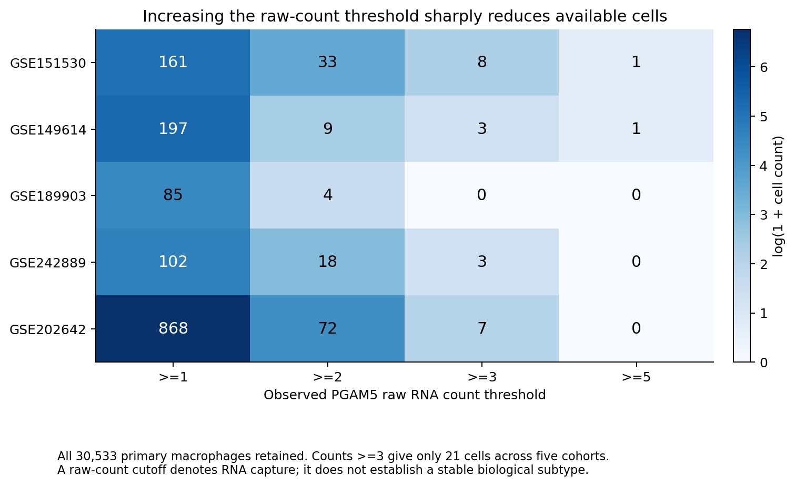
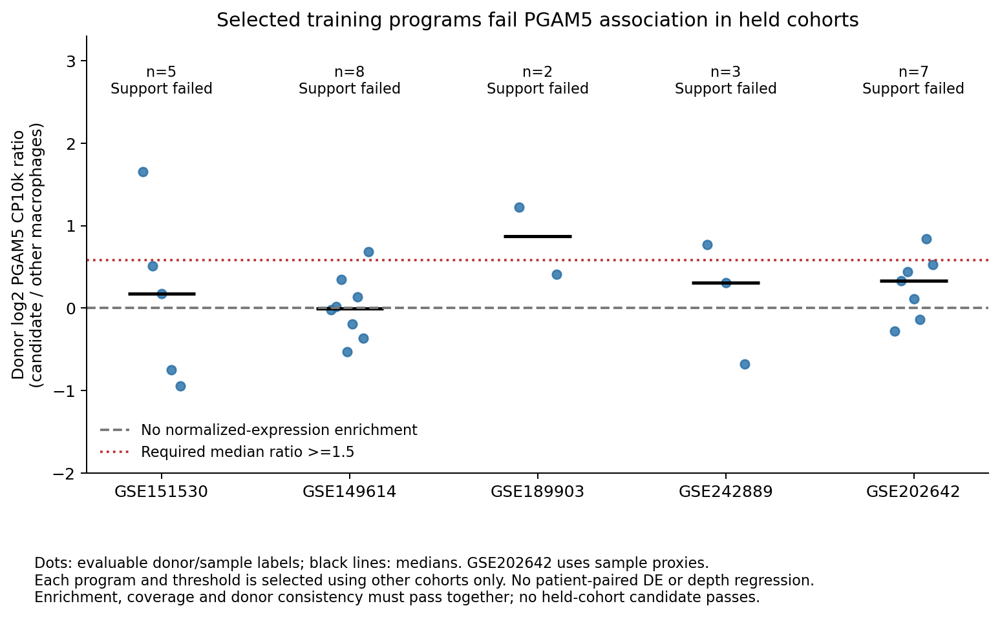
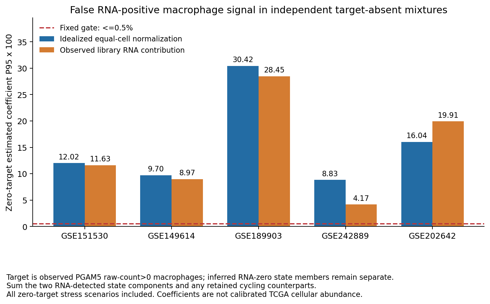

# PGAM5巨噬细胞逐细胞注释、表达程序发现和反卷积验证（v6）

**已完成可复现的“PGAM5 RNA检出巨噬细胞”注释，以及新的表达程序发现和完整竞争参考验证。当前仍未确立可用于可靠推算TCGA-LIHC中PGAM5⁺巨噬细胞丰度的细胞亚群和参考。**

五个主队列共30,533个巨噬细胞，1,413个PGAM5 RNA检出细胞。五个整队列留出的候选均未通过PGAM5关联标准；参考在目标缺失混合物中的假信号95分位为4.17%–30.42%，超过固定0.5%上限。60项计算门槛中50项失败。注释和探索性参考全部提供，但不能把其输出解释为已验证的真实细胞浸润比例。

下载本目录的`PGAM5_cell_annotation_v6_results.zip`，在GitHub文件页面点击 **Download raw file**，解压后查看CSV、PNG/PDF、参考、导入脚本和完整代码。本轮保留既往结果，未重新生成TCGA细胞丰度、分期或生存结果。

## 1. 纳入范围与可用注释

沿用既往独立于PGAM5的保守谱系注释及相同QC细胞成员，用精确`cell_id`连接原始计数。本轮重新核对了全部200,068个主队列细胞的PGAM5计数与谱系身份；没有因拟合效果改变巨噬细胞身份。保留巨噬细胞零值和增殖细胞，没有患者配对差异分析、深度匹配或深度协变量回归。

| 主队列 | 纳入范围 | QC细胞 | 巨噬细胞 | PGAM5 RNA检出巨噬细胞 |
|---|---|---:|---:|---:|
| GSE151530 | 既往限定的HCC样本 | 44,776 | 3,493 | 161 |
| GSE149614 | 原发肿瘤，末尾T | 34,414 | 7,448 | 197 |
| GSE189903 | HCC肿瘤核心和边缘 | 44,287 | 3,467 | 85 |
| GSE242889 | 全部5例HCC，不按MVI筛选 | 19,872 | 3,990 | 102 |
| GSE202642 | 库编号5–11，7个HCC肿瘤库 | 56,719 | 12,135 | 868 |
| **合计** | | **200,068** | **30,533** | **1,413** |

补充导出GSE125449、GSE140228的Droplet与Smartseq2 HCC分层、GSE146115的巨噬细胞注释，PGAM5检出数分别为4/298、54/2,223、62/531、17/141。GSE125449与GSE151530重叠，GSE140228不同技术层部分供者重叠，GSE146115为低支持C1 read counts；不能将这些分层计为独立主队列复现票。GSE140228不纳入CC细胞。GSE154906保持取消。

正式可复现的RNA标签是：

- `Macrophage_PGAM5_RNA_detected`：先确认巨噬细胞身份，符号汇总后的PGAM5原始计数>0。
- `Macrophage_PGAM5_RNA_undetected`：巨噬细胞中PGAM5计数为0，表示未检出；不等同蛋白阴性。
- `Not_macrophage`：其他谱系，即使PGAM5检出也不算目标巨噬细胞。

推断程序是另一组独立字段。`candidate_state_member`只记录算法阈值成员资格，候选状态统一标记为`Exploratory_REJECTED_PGAM5_program_candidate`。RNA未检出的候选成员仍标注RNA未检出，不能据此改为PGAM5阳性。所有细胞的`usable_for_validated_TCGA_PGAM5_cell_abundance=False`。

## 2. 原始计数阈值能否定义稳定亚群

| 队列 | ≥1 | ≥2 | ≥3 | ≥5 |
|---|---:|---:|---:|---:|
| GSE151530 | 161 | 33 | 8 | 1 |
| GSE149614 | 197 | 9 | 3 | 1 |
| GSE189903 | 85 | 4 | 0 | 0 |
| GSE242889 | 102 | 18 | 3 | 0 |
| GSE202642 | 868 | 72 | 7 | 0 |
| **合计** | **1,413** | **136** | **21** | **2** |

提高阈值到≥3只剩21个细胞，≥5只剩2个，无法提供充分的跨供者和跨队列复现。任意原始计数阈值都是RNA捕获规则，不能单独证明稳定亚群。`raw_count_threshold_sensitivity.csv`还记录供者覆盖及文库深度分布；这些描述没有用于深度回归。低于较高阈值但计数非零的细胞仍为RNA检出。



## 3. 新的表达程序发现与整队列验证

本轮在此前失败的PCA/Leiden亚群和v5差异基因参考之外，增加非负矩阵分解（NMF），允许多个表达程序叠加，并用固定程序NNLS投影标注细胞。方法与门槛见`protocol.json`。

每次完整留出一个主队列，其他四个队列发现程序；另有全部五个队列的最终探索性模型。仅训练数据用于选择1,000个特征、缩放、NMF程序、阈值和候选。每个训练供者至少30个巨噬细胞、最多随机抽取200个，最终发现模型使用6,507个训练细胞。供者抽样上限减轻大样本支配，但并非完全等供者权重。

特征要求训练检出率≥10%，按log1p(CP10k)变异度排序，排除PGAM5、所列119个周期基因、MT/RPL/RPS/免疫球蛋白和部分明确其他谱系背景。训练其他谱系最高均值超过巨噬细胞均值4倍的基因也排除。这些有限规则不代表排除了所有应激、周期或解离影响。PGAM5从程序发现中排除以避免验证定义自身，**在完整反卷积参考中始终保留**。

NMF主分析rank=8，Frobenius损失、coordinate descent、nndsvda初始化、tol=1e-4。输入为非负log1p(CP10k)/训练SD（SD下限0.1），上限10；CP10k以全部文库计数归一化。程序载荷L2归一化，细胞使用固定载荷的精确非负最小二乘投影。成员要求该程序为主导、激活值≥训练抽样细胞70分位、第一与第二程序的相对差≥0.05。

最初400次迭代上限产生收敛警告，在混合物结果生成前统一升至2,000次并重跑发现；这项数值修正未按生物学结果选择参数。最终20次主分析、bootstrap和rank敏感性拟合均收敛，最多995次，无收敛警告。

训练候选按通过关联门槛的队列数优先、其次PGAM5归一化供者均值比值中位数排序。需至少60%训练队列支持才算训练合格；没有合格者时仍保存排序最优的**已拒绝探索性候选**，用于诊断失败，不能据此宣称发现了目标亚群。

队列关联门槛同时要求：候选≥30细胞、其中PGAM5检出≥5细胞、≥3个可评估供者、候选/其他巨噬细胞检出率比≥1.5、供者PGAM5 CP10k均值比中位数≥1.5、≥70%供者正方向。供者可评估要求候选≥10、其他≥20、总PGAM5检出≥3；均值比加0.05伪计数。供者方向检查不是患者配对DE。

| 留出队列 | 候选细胞 | 其中PGAM5检出 | 可评估供者/样本标签 | PGAM5检出率比 | 供者CP10k比值中位数 | 关联门槛 |
|---|---:|---:|---:|---:|---:|---|
| GSE151530 | 171 | 9 | 5 | 1.150 | 1.127 | 未通过 |
| GSE149614 | 1,225 | 27 | 8 | 0.807 | 0.998 | 未通过 |
| GSE189903 | 147 | 4 | 2 | 1.115 | 1.831 | 未通过 |
| GSE242889 | 101 | 5 | 3 | 1.985 | 1.240 | 未通过 |
| GSE202642 | 4,036 | 338 | 7个样本代理 | 1.280 | 1.258 | 未通过 |

各折程序编号不代表同一个生物学亚群，不能把不同折的最优候选当成同一群直接合并。GSE202642的7个库尚未确认对应7位独立患者，不能认定独立患者覆盖通过。所列细胞层Fisher/BH p/q仅为描述性输出，细胞不是独立患者，不能以这些p值替代供者/队列复现。



全训练最终最优程序编号6，前15个载荷基因为CCL3、CCL4、IER3、JUN、EGR1、PPP1R15A、IER2、CCL4L2、CXCL2、FOSB、HSPA1B、CXCL8、CD83、ATF3、CXCL3，更接近趋化因子、即刻早期反应和应激表达组合。这是描述性提示，不能命名为PGAM5特异signature或据此推断PGAM5驱动功能。全训练该程序3,625个成员中只有99个PGAM5检出，0/5队列通过关联。rank=6或10时也没有程序得到跨队列合格支持。

每折进行两次供者内bootstrap，在相同特征和缩放基础上重拟合、Hungarian载荷余弦匹配；要求最小余弦≥0.8、最小成员Jaccard≥0.6。最终模型最小余弦0.879，但最小成员Jaccard仅0.428，成员稳定性未通过。两次条件bootstrap不是充分的不确定性估计，`bootstrap_membership_agreement`也不是后验概率。

## 4. 完整竞争参考与独立RNA检出真值验证

最终探索性参考为**628基因×24组分**。巨噬细胞按“原始PGAM5检出/未检出×候选程序/其他程序”拆分，并保留足够支持的增殖对应组分。竞争组分包括单核、DC/pDC、Mixed_APC、其他巨噬细胞、T/NK、B/浆细胞、肥大细胞、CAF、内皮、肿瘤/肝细胞代理、增殖群和Unknown。每群需≥50细胞和≥2供者标签，不足的增殖群回退对应母群，状态群优先回退同一RNA状态的其他群，其他不足群回退Unknown；没有将RNA未检出细胞并入RNA检出目标。

各队列等权，队列内各可用供者等权。训练参考特征为每活跃组分前25个广谱区分特征、候选NMF前30个载荷基因和PGAM5；这些不是独立FDR筛选通过的PGAM5特异signature。

两套单位分别为每细胞CP10k均值的`equalized_cell_fraction`和供者/群原始计数汇总后归一化的`library_RNA_contribution`。后者测量观测文库贡献，没有测定真实单细胞RNA含量或捕获效率。求解器固定沿用v5的robust FCLS（非负且和为1、ridge=0.001、3次Cauchy残差重加权），未用本轮留出结果挑选求解器。

重建并复用v5的同一批1,660个实际抽样混合物，每个2,000细胞、两套单位共3,320行；与原始标签逐项核对真值。包括标准0/0.5/1/2/5% RNA检出巨噬细胞、总巨噬细胞10/25/50%、PGAM5检出非巨噬细胞、增殖非巨噬细胞和纯竞争细胞压力情形。

主要目标`all_PGAM5_RNA`的真值为原始计数>0的巨噬细胞，估计为所有RNA检出参考组分系数之和。另报告`PGAM5_RNA_in_candidate_state`交集及`candidate_state_algorithm_label`程序成员诊断，共9,960行；后两者涉及本身推断的程序成员资格，不能当作独立生物学阳性标准，更不能以较好的程序恢复率证明PGAM5亚群成立。

| 留出队列 | 单位 | 标准MAE（百分点） | 标准Pearson r | 所有零目标情形P95（系数×100） |
|---|---|---:|---:|---:|
| GSE151530 | 理想等细胞 | 4.113 | 0.006 | 12.016 |
| GSE151530 | 观测文库RNA贡献 | 5.541 | 0.429 | 11.629 |
| GSE149614 | 理想等细胞 | 2.808 | 0.017 | 9.701 |
| GSE149614 | 观测文库RNA贡献 | 2.448 | -0.130 | 8.971 |
| GSE189903 | 理想等细胞 | 10.789 | 0.376 | 30.422 |
| GSE189903 | 观测文库RNA贡献 | 10.821 | 0.475 | 28.455 |
| GSE242889 | 理想等细胞 | 2.602 | 0.172 | 8.833 |
| GSE242889 | 观测文库RNA贡献 | 1.892 | 0.134 | 4.170 |
| GSE202642 | 理想等细胞 | 2.686 | -0.006 | 16.041 |
| GSE202642 | 观测文库RNA贡献 | 6.238 | 0.070 | 19.913 |

固定门槛为MAE≤1百分点、r≥0.7、所有目标缺失情形P95≤0.5%、独立标准验证患者≥3，再加训练支持、留出关联和bootstrap稳定性。本轮60项检查50项失败，没有任何队列/单位通过全部丰度门槛。GSE189903标准剂量合格供者仅2位；GSE202642仍为样本代理。重复抽样不增加独立患者数。



这些队列此前已经反复探索，本轮整队列留出控制训练泄漏，但不是全新盲法生物学验证，也不是前瞻性预注册。参考可供方法研究和失败诊断；**没有PGAM5蛋白阳性的独立身份标准、真实bulk平台匹配和细胞RNA单位校准，不能转换成TCGA细胞比例。** 既往探索性TCGA预后关联不能反向证明注释或参考成立。

## 5. 文件、核验及导入

| 文件 | 用途 |
|---|---|
| `ALL_PRIMARY_macrophage_annotation.csv.gz` | 五主队列30,533个巨噬细胞完整注释，按dataset和cell_id选择 |
| `GSE*_all_cell_annotation.csv.gz` | 每个主队列全部QC HCC细胞；推荐用于回填对象 |
| 补充队列`*_macrophage_annotation.csv.gz` | 对应补充巨噬细胞范围，不能回填未纳入的其他细胞 |
| `annotation_coverage.csv`、`annotation_data_dictionary.json` | 范围、细胞数及字段定义 |
| `ALL_TRAINING/definition.json`、`features.csv`、`program_loadings.tsv` | 冻结探索性程序、缩放和阈值 |
| 各折目录`EXPLORATORY_reference_*.tsv`、`*_row_scales.csv` | 两套探索性参考及必须配套的行缩放 |
| `reference_validation_summary.csv`、`validation_gates.csv`、`validation_result.json` | 恢复误差、假信号及未通过的门槛 |
| `source_provenance.json`、`MANIFEST_SHA256.csv` | 输入来源和结果文件校验 |
| `attach_annotations.py`、`attach_annotations.R` | AnnData/Seurat精确细胞编号连接 |

源数据及实现审计331项通过，包括全部主队列RNA计数/谱系、150个实际细胞的独立BVLS投影、训练边界、实际混合成员及结果汇总。便携保存结果审计171项通过。40个真实拟合输入的KKT检查只确认IRLS最后固定权重的凸子问题，不证明整个非凸迭代全局最优。**实现检查通过不等于生物学或反卷积验证通过。**

AnnData导入使用GSE149614的60个真实细胞（20个非巨噬、20个RNA检出巨噬、20个RNA未检出巨噬）测试：标签、候选成员、原始计数和顺序正确，未匹配编号会停止且不产生输出。Seurat脚本已提供，本环境没有R，未实际执行R导入。

建议使用Python 3.12（本轮3.12.14）。在解压目录安装依赖并复核保存结果，无需大型原始矩阵：

```bash
python3 -m venv .venv
source .venv/bin/activate
python -m pip install -r requirements.txt
OPENBLAS_NUM_THREADS=1 python audit_results.py --saved-only
OPENBLAS_NUM_THREADS=1 python check_import.py --saved-example
MPLCONFIGDIR=/tmp/pgam5-matplotlib python plot_results.py
```

回填自己的匹配HCC AnnData对象：

```bash
python attach_annotations.py \
  --input-h5ad your_HCC_object.h5ad \
  --annotation-csv GSE149614_all_cell_annotation.csv.gz \
  --output-h5ad your_HCC_object_pgam5_v6.h5ad
```

默认按`obs_names`连接；编号在obs字段时增加`--cell-id-column cell_id`。必须保留原始样本/条形码前缀，不能仅按裸条形码跨样本匹配。重复或未匹配编号会停止；脚本禁止覆盖原输入。新增字段以`pgam5_v6_`开头。

Seurat示例（需要R及SeuratObject）：

```r
source("attach_annotations.R")
object <- attach_pgam5_v6(object, "GSE151530_all_cell_annotation.csv.gz")
table(object$pgam5_v6_PGAM5_macrophage_annotation)
```

完整重跑需先准备v5的原始输入和缓存：`prepare_data.py`、`prepare_supplementary.py`和`make_mixtures.py`见[既往v5目录](../PGAM5_signature_optimization_v5/)。大型原始h5ad、全细胞计数缓存和全混合表达矩阵未打包；来源路径/哈希见`source_provenance.json`。修改`protocol.json`的`source_root`为实际v5缓存目录，再依次运行`discover_programs.py`、`validate_reference.py`、`export_annotations.py`、`audit_results.py`和`check_import.py`；需要相同原始成员、标签、基因汇总和顺序，不能用只含目标巨噬细胞的矩阵替代完整竞争背景。主程序使用共同可测的15,746个精确符号，补充投影只用实际可测特征，不将未测基因当0。复核脚本若被重新运行，会更新本地审计记录。

本轮构建时间为2026-10-10，用户报告时区Asia/Shanghai。运行版本见`environment.json`；ZIP完整性和SHA256见GitHub目录中的[package_integrity.json](package_integrity.json)，该记录置于ZIP外以避免循环哈希。

## 6. 达到TCGA丰度用途还缺少什么

下一步需要独立证明目标细胞的身份：在多个HCC患者中联合确认巨噬谱系和PGAM5蛋白/RNA，区分增殖、即时应激及其他髓系细胞表达；以此固定可重复目标群后再筛选多基因参考。随后在独立患者和已知比例的真实混合物中检验目标缺失假信号、剂量恢复及单核/DC/肿瘤竞争，并用匹配bulk平台及细胞RNA量校准细胞比例单位。当前数据支持RNA表达状态研究，不能仅靠提高原始计数阈值、扩大载荷基因列表或更换求解器保证这一用途。
