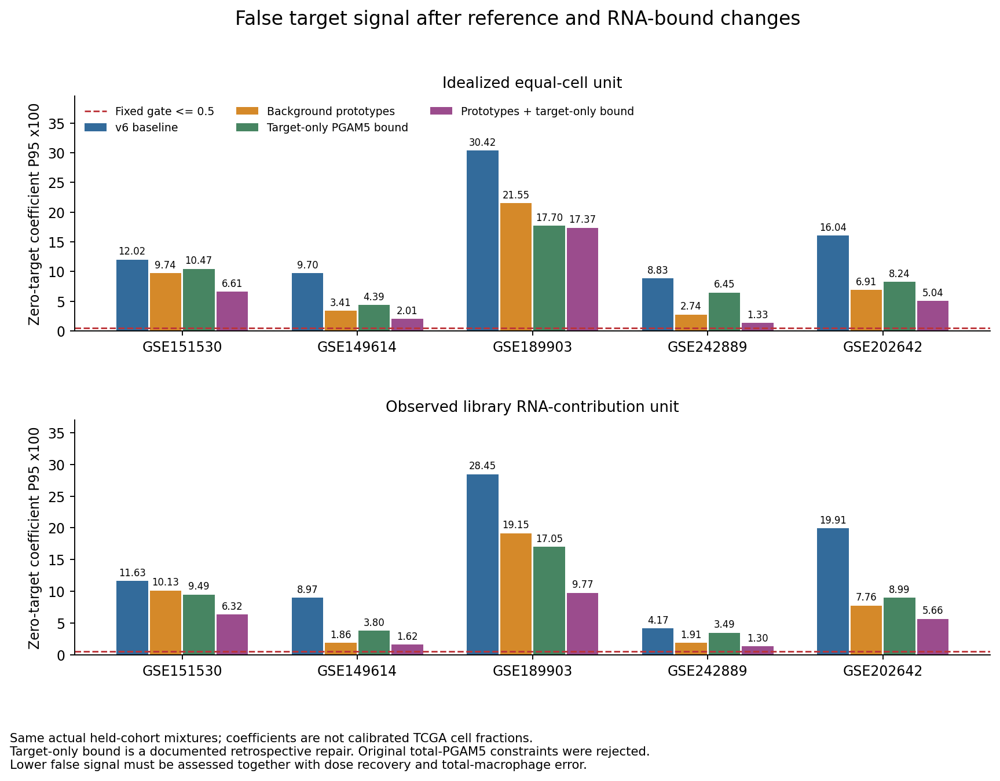
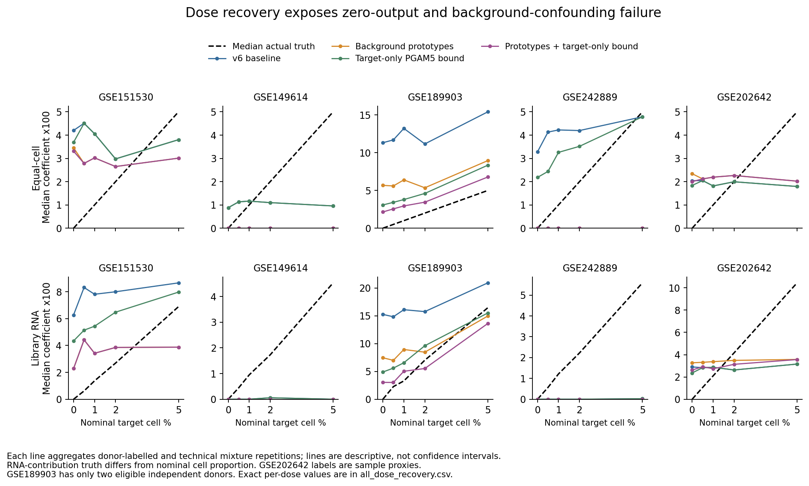
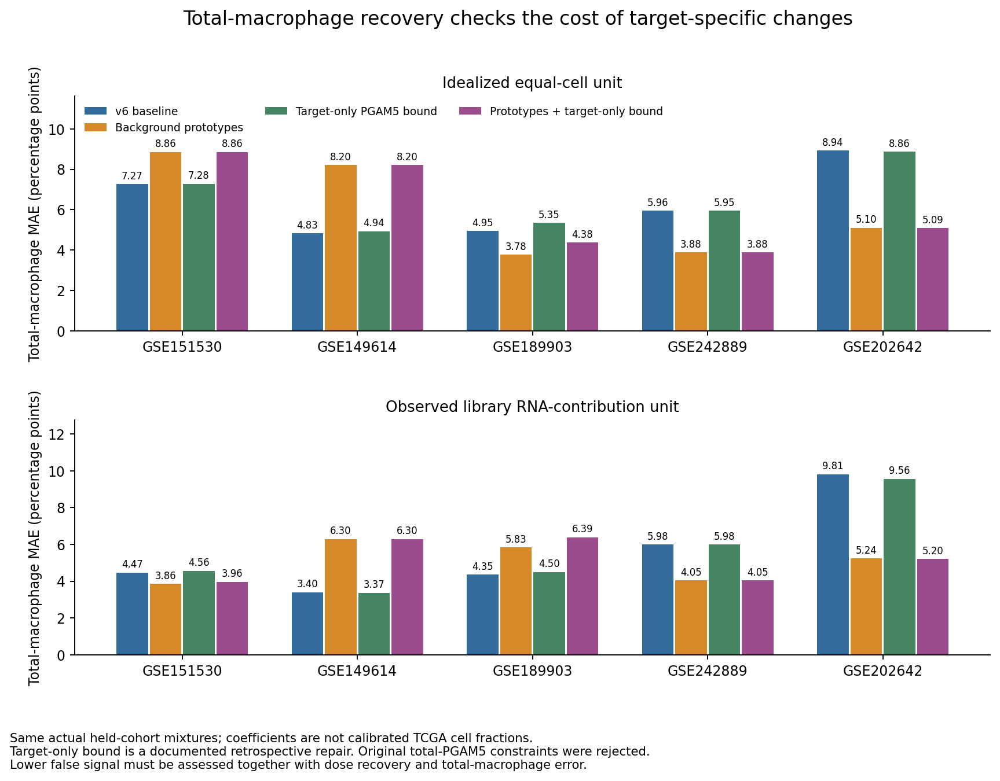

# PGAM5巨噬细胞参考优化与真实验证交接（v7）

**已完成竞争参考优化、RNA约束修正和整队列比较。目标假信号有所降低，但仍未获得可可靠用于TCGA-LIHC细胞丰度的PGAM5⁺巨噬细胞注释或signature。**

“供者背景原型+目标PGAM5贡献上限”在同一批混合物中的零目标假信号P95从v6的4.17%–30.42%降至1.30%–17.37%，仍全部高于固定0.5%门槛。标准剂量恢复也失败，部分真实5%目标混合物的中位估计仍接近0。因此，本轮计算改动是探索性方法结果，不能视为细胞丰度工具已经成立。

下载`PGAM5_reference_guard_optimization_v7_results.zip`，在GitHub文件页面点击 **Download raw file**。本目录保留全部方法的预测、参考、代码、图和失败诊断，以及可交给实验团队的身份验证、真实混合物方案和空白记录模板。

## 1. 本轮保留什么、优化什么

沿用[v6逐细胞注释](../PGAM5_cell_annotation_v6/README.md)：五个主队列GSE151530、GSE149614、GSE189903、GSE242889和GSE202642共200,068个QC细胞、30,533个巨噬细胞，1,413个PGAM5 RNA检出。巨噬细胞身份独立于PGAM5，检出为原始计数>0，计数0为未检出，不表示蛋白阴性。本轮没有把RNA未检出的程序成员改成阳性，没有重新用高阈值定义亚群，也没有创造蛋白真值。

保留用户原定HCC范围、全部巨噬细胞零值和增殖细胞，不做患者配对DE、深度匹配或深度协变量回归。GSE154906保持取消。原有RNA标签可以继续回填单细胞对象，v6发现的候选状态仍未通过验证；本轮不生成新的“稳定PGAM5细胞亚群”标签。

先复核v6压力情形：PGAM5未检出巨噬细胞及其增殖群是重要假信号来源，单核/DC、PGAM5检出非巨噬细胞也产生交叉信号。增加背景多样性和限制目标RNA贡献，旨在改善这些计算错误，不替代独立生物学身份验证。

## 2. 供者背景原型

保留v6各训练折完整参考、同一特征列表、行缩放和目标组分。使用v5实际供者/细胞群统计，在原始**非目标**fine group内部加入供者间差异的背景原型：

- 每个供者/群至少20个细胞，该群至少6个支持的供者表达谱。
- 对`log1p(供者表达谱/v6行缩放)`做加权KMeans；固定k=min(3,floor(供者谱数/3))，n_init=10，seed=20261010。
- 权重按该群可用队列等权、队列内供者等权；每个保留原型至少2个供者标签和50个细胞。
- 所有PGAM5 RNA检出巨噬细胞fine group均不得进入背景原型；其他巨噬、单核、DC、肿瘤等竞争群继续保留。

最终全训练参考仍为628个基因，等细胞单位增加35个原型至59个组分，文库RNA贡献单位增加36个原型至60个组分。原型是干扰表达参考，不是新的细胞亚群；两套单位聚类不同，所以原型编号不可跨单位当作同一生物学群。新增原型没有筛出新的FDR合格PGAM5特异基因，628基因也不能称为已验证的PGAM5⁺signature。

## 3. RNA约束及明确记录的修正

最初固定比较四种配置：v6原方法、PGAM5总量约束、仅背景原型、背景原型+总量约束。求解器沿用非负、系数和为1的robust FCLS，ridge=0.001、3次Cauchy重加权，特征和参数不按留出效果调整。

总量约束要求所有参考组分预测PGAM5之和不超过查询实际PGAM5。结果发现这个假设过强：PGAM5=0的非巨噬混合物会被迫使用PGAM5=0的巨噬参考，部分纯非巨噬情形总巨噬估计达到100%。**这两种总量约束配置被拒绝；它们的较低目标误差不能作为成功结果。** 全部初版结果保留在`heldout_predictions.csv.gz`及`validation_summary.csv`。

随后只修正约束对象，固定比较两个追加配置：仅目标RNA上限、背景原型+目标RNA上限。修正为：

`sum(目标组分系数 × 对应参考PGAM5表达) ≤ 查询PGAM5表达`

只约束RNA检出巨噬细胞目标的PGAM5贡献，其他竞争组分继续正常拟合，不因查询PGAM5为0被强制排除。查询PGAM5为0时，将目标系数固定0；这只是RNA观测与参考单位可比前提下的必要约束，不说明患者没有PGAM5蛋白阳性细胞。

这一修正是在看到初版结果后做的，时间和理由见`diagnostic_amendment.json`、`amendment_provenance.json`；不是新的盲法验证。没有将修正后结果包装成预先未见数据上的成功，也没有继续在这些队列上挑选阈值直到通过。

## 4. 同一混合物上的结果和代价

复用v5/v6同一批1,660个实际抽样混合物，两种表达单位共3,320个查询；六种配置共19,920行预测。每次完整留出一个队列，其表达不用于创建该折背景原型。数据之前已多次探索，整队列留出减少训练泄漏，但不能称为新的独立生物学复现。

主要真值仍是原始RNA检出巨噬细胞；不把推断程序成员当作独立阳性真值。所有零目标压力情形包括标准零目标、纯竞争群、PGAM5高表达非巨噬及增殖非巨噬背景。表中“优化”固定指供者背景原型+目标RNA上限，系数×100不是临床细胞百分比。

| 队列 | 单位 | v6零目标P95 | 优化后零目标P95 | 优化后标准MAE（百分点） | 优化后标准r |
|---|---|---:|---:|---:|---:|
| GSE151530 | 理想等细胞 | 12.016 | 6.615 | 3.152 | 0.017 |
| GSE151530 | 文库RNA贡献 | 11.629 | 6.320 | 3.005 | 0.398 |
| GSE149614 | 理想等细胞 | 9.701 | 2.008 | 1.655 | 0.061 |
| GSE149614 | 文库RNA贡献 | 8.971 | 1.624 | 1.574 | -0.027 |
| GSE189903 | 理想等细胞 | 30.422 | 17.368 | 1.952 | 0.781 |
| GSE189903 | 文库RNA贡献 | 28.455 | 9.769 | 4.960 | 0.637 |
| GSE242889 | 理想等细胞 | 8.833 | 1.329 | 1.526 | 0.187 |
| GSE242889 | 文库RNA贡献 | 4.170 | 1.304 | 1.892 | -0.037 |
| GSE202642 | 理想等细胞 | 16.041 | 5.036 | 1.676 | 0.085 |
| GSE202642 | 文库RNA贡献 | 19.913 | 5.659 | 3.032 | 0.155 |

固定要求仍为标准MAE≤1百分点、r≥0.7、所有零目标P95≤0.5%、独立标准供者≥3。优化组合40项恢复/覆盖门槛中33项失败，没有一个队列/单位通过完整要求。GSE189903只有2个标准验证合格供者，不能仅凭r=0.781认定通过；GSE202642的7个库仍是样本代理，不能证明7位独立患者。



**剂量恢复不能忽略。** 在理想等细胞单位、实际目标5%的标准混合物中，优化组合的中位目标系数×100在GSE149614和GSE242889均接近0；超过0.5%诊断阈值的混合物分别只有37.0%和20.0%。此阈值仅用于描述，不是已校准的临床检出界值。不能因为零目标假信号降低，就接受一个会漏掉真实目标的模型。



总巨噬细胞恢复也并非一致变好。例如GSE149614等细胞标准MAE从4.83增至8.20百分点，而GSE202642从8.94降至5.09。残差下降也不证明细胞身份成立，模型可以用更多干扰参考吸收真实目标。完整代价见`lineage_residual_tradeoffs.csv`和`changes_vs_v6.csv`。



另提供有/无PGAM5特征的参考列非负锥几何诊断。列之间存在表达差异不意味着能稳定区分独立患者中的真实亚群；锥系数不要求和为1，不能把这一残差当作细胞丰度精度或独立分类准确率。

## 5. 验证结论和可执行交接

当前没有独立PGAM5蛋白/RNA联合谱系身份真值，没有真实已知细胞比例混合物结果，也没有TCGA平台及细胞RNA单位校准。v6的候选状态关联失败仍然成立。所有新预测的`usable_as_cellular_abundance=False`，本轮未将失败参考重新用于TCGA真实细胞丰度、分期或生存结论。

已将缺少的验证步骤具体化为[实验验证方案](experimental_validation_plan.md)，包括：

1. 独立患者探索/验证集合，联合巨噬谱系、PGAM5蛋白/RNA、增殖及应激证据；控制单核/DC、肿瘤和细胞混合。
2. 验证抗体、背景和锁定阈值，确认是离散稳定群还是连续表达状态；PGAM5为胞内蛋白，不能默认用普通活细胞表面分选得到可靠真值。
3. 0/0.5/1/2/5%物理混合物、不同总巨噬比例及竞争群压力测试，记录实际细胞数量和分选纯度。
4. 匹配bulk平台，测量细胞RNA贡献并校准细胞比例单位，独立验证通过后再进入TCGA。

配套三个TSV仅含表头：`sample_validation_template.tsv`、`cell_identity_template.tsv`、`physical_mixture_template.tsv`。它们是待填写交接模板，**不是已完成实验的数据**。如果独立身份验证显示连续梯度，应报告PGAM5相关状态分数，并与总巨噬细胞丰度分开；不能强行命名二分类亚群。

## 6. 可复现文件与核验

| 文件 | 用途 |
|---|---|
| `protocol.json`、`diagnostic_amendment.json` | 初始固定方案及诊断后修正时点 |
| `all_predictions.csv.gz`、`all_validation_summary.csv` | 六种方法完整比较 |
| `all_validation_gates.csv`、`validation_result.json` | 未通过的门槛及解释限制 |
| `all_dose_recovery.csv`、`lineage_residual_tradeoffs.csv` | 各剂量、总巨噬及残差代价 |
| `ALL_TRAINING/EXPLORATORY_augmented_reference_*.tsv` | 最终两套探索性参考 |
| 各折`*_model.npz`、`*_prototype_membership.csv` | 同一缩放基准、原型成员及训练边界 |
| `fit_case_*.npz` | 120个实际查询、权重和系数；配套模型矩阵以路径及SHA256精确链接，避免重复下载 |
| `source_provenance.json`、`MANIFEST_SHA256.csv` | 输入来源及结果校验 |

实际源数据核查747项通过，保存结果核查341项通过：包括全部3,320个v6目标系数复现、真值不变、训练边界、实际供者原型重算、重要汇总独立复算、RNA约束及120个实际QP结果的KKT证书。KKT只确认最后固定权重的凸子问题；不证明整个重加权过程全局最优，**也不等于生物学验证通过**。所有PNG已检查显示。

建议Python 3.12；运行版本见`environment.json`。不需大型计数矩阵的保存结果检查：

```bash
python3 -m venv .venv
source .venv/bin/activate
python -m pip install -r requirements.txt
OPENBLAS_NUM_THREADS=1 python audit_results.py --saved-only
MPLCONFIGDIR=/tmp/pgam5-matplotlib python plot_results.py
```

完整重跑需v5供者/群统计、同一混合表达缓存及v6各折参考/真值；原始大矩阵和v5完整混合缓存不放入ZIP。先按既往v5说明准备相同输入，修改`protocol.json`中的`source_root`和`v6_root`，然后依次执行：

```bash
OPENBLAS_NUM_THREADS=1 OMP_NUM_THREADS=1 python optimize_reference.py
OPENBLAS_NUM_THREADS=1 OMP_NUM_THREADS=1 python run_target_budget.py
OPENBLAS_NUM_THREADS=1 python summarize_tradeoffs.py
OPENBLAS_NUM_THREADS=1 python audit_results.py
MPLCONFIGDIR=/tmp/pgam5-matplotlib python plot_results.py
```

重跑会覆盖本地同名计算结果，建议使用新目录。大输入的路径和哈希有记录，不能用只有目标细胞的参考替代完整竞争背景。重跑审计会更新本地审计记录。

报告日期2026-10-10，用户报告时区Asia/Shanghai。ZIP校验记录[package_integrity.json](package_integrity.json)放在GitHub目录、ZIP外，避免循环哈希。
