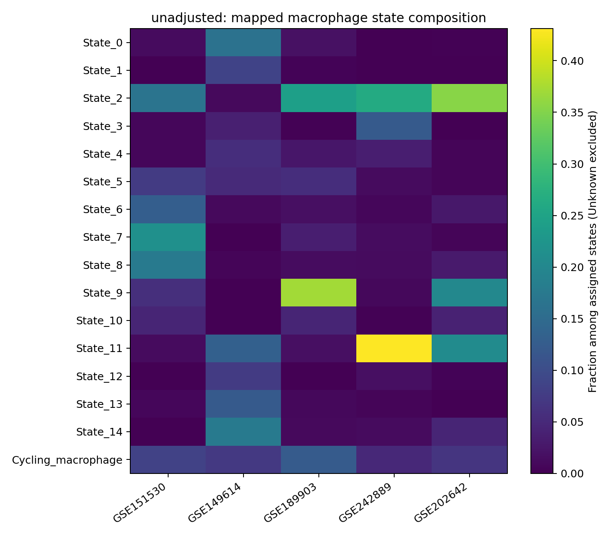
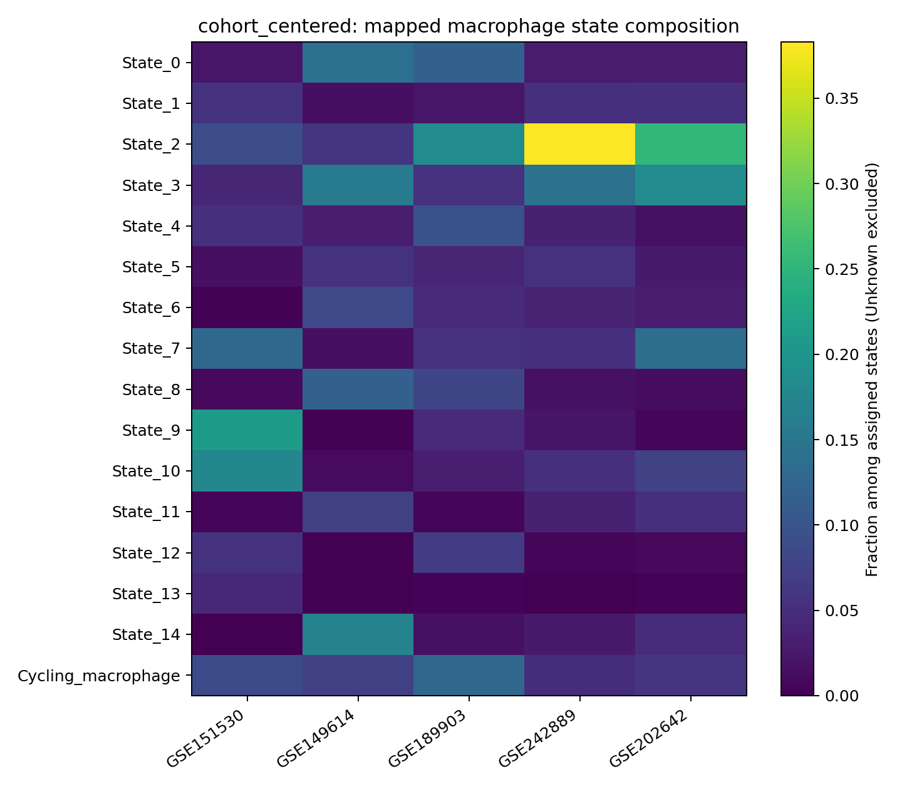
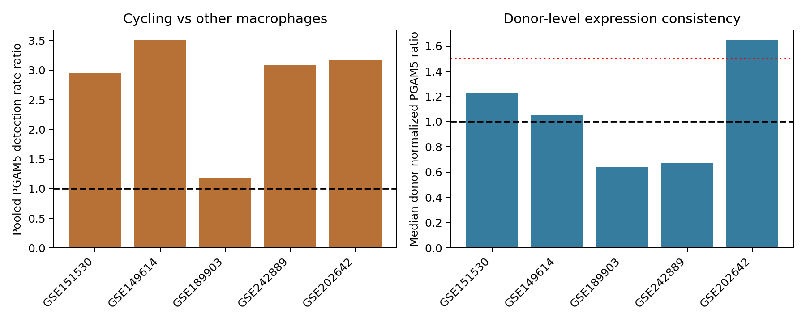

# 重新寻找可重复的PGAM5相关巨噬细胞状态

**结论：本轮未能从五个主要HCC数据集中确立跨队列稳定的PGAM5相关巨噬细胞亚群。可重复识别“增殖巨噬细胞”，但其PGAM5关联并不跨队列稳定，不能把它命名为已验证PGAM5特异群。**

## 完成的分析

纳入30,533个标记一致的巨噬细胞。GSE151530/GSE149614作为发现队列，GSE189903/GSE242889用于主要外部复测，GSE202642作为样本代理的补充证据。其余此前数据集未纳入这轮主检验（部分目标阳性过少或范围/技术不同）；取消的GSE154906未重启。

| 数据集 | 巨噬细胞 | PGAM5检出细胞 | 供者编号单位 |
|---|---:|---:|---:|
| GSE151530 | 3493 | 161 | 20 |
| GSE149614 | 7448 | 197 | 10 |
| GSE189903 | 3467 | 85 | 4 |
| GSE242889 | 3990 | 102 | 5 |
| GSE202642 | 12135 | 868 | 7 |

151530/149614/189903沿用上一轮统一谱系注释。242889/202642对原有推断巨噬细胞候选重新聚类并按相同保守标记规则筛选；分别从4891保留3990、从12907保留12135细胞。未强制纳入单核/DC样细胞。GSE202642的7个样本标签不是已核实的7位独立患者，不能视为患者独立验证。所有队列此前都被探索过，因此不是前瞻性盲法研究。

## 定义与验证规则

不先按PGAM5是否检出来分群。使用训练队列的非增殖巨噬细胞、每位供者最多200细胞的固定抽样、1000个训练表达特征、PCA和Leiden分群；PGAM5以及所列细胞周期基因不参与非增殖亚群特征构建。保留核编码代谢基因，去除明确肝细胞/Ig/其他谱系背景及强非巨噬细胞背景，不能因此认定环境RNA或双细胞已纠正。没有测序深度匹配/协变量，没有患者配对DE；原有严格DE表未更改。

另以固定规则识别增殖巨噬细胞：MKI67/TOP2A/UBE2C/CENPF/CDK1/BIRC5中至少2个原始计数>0，定义不含PGAM5。RNA状态定义不等于蛋白/功能状态。

非增殖亚群的固定特征、标准化参数、PCA载荷、分类质心和拒绝不确定细胞的阈值全部导出，供复现。细胞只投影到预先锁定的定义，未根据外部PGAM5结果改标签或切点。

选定PGAM5相关候选要求两个发现队列均有>=30群细胞、>=5群内PGAM5检出、>=3可评估供者；每位供者要求群内>=10、群外>=20、总PGAM5检出>=3；总体检出率比>=1.5、供者中位归一化PGAM5表达比>=1.5、>=70%供者方向一致、分群映射覆盖>=70%。非增殖群还需两随机种子最佳匹配Jaccard>=.6。达到发现要求后才可进入已选候选的主要外部确认。阈值是本轮预先记录的研究标准，不是通用生物学定律。

Fisher/BH仅作为细胞层面的描述性统计；同一患者细胞不独立，显著p不能替代供者一致性与外部重复。描述性标记清单按训练均值差异排序，不是新FDR合格DE signature。

## 亚群重现与队列差异

原始表达空间得到15个非增殖算法亚群，随机种子重复ARI约0.90，但很多群主要来自某一发现队列。技术上的分群稳定并不等于生物学或PGAM5关联稳定。追加队列中心校准敏感性分析，保持发现/关联门槛不变，仍未选出同时满足两个发现队列要求的候选。

追加校准以PGAM5以外特征的供者平衡均值去除队列中心差异，查询队列也使用无PGAM5的非增殖细胞表达做无监督中心校准。因此该敏感性不是严格归纳式盲法外部验证，也可能去掉真实队列生物学差异；没有把它包装为独立确认。两个方案的State编号分别定义，不能直接按编号视为同一生物群。

## 增殖群的PGAM5证据

| 数据集 | 增殖巨噬细胞 | 其中PGAM5检出 | 总体检出率比 | 可评估供者/样本 | 供者中位归一化PGAM5表达比 | 表达富集方向一致率 |
|---|---:|---:|---:|---:|---:|---:|
| GSE151530 | 291 | 34 | 2.95 | 4 | 1.22 | 75% |
| GSE149614 | 520 | 41 | 3.50 | 7 | 1.05 | 57% |
| GSE189903 | 390 | 11 | 1.17 | 4 | 0.64 | 0% |
| GSE242889 | 180 | 13 | 3.09 | 4 | 0.68 | 25% |
| GSE202642 | 649 | 132 | 3.17 | 7 | 1.64 | 100% |

检出率较高并不等于每位患者的归一化PGAM5表达都较高。GSE202642的增殖巨噬细胞在7个样本代理中方向一致，可作为该队列内的研究候选；GSE189903/GSE242889未重现同样的表达富集，不能推广为通用PGAM5相关HCC巨噬细胞群。未进行深度控制，相关检出差异可能仍受测序/细胞RNA量影响。

## 可用输出与下一步

- *_macrophage_state_metadata.csv.gz：逐细胞原始PGAM5、归一化表达、状态、投影距离及置信边界。
- state_PGAM5_association_by_cohort/donor.csv：全部亚群结果与患者覆盖，包含未通过项。
- locked_state_classifier.json、PCA_gene_loadings.tsv：可复现的算法定义，尚非PGAM5特异参考。
- training_state_descriptive_markers.csv：训练群的描述性表达标记。
- EXPLORATORY_Cycling_macrophage_definition.json、cycling_macrophage_PGAM5_evidence.csv：增殖候选定义和跨队列证据。
- additional_cohort_macrophage_marker_QA.csv：新增队列的巨噬细胞身份检查。
- independent_cell_label_reconstruction.csv、independent_donor_ratio_checks.csv：原始计数独立复核。

本轮不生成PGAM5特异bulk反卷积参考，也不据此重新解释已有TCGA生存评分为浸润丰度。下一步应以PGAM5蛋白联合巨噬细胞标记（如CD68/CSF1R），并加入MKI67等增殖标记，在独立HCC组织中检验这个候选；若目标是PGAM5活性状态，还需要功能证据，RNA表达本身不足。只有有明确生物学锚点后，才适合继续训练特异参考。

复现：核心输入为上一轮三个harmonized_counts_QC.h5ad及此前GSE242889/GSE202642的macrophage_counts_QC.h5ad。先prepare_additional_macrophages.py，再discover_validate_states.py和discover_cohort_centered_states.py，最后audit_and_report.py。默认路径位于/workspace/scratch，复现机器需调整。大型h5ad不随包发布。环境版本、输入哈希、细胞周期/背景排除清单均保留。

细胞周期排除清单的来源记录于cell_cycle_provenance.json，为有限S/G2M列表及明确列出的扩展，不是完整GO/MSigDB本体。原方案仅共同基因是否存在参考了五个输入的基因目录；特征排序、PCA和质心使用发现队列，未以外部PGAM5结果调参。requirements.txt记录本次版本（Python 3.12.14）。原始/上游大型计数文件必须另行取得；这个下载包包含结果和代码，不包含完整原始表达矩阵。
