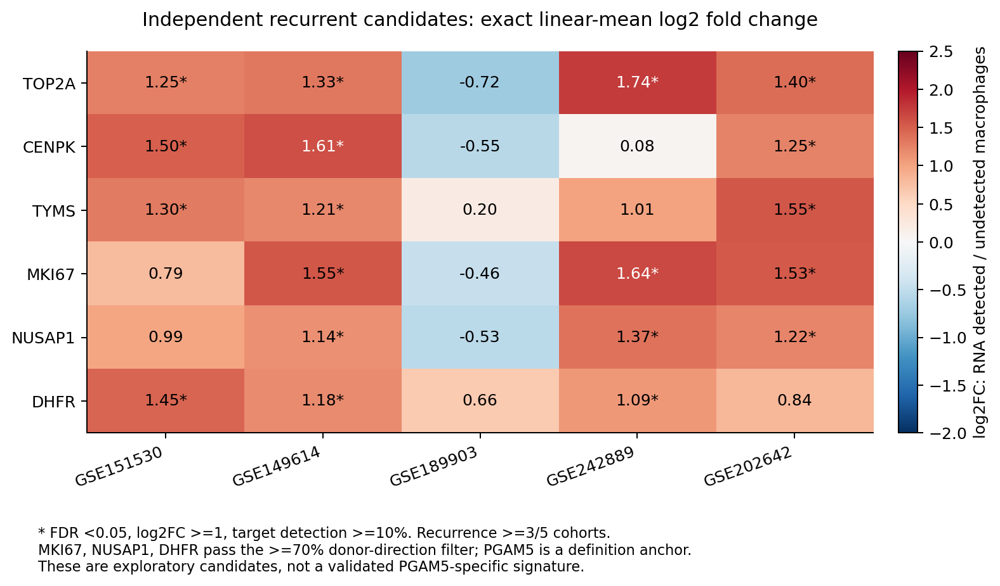
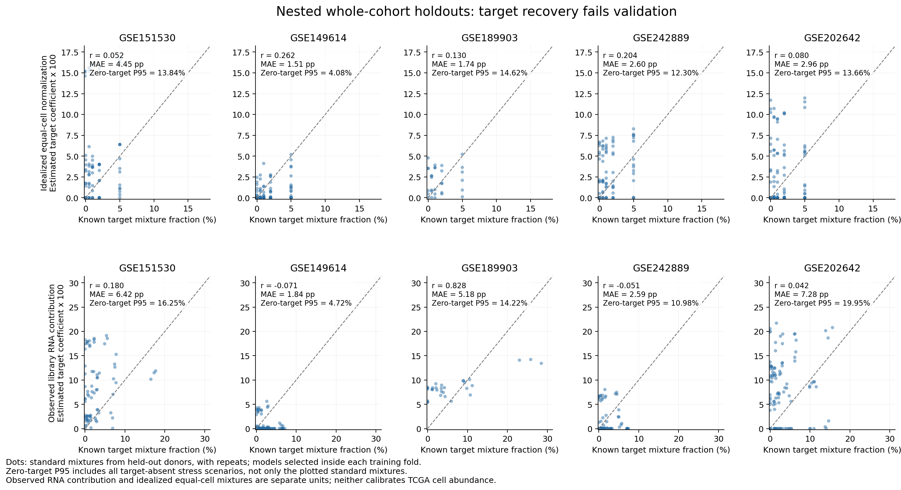
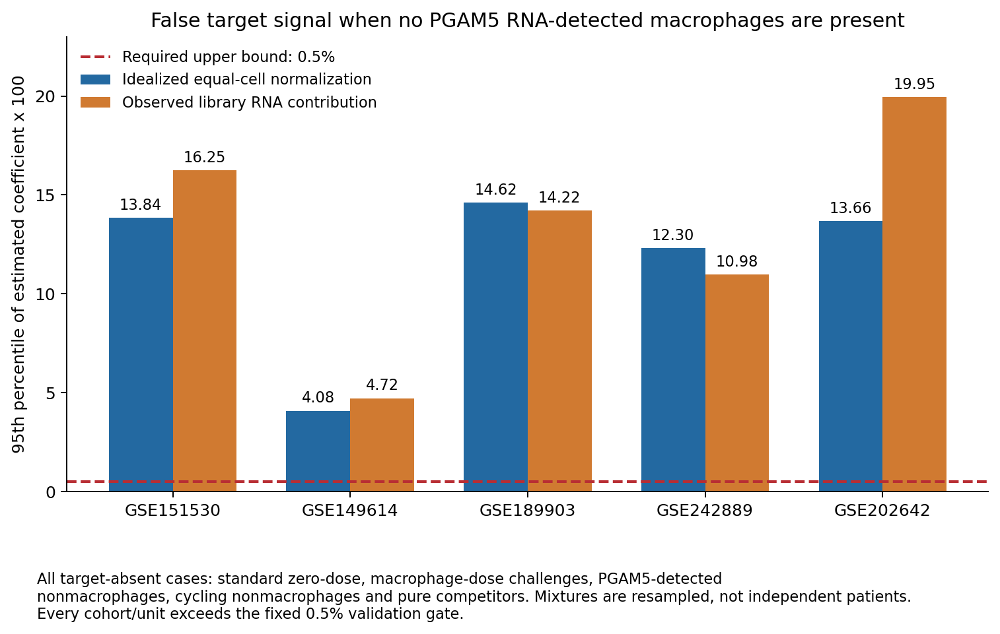
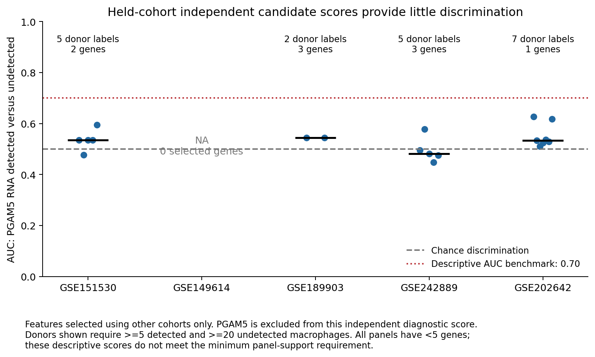

# 多队列PGAM5 RNA检出巨噬细胞signature优化与TCGA试算（v5）

**已完成重新筛选、竞争参考重建、嵌套队列验证和371例TCGA-LIHC试算。当前仍未获得可可靠推算PGAM5⁺巨噬细胞丰度的signature。** PGAM5已纳入反卷积参考；其余最终候选为MKI67、NUSAP1、DHFR。这些基因只有探索性状态证据，不能据此把增殖或代谢信号命名为PGAM5特异细胞群。

追加的[TCGA生存报告](survival_exploratory/README.md)已完成：中位数高系数组OS/PFI的log-rank p=0.006834/0.013685；调整后的连续系数与OS关联获支持，与PFI关联未获支持。这些统计关联不能替代细胞丰度验证。

本轮所有结果保存在新目录，既往差异分析、生存分析和分期分析文件保留。下载`PGAM5_signature_optimization_v5_results.zip`后解压即可查看CSV、PNG/PDF、参考及代码；GitHub ZIP页面点击 **Download raw file**。

## 1. 数据范围和注释定义

先沿用PGAM5以外的保守谱系标记确认巨噬细胞，再以符号合并后的PGAM5原始计数>0标注“RNA检出”；计数0为“未检出”，不能解释为蛋白阴性。沿用v4逐细胞注释的细胞成员，以cell_id精确连接原始计数，不改变细胞身份以改善拟合。保留全部巨噬细胞零值和增殖细胞。没有患者配对DE、测序深度匹配或深度协变量回归。

| 主队列 | 纳入范围 | QC细胞 | 巨噬细胞 | PGAM5 RNA检出巨噬细胞 | 标准剂量验证合格供者/样本标签 |
|---|---|---:|---:|---:|---:|
| GSE151530 | 既往限定的HCC样本 | 44,776 | 3,493 | 161 | 5 |
| GSE149614 | 原发肿瘤，末尾T | 34,414 | 7,448 | 197 | 9 |
| GSE189903 | HCC肿瘤核心和边缘 | 44,287 | 3,467 | 85 | 2 |
| GSE242889 | 全部5例HCC，不按MVI筛选 | 19,872 | 3,990 | 102 | 5 |
| GSE202642 | 末尾库编号5–11，7个HCC肿瘤库 | 56,719 | 12,135 | 868 | 7个样本代理 |
| **合计** | | **200,068** | **30,533** | **1,413** | **28个标签** |

GSE202642的7个样本不等于已确认7位独立患者，独立患者覆盖门槛因此不能认定通过。GSE151530全部QC细胞有25个供者标签，其中20个有巨噬细胞；标准剂量验证只有5个标签足够。资格和所有标签覆盖详见`validation_donor_coverage.csv`。50个供者/样本标签参与至少一种压力测试，不能把抽样重复计为独立患者。

补充证据涵盖其他既往分析数据，分开处理平台、重叠和低支持：

| 补充数据 | HCC巨噬细胞 | PGAM5检出 | 作用和限制 |
|---|---:|---:|---|
| GSE125449 | 298 | 4 | 与GSE151530重叠，不作为独立复现票；目标细胞很少 |
| GSE140228 Droplet | 2,223 | 54 | 仅HCC；排除旧缓存中的285个CC细胞；4个供者 |
| GSE140228 Smartseq2 | 531 | 62 | HCC；read counts；6个供者标签，部分与Droplet重叠 |
| GSE146115 | 141 | 17 | C1 read counts，巨噬细胞由标记推断，支持有限 |

主分析5队列加补充3个数据集，共8个数据集、9个技术/范围分层。GSE154906按用户要求保持取消。GSE125449和GSE146115的补充严格上调结果均没有基因同时通过检出频率Fisher检验的FDR<0.05，不能仅用极少目标细胞下的渐近p值形成可靠参考。

## 2. 筛选和参考如何优化

以5个主队列均可测的15,746个精确基因符号为共同检验空间；重复符号先汇总原始计数。共同可测性只用于确定可用变量，不利用留出队列的表达差异或临床结局选择特征。

每个队列内，将所有PGAM5检出巨噬细胞与所有未检出巨噬细胞汇总比较。检验使用log1p(CP10k)上的双侧Mann–Whitney U，处理秩并列及连续性校正，按每队列共同基因全集进行BH校正。全体均为0的基因设p=1；`constant_zero_test_handling.json`记录了相应基因数。效应量使用**线性CP10k算术均值**的精确比值：

`log2FC = log2((mean_positive + 0.001)/(mean_undetected + 0.001))`

上调候选要求FDR<0.05、log2FC≥1及目标检出频率≥10%。这里使用线性均值比值，与旧分析中可能采用的log表达均值反变换近似FC不同，所以本轮候选数不应当作旧表的直接复制。下调基因不进入正向signature。

候选需在至少60%的训练队列严格上调（最终5队列需≥3个），再要求至少70%的合格供者标签呈正向效应；合格标签至少有5个检出和20个未检出巨噬细胞。供者方向检查是稳定性验证，**没有做患者配对差异检验**。PGAM5强制纳入参考作为定义锚点，但不作为独立验证成功的证据，独立候选不含MT-/RPL/RPS基因。

竞争参考覆盖单核、DC/pDC、Mixed_APC、其他巨噬细胞、B/浆细胞、T/NK、肥大细胞、内皮、CAF、肿瘤/肝细胞代理、增殖群和Unknown_other。每个参考群至少50个细胞、2个供者标签；不足的增殖群回退到对应母群，其他不足群回退Unknown。未知细胞一直保留。各队列等权，然后各队列内可用供者等权，避免大队列完全支配参考。

同时构建两套丰度单位：

- `equalized_cell_fraction`：每细胞CP10k均值，用于理想化等细胞混合检验。
- `library_RNA_contribution`：供者/群原始计数汇总后按全部文库计数归一化，用于观测RNA计数贡献检验。

这两种真值不是同一个量。第二种没有测定真实单细胞RNA含量、捕获效率或bulk长度效应；不能换算成临床细胞比例。

## 3. 得到的基因证据

在至少3/5主队列严格上调的独立候选共6个；TOP2A在4个队列上调，但供者方向一致性未达到70%。没有独立候选在全部5个主队列同时达到严格上调门槛。

| 基因 | 严格上调队列数 | 合格供者正向标签 | 处理 |
|---|---:|---:|---|
| TOP2A | 4/5 | 18/28，64.3% | 未通过供者方向过滤 |
| CENPK | 3/5 | 19/28，67.9% | 未通过供者方向过滤 |
| TYMS | 3/5 | 19/28，67.9% | 未通过供者方向过滤 |
| **MKI67** | **3/5** | **20/28，71.4%** | 探索性候选，增殖标记 |
| **NUSAP1** | **3/5** | **20/28，71.4%** | 探索性候选，细胞周期标记 |
| **DHFR** | **3/5** | **22/28，78.6%** | 探索性候选，叶酸/核苷酸代谢相关 |
| PGAM5 | 按定义5/5 | 按定义28/28 | **定义锚点，不计独立候选证据** |

DHFR未被本轮有限的cell-cycle列表标记，不能由此证明它不受增殖或代谢状态影响。MKI67/NUSAP1在其他增殖谱系同样表达。巨噬细胞谱系锚点C1QA/B/C、CSF1R、CD68、TYROBP、FCER1G、LST1、AIF1、CD163、MSR1、MRC1、SPP1另列角色；这些是身份参照，不能直接增加PGAM5状态特异性。`EXPLORATORY_signature_gene_roles.csv`是角色表，不是已验证的17基因signature；实际多组分反卷积参考使用更广的503个特征。



## 4. 嵌套整队列验证

外层每次完整留出1个主队列，其他4个队列内部再做整队列留出，选择两种广谱特征数（每群25/75）乘三种求解器（NNLS、FCLS、robust_FCLS），共6个配置。每个训练折重新选择状态基因和参考，外层留出数据不参与挑选。固定选择目标为队列/单位等权均值：`MAE + 2*zero_target_P95 + 0.02*(1-max(r,0))`；r不可计算时按0。FCLS为非负且系数和为1的岭约束最小二乘（λ=0.001）；robust_FCLS进行3次固定Cauchy残差权重更新。它们不是CIBERSORTx、MuSiC或BayesPrism。

最终全训练配置为top25/robust_FCLS；GSE189903外折选top75，其余外折top25，所有外折选robust_FCLS。方法和门槛在本轮外层计算前锁定，但这些队列此前被探索过，不能声称为前瞻性预注册或全新盲法外部验证。

每个合格标签抽样2000个细胞，标准混合总巨噬细胞25%，目标细胞0/0.5/1/2/5%，其余按该标签实际非巨噬细胞池混合，包括Unknown。标准情形重复3次（内部调参用replicate=0）。额外测试总巨噬细胞10%/50%、PGAM5检出非巨噬细胞、增殖非巨噬细胞、纯竞争细胞。无需明确肿瘤标签即可纳入混合，使GSE242889的5个供者均有标准剂量测试。共1,660个抽样混合物、两种单位共3,320行外层预测。

固定门槛：标准MAE≤1百分点、Pearson r≥0.7、**所有目标缺失压力情形**预测95分位≤0.5%；每个主要队列独立供者≥3、单核/DC关键挑战供者≥2、独立状态基因≥5。未知或覆盖不足不算通过。45项检查中38项失败。

| 留出队列 | 单位 | 标准MAE（百分点） | 标准r | 所有零目标情形P95（系数×100） |
|---|---|---:|---:|---:|
| GSE151530 | 理想等细胞 | 4.447 | 0.052 | 13.843 |
| GSE151530 | 观测RNA贡献 | 6.418 | 0.180 | 16.248 |
| GSE149614 | 理想等细胞 | 1.512 | 0.262 | 4.076 |
| GSE149614 | 观测RNA贡献 | 1.836 | -0.071 | 4.718 |
| GSE189903 | 理想等细胞 | 1.739 | 0.130 | 14.618 |
| GSE189903 | 观测RNA贡献 | 5.183 | 0.828 | 14.217 |
| GSE242889 | 理想等细胞 | 2.600 | 0.204 | 12.302 |
| GSE242889 | 观测RNA贡献 | 2.593 | -0.051 | 10.976 |
| GSE202642 | 理想等细胞 | 2.964 | 0.080 | 13.665 |
| GSE202642 | 观测RNA贡献 | 7.276 | 0.042 | 19.949 |

GSE189903观测RNA贡献的r=0.828不能单独解释为通过：MAE、零目标信号及独立患者覆盖均失败。本轮零目标P95覆盖所有压力情形，与v4报告中的**标准零目标混合物**P95范围不同，不能直接据数值判断优化变好或变坏。





另外，使用训练折选出的独立候选，在留出巨噬细胞中按均值log1p(CP10k)计算诊断分数。PGAM5在这一独立诊断分数中不计入，避免用标签定义基因验证自身；它在完整反卷积参考中保留。GSE151530/189903/242889/202642的供者AUC中位数分别为0.535/0.545/0.482/0.533；GSE149614外折没有合格独立基因，AUC为NA。所有折均不足5个独立候选，图为描述性诊断，不能宣称一个获支持的分类器。补充Droplet/Smartseq2/C1数据的中位AUC约0.549/0.609/0.492；跨平台和重叠限制仍在。



删除PGAM5锚点及删除所列周期基因的敏感性结果见`nested_sensitivity_predictions.csv.gz`和`sensitivity_validation_summary.csv`；这些结果完整保留，没有用外层结果反选方法。周期列表为有限列表，不能视为对所有增殖通路的全面剔除。

## 5. TCGA-LIHC实际运行结果与单位

已对371位患者各选1个原发肿瘤样本（sample type 01），沿用既往不使用生存结局的样本选择。对已有GSE62944 FeatureCounts原始read counts按全部23,368个测量基因的文库总数计算CP10k，再截取参考特征；没有将截取后的基因重新归一化。

公开GDC/Xena数据端点本轮受到网络代理HTTP403阻断，未取得新的TPM；输入来源、SHA256和单位见`TCGA_input_provenance.json`。read-count CPM不是TPM，不能用基因跨度虚构转录本长度校正。bulk read counts与单细胞UMI的平台/长度效应没有校准。

全训练原始参考为**503基因×20组分**，TCGA精确匹配459基因（91.25%，低于95%覆盖门槛）。未测量的44个参考基因同时从查询和参考移除，没有当成0值。使用保存的参考行缩放和固定robust_FCLS同时拟合所有竞争组分，未使用结局、分期或预后选择基因/参数。

结果文件`EXPLORATORY_TCGA_coefficients_NOT_CELL_FRACTIONS.csv`保留371位患者的探索性目标系数；每行`usable_as_cellular_infiltration=False`。数值阈值>1e-8的系数有365例，中位系数0.055108；**不能写成365例真实PGAM5⁺浸润或中位浸润5.51%**。删除PGAM5后拟合与原拟合的Spearman相关为0.981，表明这个系数不能单凭名字当作PGAM5特异性测量。

参考验证失败、特征覆盖不足、bulk平台和细胞RNA单位未校准，因此尚未得到可用于可靠丰度比较的工具。应用户追加要求，本轮进一步进行了探索性系数与OS/PFI的关联分析，详见[survival_exploratory/README.md](survival_exploratory/README.md)，不将高/低系数组解释为真实高/低浸润。既往基于探索性参考的统计关联只能保留相应探索性解释，不能升级为已验证细胞丰度结果。

## 6. 可复现文件和核验

下载包提供：共同基因、完整DE/候选证据、供者对比、外层预测及全部敏感性、调参记录、验证门槛、参考/行缩放、TCGA输入特征和系数、PNG/PDF图、来源哈希、求解器实际输入案例及代码。大型h5ad、全细胞稀疏缓存和134 MiB混合矩阵不放入包，来源路径和SHA256已记录。

独立实现审计`audit.json`的1,100项检查通过：200,068个主队列细胞的原始PGAM5计数、900个原始多基因计数抽查、独立U检验/BH和效应量复算、留出边界、3,320行验证汇总及实际拟合案例等。便携保存结果审计131项检查通过。KKT证书只确认robust IRLS**最后固定权重的凸子问题**，不证明整个非凸迭代取得全局最优。便携CLI重现3个TCGA实际拟合，最大系数差2.92×10⁻¹⁶。**这些实现核验不等于生物学验证通过。**

安装Python依赖后，在解压目录进行不需大型原始数据的核查：

```bash
python3 -m venv .venv
source .venv/bin/activate
python -m pip install -r requirements.txt
OPENBLAS_NUM_THREADS=1 python audit_results.py --saved-results-only
OPENBLAS_NUM_THREADS=1 python check_portable_inference.py
MPLCONFIGDIR=/tmp/pgam5-matplotlib python plot_results.py
```

探索性推断CLI（**参考已失败，输出不是细胞浸润比例**）：

```bash
OPENBLAS_NUM_THREADS=1 python fit_saved_reference.py \
  --bulk portable_example_CP10k.tsv --unit CP10k \
  --output exploratory_coefficients.csv
```

输入为首列精确gene symbol、其余列为样本的TSV。CPM/TPM/CP10k必须事先使用完整文库归一化；`raw_counts`输入必须提供完整测量基因矩阵后才可归一化，不能只输入signature行。重复基因符号按行求和；未知单位/缺PGAM5会停止。TPM支持只代表格式与尺度转换，不表示跨平台验证通过。

完整重跑需要`source_provenance.json`、`supplementary_source_provenance.json`及`TCGA_input_provenance.json`记录的h5ad、v4注释和bulk矩阵。下载恢复源文件并调整`prepare_data.py`、`prepare_supplementary.py`、`prepare_tcga_input.py`和`audit_results.py`中的默认路径；依次执行：

```bash
python prepare_data.py
python prepare_supplementary.py
python make_mixtures.py
OPENBLAS_NUM_THREADS=1 python validate_reference.py
python validate_state_expression.py
python prepare_tcga_input.py
OPENBLAS_NUM_THREADS=1 python apply_tcga.py
OPENBLAS_NUM_THREADS=1 python audit_results.py
python plot_results.py
```

生存分析源表已随包保存：`OPENBLAS_NUM_THREADS=1 python analyze_survival.py`可复算中位数分组、OS/PFI KM、log-rank及Cox模型，无需大型表达矩阵。

`source_provenance.json`中的config_sha256为数据准备时配置快照，`run_provenance.json`记录最终用于验证/TCGA的配置哈希；本轮在开始外层验证前完成选择目标的锁定，属于回顾性优化。结果包使用`MANIFEST_SHA256.csv`校验文件，ZIP完整性已检测。

## 7. 当前能用于什么

可继续使用“PGAM5 RNA检出巨噬细胞”标签研究单细胞表达状态；MKI67/NUSAP1/DHFR可作为探索候选，但证据不足以建立PGAM5特异亚群或临床bulk丰度工具。实现本来的丰度用途还需独立确认PGAM5与巨噬细胞身份（例如联合蛋白/原位RNA和CD68/CSF1R等标记）、证明候选在单核/DC/其他增殖谱系中的区分度，并用独立、平台匹配的已知混合物完成零目标、剂量恢复及细胞RNA单位校准。当前数据的继续调参不能替代这些证据。
