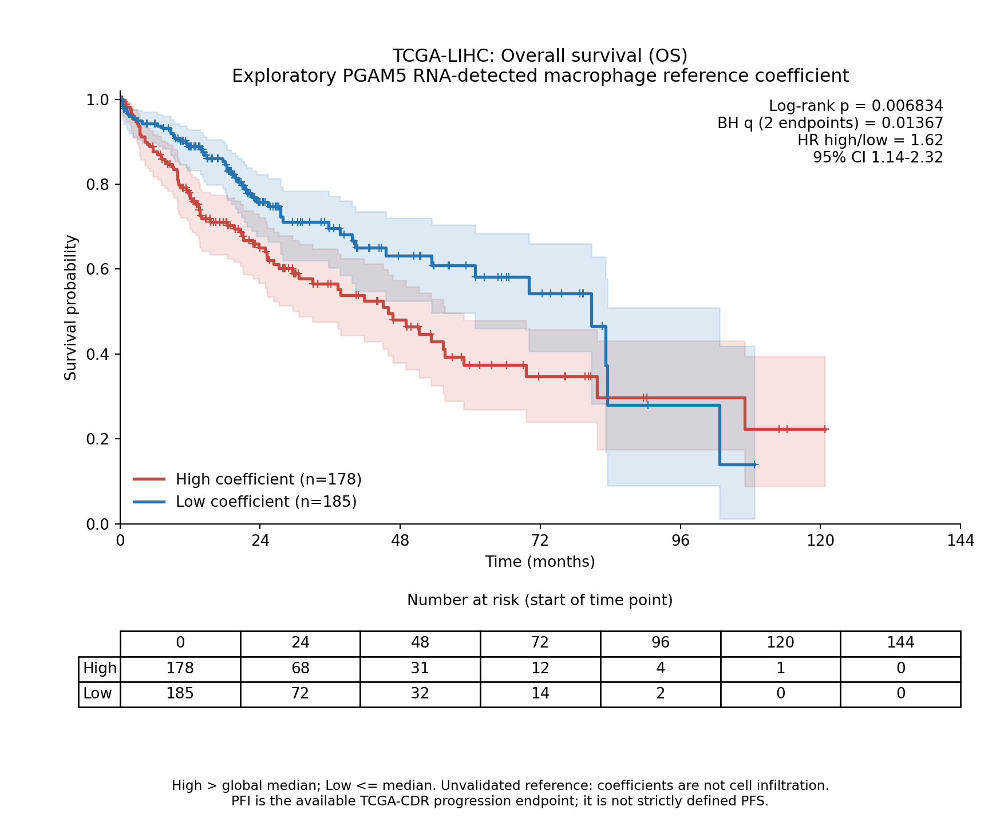
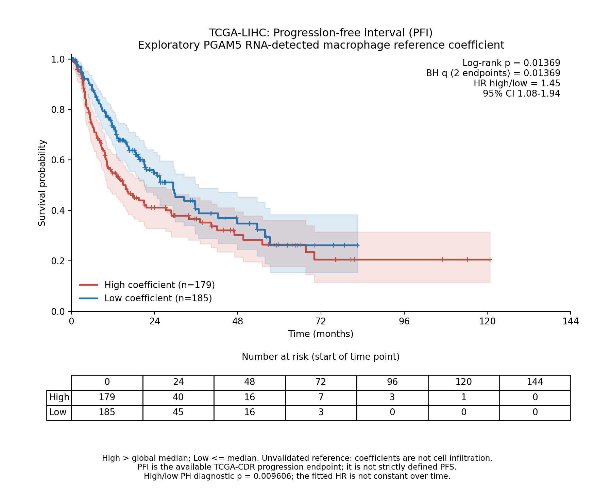

# TCGA-LIHC：v5探索性参考系数与生存

**高系数组OS和PFI较短，两个主要log-rank检验经BH校正后显著。调整年龄、性别和分期后，连续系数与OS的关联仍获统计支持，PFI关联未获支持。** 参考未通过细胞丰度验证，所以这些结果是探索性反卷积系数与结局的关联，不能写成“PGAM5⁺巨噬细胞高浸润导致预后差”。

## 主要KM和log-rank结果

| 终点 | 患者（事件） | 高组/低组 | 高对低未调整HR（95%CI） | log-rank p | 两终点BH q |
|---|---:|---:|---|---:|---:|
| OS | 363（128） | 178/185 | 1.624（1.139–2.315） | 0.006834 | 0.013668 |
| PFI | 364（179） | 179/185 | 1.447（1.077–1.944） | 0.013685 | 0.013685 |

PFI高/低未调整模型的比例风险诊断p=0.00961，显示风险比随时间变化，表中的HR是整体模型汇总，**不能解释为随时间恒定的1.447倍风险**。标准log-rank检验仍可用于检验两组整体生存分布差异；它不要求真实效应为恒定风险比。OS相应诊断p=0.296，未检出显著违反并不证明假设绝对成立。





图中包含95% Greenwood log-log置信区间、删失标记、风险人数表、log-rank p及两终点BH q。后期风险人数很少，不能过度解释尾部。生存计算使用天数，显示月份为天数/30.4375。

## 分组、终点和排除

使用优化v5的固定503基因/20组分参考，在371例患者中的探索性目标系数作为预测变量，按**全部371例的中位数0.05510804758**固定分组：High>中位数185例，Low≤中位数186例。OS/PFI保留同一分组，不重新按各终点寻找中位数，不寻找最佳生存切点。这里的High/Low是系数组，不是真实浸润组。

源表为UCSCXenaShiny保存的Xena Toil TCGA-CDR镜像，版本e012e4a3e77702863dc639bfc8ee23c8e48e3231；TCGA-CDR来源[Liu等，Cell 2018](https://doi.org/10.1016/j.cell.2018.02.052)。按12字符患者ID连接，先核对同一患者所有样本别名的8项生存终点完全一致，再保留原发01别名。一对一连接得到369位有生存记录，2位未匹配。

有效终点要求事件为0/1且时间有限、>0天。OS排除8例（高组7、低组1），PFI排除7例（高组6、低组1），原因及ID保存在`excluded_patients.csv`。未填补缺失时间、事件或临床协变量。

**源表提供PFI（progression-free interval，无进展间期），没有严格定义的PFS。** PFI依据TCGA-CDR的进展/复发等事件和删失定义；不能将图改名为PFS。OS/PFI结果均以患者为单位，不把RNA样本别名当作独立患者。

## 连续系数与协变量调整

连续模型的HR表示系数增加**全371例IQR=0.04240429591**对应的风险比，没有把系数乘100命名为真实细胞比例。调整变量为诊断年龄（每10年）、性别（男相对女）、病理分期（II、III–IV，相对I）；分期严格映射AJCC原始值，缺失或Discrepancy不填补。调整模型OS337例/114事件、PFI338例/162事件。

| 终点 | 模型目标项 | HR（95%CI） | Wald p | 六项次要检验BH q |
|---|---|---|---:|---:|
| OS | 连续系数，未调整 | 1.295（1.113–1.507） | 0.000811 | 0.004864 |
| OS | 高对低，调整 | 1.485（1.009–2.185） | 0.044843 | 0.082214 |
| OS | 连续系数，调整 | 1.234（1.050–1.449） | 0.010757 | 0.032271 |
| PFI | 连续系数，未调整 | 1.145（0.997–1.314） | 0.054810 | 0.082214 |
| PFI | 高对低，调整 | 1.291（0.935–1.781） | 0.120300 | 0.144360 |
| PFI | 连续系数，调整 | 1.061（0.915–1.230） | 0.435290 | 0.435290 |

六项次要检验的BH校正单独成组；主要结论仍基于两项预先固定的log-rank检验。OS高/低调整模型虽然原始p<0.05，但六项次要检验校正后q=0.0822，不能称为校正后显著。

PFI连续调整模型中分期II及III–IV的比例风险诊断p约0.0316/0.0270。因此，**在看到该诊断后追加**分期分层Cox敏感性：各分期使用不同基线风险，保留年龄、性别及连续系数；两终点均运行，未替代原分析或反选较有利结果。这是事后敏感性，不是预设主要检验。

| 终点 | 分期分层、年龄/性别调整，连续系数HR（95%CI） | p | 两项事后敏感性BH q |
|---|---|---:|---:|
| OS | 1.240（1.055–1.458） | 0.009151 | 0.018303 |
| PFI | 1.034（0.889–1.204） | 0.661819 | 0.661819 |

OS关联在这项敏感性中方向相同；PFI仍未获调整后的统计支持。不能由未显著证明完全没有关联，也不能仅用OS显著验证PGAM5细胞特异性。没有调整肿瘤纯度、治疗、肝功能、病因等因素，亦无独立生存验证队列，不能作因果或临床预测工具结论。

## 文件、复现和独立核查

- `survival_statistics.csv`：主要患者/事件数、log-rank及高低组HR。
- `Cox_all_models.csv`、`PH_diagnostics.csv`：所有协变量与目标项，包括分期分层敏感性。
- `patient_coefficients_survival_join.csv`、`*_analysis_patients.csv`：371例连接数据及实际分析患者。
- `KM_curve_values.csv`、`KM_numbers_at_risk.csv`：图中曲线、CI和风险人数。
- `independent_logrank_risk_sets.csv`：各事件时间的风险集、观察/期望事件及方差。
- `protocol.json`、`source_provenance.json`：固定分组、方法、事后追加记录与输入来源SHA256。
- `implementation_checks.json`、`independent_audit.json`：核验记录。

在上一级解压目录安装`requirements.txt`后运行：

```bash
OPENBLAS_NUM_THREADS=1 MPLCONFIGDIR=/tmp/pgam5-matplotlib python analyze_survival.py
OPENBLAS_NUM_THREADS=1 python audit_survival.py
```

源生存表和LIHC原发临床输入已随包保存，不需要重新下载泛癌表达矩阵。实现核验覆盖全部KM乘积限及log-log CI步骤、手算两项log-rank；所有10个Cox模型的系数/协方差与独立statsmodels Efron PHReg一致。独立保存结果审计重新核对原始系数、全队列分组、源终点、风险人数、主要/次要/事后检验家族及所有模型HR/CI/p。通过实现核验不能改变参考丰度验证失败的结论。
