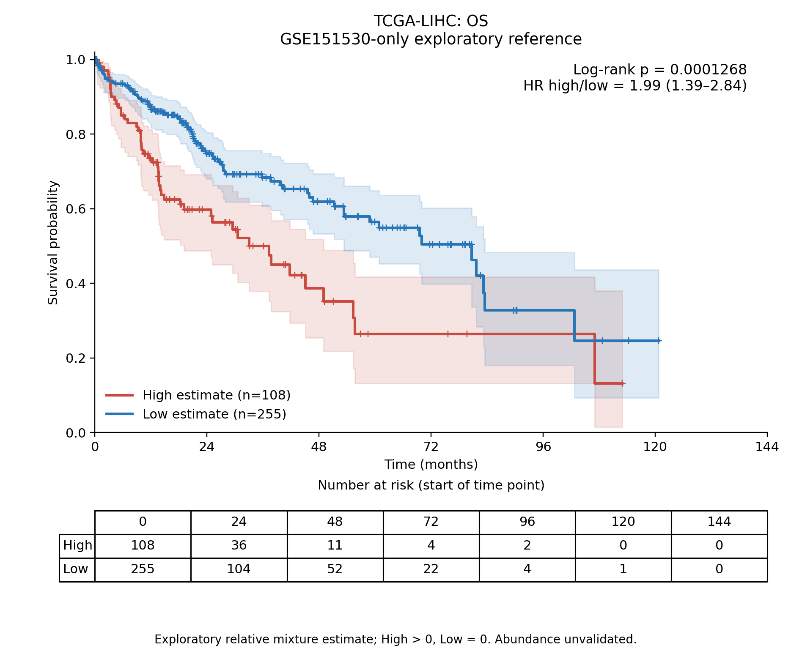
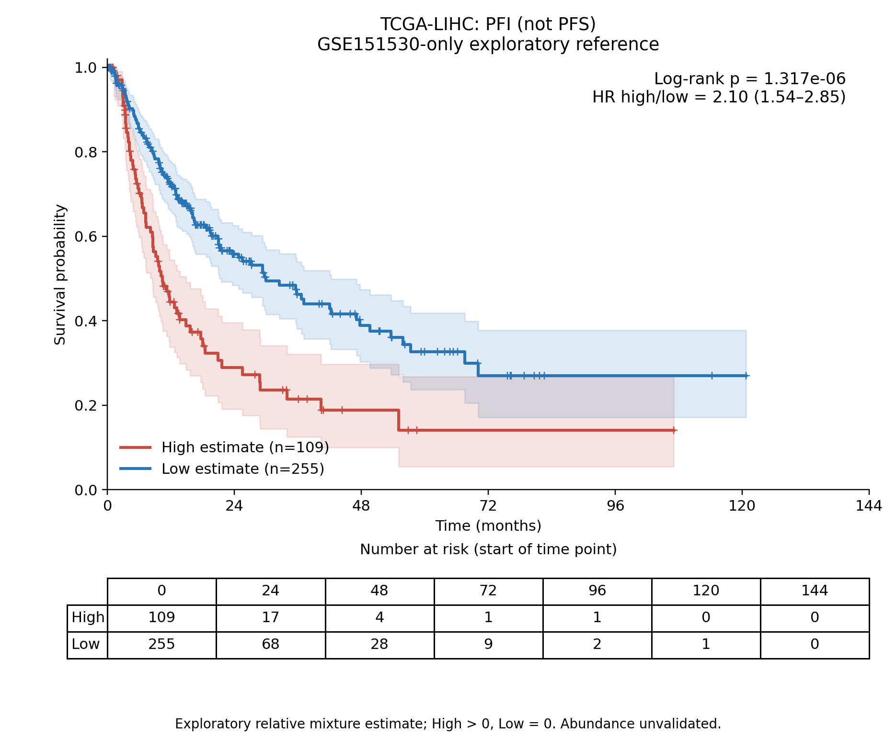

# 最新GSE151530单队列参考：TCGA-LIHC生存分析

**使用用户确认的115例非零估计值（高组）与256例零估计值（低组），已完成OS和PFI的KM、logrank及未调整Cox分析。高估计值组在两个终点均较差。PFI不是PFS。**

## 分组与数据

估计值直接来自提交aa9e46b的GSE151530_only_TCGA_PGAM5_deconvolution/TCGA_LIHC_PGAM5_macrophage_estimates.csv。只使用最新GSE151530筛选的50目标候选、700参考基因14组分及636匹配bulk基因的NNLS估计；没有使用之前联合参考估计、30/31基因程序评分，也没有重新拟合参考。

全371例原发患者中位数为0：High=estimate>0共115例，Low=estimate=0共256例。这是非零与零相对混合系数比较，零不证明组织内目标细胞不存在。两终点使用同一固定组别，没有按结局优化切点、分开计算终点中位数或随机拆分零值。

临床沿用此前已核实的TCGA-CDR/Xena镜像（UCSCXenaShiny的tcga_surv.rda，来源Toil TCGA_survival_data，引用Liu Cell2018 DOI10.1016/j.cell.2018.02.052）。检查各患者不同样本别名8个终点一致后保留原发01样本，一对一连接369例，2例未匹配。每个终点要求有效二元事件及有限时间>0；全部排除患者及原因见endpoint_excluded_patients.csv。

## 统计结果

| 终点 | 纳入人数（高/低） | 事件数（高/低） | HR高/低（95%CI） | logrank p | 两终点BH q |
|---|---:|---:|---:|---:|---:|
| OS | 363（108/255） | 128（50/78） | 1.988（1.389–2.844） | 0.000126845 | 0.000126845 |
| PFI | 364（109/255） | 179（66/113） | 2.097（1.543–2.850） | 1.31744e-06 | 2.63487e-06 |

OS排除8例（高组7、低组1），最终108/255；PFI排除7例（高组6、低组1），最终109/255。排除只根据随访有效性，没有改变115/256的原始分组。

图含95%CI、删失标记和风险人数。双侧未加权logrank；HR来自未调整Cox模型，PH诊断p值见survival_statistics.csv。时间检验使用原始天数，显示换算为月。两项logrank在BH校正后仍显著。

现有可用终点为OS和PFI（progression-free interval），没有独立定义的PFS（progression-free survival），没有把PFI改名为PFS。若要正式PFS分析，必须补充定义明确的进展/死亡及随访记录。

## 解释与核验

该单队列参考未通过内部丰度恢复诊断；此处是探索性相对混合估计与预后的关联，尚不能表述为经验证的PGAM5⁺巨噬细胞真实高浸润导致更差生存。没有调整分期、年龄、肿瘤纯度等因素，也没有独立生存队列验证。统计显著不证明细胞特异性或因果作用。

独立核验：全部371例分组与源估计一致；两个终点纳入/排除重算；logrank按患者风险集重算；所有导出KM乘积极限点、风险表人数及两终点BH q重算一致。源码也包含单独风险集/KM核查。

## 文件与复现

- KM_OS.png/pdf、KM_PFI.png/pdf：曲线图片和矢量PDF。
- survival_statistics.csv：检验、HR、置信区间、PH诊断、中位生存时间。
- patient_scores_survival_join.csv与OS/PFI_analysis_patients.csv：分组、随访及分析患者。
- endpoint_excluded_patients.csv：排除原因。
- KM_curve_values.csv、KM_numbers_at_risk.csv：全部曲线和风险表数据。
- independent_endpoint_checks.csv、independent_audit_summary.json：独立复核。

依次运行prepare_survival.py、analyze_survival.py、audit_report.py；默认输入源路径位于/workspace，换机器需改路径。依赖及Python版本见requirements.txt和environment_versions.json。源估计、临床和参考输入哈希见source_provenance.json。大型原始单细胞与TCGA计数无需重新读取，不随结果包发布。前几轮生存结果均保留，当前文件夹只对应最新GSE151530单队列参考。
