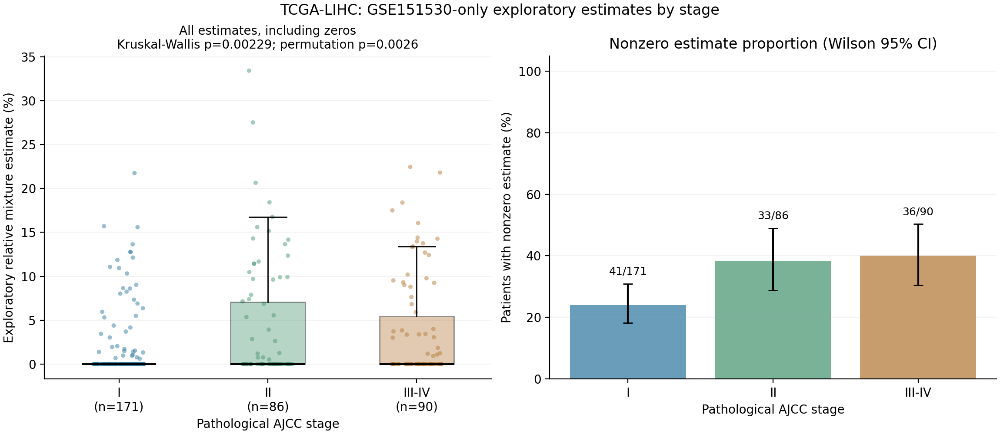

# GSE151530单队列反卷积估计值与TCGA-LIHC病理分期

按用户要求将III期与IV期合并，比较 **I、II、III–IV** 三组。沿用GSE151530单队列参考得到的371例患者NNLS估计值（115例非零、256例为0），不重新筛选基因或拟合参考。

**主分析中，II期和III–IV期的估计值分布均高于I期；II期与III–IV期之间未发现显著差异。** 总体Kruskal–Wallis H=12.15845，渐近p=0.002290，20,000次置换p=0.002600。全部估计值，包括0，均参与比较。

| 病理分期 | 患者数 | 非零估计患者 | 非零患者比例 | 平均相对估计值×100 | 中位相对估计值×100 |
|---|---:|---:|---:|---:|---:|
| I | 171 | 41 | 23.98% | 1.55 | 0 |
| II | 86 | 33 | 38.37% | 3.96 | 0 |
| III–IV | 90 | 36 | 40.00% | 3.61 | 0 |

非零患者比例的分母是相应分期患者数。平均相对估计值×100是归一化模型混合系数的百分比刻度，**不能直接等同于组织中真实细胞百分比**。三组中位数均为0，不能将结果描述为随分期逐级升高。

两两比较使用双侧Mann–Whitney U统计量的20,000次置换检验，在每个临床来源内对三个比较进行BH校正：

| 比较 | 置换p | BH校正q | 解释 |
|---|---:|---:|---|
| I vs II | 0.004850 | 0.007275 | II期分布较高 |
| I vs III–IV | 0.002400 | 0.007200 | III–IV期分布较高 |
| II vs III–IV | 0.950652 | 0.950652 | 未发现显著差异 |

顺序分期的Spearman rho=0.17864，置换p=0.000850；分期与估计值是否非零的3×2检验置换p=0.010299。这两项为次要分析，分别BH校正为q=0.001700和0.010299，单独组成两个检验的校正族。

## 分期来源与纳入范围

主分析采用公开[UCSCXenaShiny临床镜像](https://github.com/openbiox/UCSCXenaShiny/blob/e012e4a3e77702863dc639bfc8ee23c8e48e3231/data/tcga_clinical.rda)，固定提交`e012e4a3e77702863dc639bfc8ee23c8e48e3231`。文档将其描述为Toil Hub TCGA Clinical Data；使用`ajcc_pathologic_tumor_stage`字段。此镜像项目与前次生存分析一致，但并不因此将分期字段归于Liu TCGA-CDR生存端点表。

仅保留LIHC、原发肿瘤样本类型01，并按患者编号一对一连接。全部371例临床原发样本均与已选RNA aliquot的前15位一致。IA/IB等先归并到相应主分期，再将III和IV合并；原始标签与未合并分期均保存在逐患者表中。347例有可用分期；22例缺失、2例标签为`[Discrepancy]`，合计排除24例，不插补。III–IV组由III期85例、IV期5例组成；没有进行独立IV期推断。没有以临床分期、组织学分级或BCLC替代病理AJCC分期。

敏感性分析采用[GSE62944配套2015年临床表](https://ftp.ncbi.nlm.nih.gov/geo/series/GSE62nnn/GSE62944/suppl/GSE62944_06_01_15_TCGA_24_548_Clinical_Variables_9264_Samples.txt.gz)，按选定RNA aliquot精确匹配。该来源有334例有效分期：I=165、II=82、III–IV=87；37例排除。总体置换p=0.002850；I vs II、I vs III–IV的BH q分别为0.018749、0.002550，II vs III–IV为0.719164，方向与主分析一致。

两份来源并非完全一致；其中双方都有有效主分期但互相冲突的患者为TCGA-FV-A2QQ（主来源I、2015来源IVA）。缺失/冲突记录已单独导出。不交叉补齐，也不依据p值选择来源。2015临床表存在不同AJCC版本，历史快照和分期版本差异应纳入解释。

## 图表、结果与复现



左图显示全部患者估计值；右图为非零估计患者比例及Wilson 95%置信区间，右图不是组织细胞比例。

- `all371_estimates_and_stage_sources.csv`：371例原始估计值、临床原始标签、主分期和合并分期。
- `*_analysis_patients.csv`、`stage_excluded_patients.csv`：两来源实际纳入/排除患者。
- `stage_descriptive_statistics.csv`：人数、非零比例、均值、中位数、四分位数及置信区间。
- `stage_overall_and_secondary_tests.csv`、`stage_pairwise_tests.csv`：统计量、渐近p、置换p、校正q、效应量及置换极端计数。
- `stage_source_discrepancies.csv`、`valid_stage_source_conflicts.csv`：临床来源差异。
- `protocol.json`、`source_provenance.json`、`environment_versions.json`：分析定义、输入哈希和环境。
- `audit_stage.py`、`audit.json`：独立复核43项均通过，包括患者连接、合并映射、估计值保留、描述统计、秩统计量、置换p公式及BH校正。程序复核不代表生物学验证通过。

安装`requirements.txt`所列依赖，将固定版本`tcga_clinical.rda`和上述GSE62944临床表下载到本地，使用仓库既有估计值即可重跑；不需要重新下载单细胞矩阵或TCGA表达矩阵：

```bash
python analyze_stage.py \
  --estimate ../GSE151530_only_TCGA_PGAM5_deconvolution/TCGA_LIHC_PGAM5_macrophage_estimates.csv \
  --clinical /path/to/tcga_clinical.rda \
  --geo /path/to/GSE62944_clinical.txt.gz
python audit_stage.py \
  --estimate ../GSE151530_only_TCGA_PGAM5_deconvolution/TCGA_LIHC_PGAM5_macrophage_estimates.csv \
  --clinical /path/to/tcga_clinical.rda \
  --geo /path/to/GSE62944_clinical.txt.gz
```

输出写入脚本所在目录。置换次数固定20,000，随机种子固定；p=(极端置换数+1)/(20,000+1)。置换p属于Monte Carlo估计。ZIP包含本目录脚本、图表和结果，已通过完整性检查；原始公共临床输入按上述固定来源另行获取，输入SHA256见`source_provenance.json`。

本结果是未经协变量调整的横断面关联。原GSE151530参考未通过内部准确性验证，因此这里比较的是**探索性PGAM5表达巨噬细胞相对混合系数**；零估计不证明组织中没有相应细胞。不能据此确认真实浸润比例、因果关系或临床预测价值。前次生存分析结果未改变。
