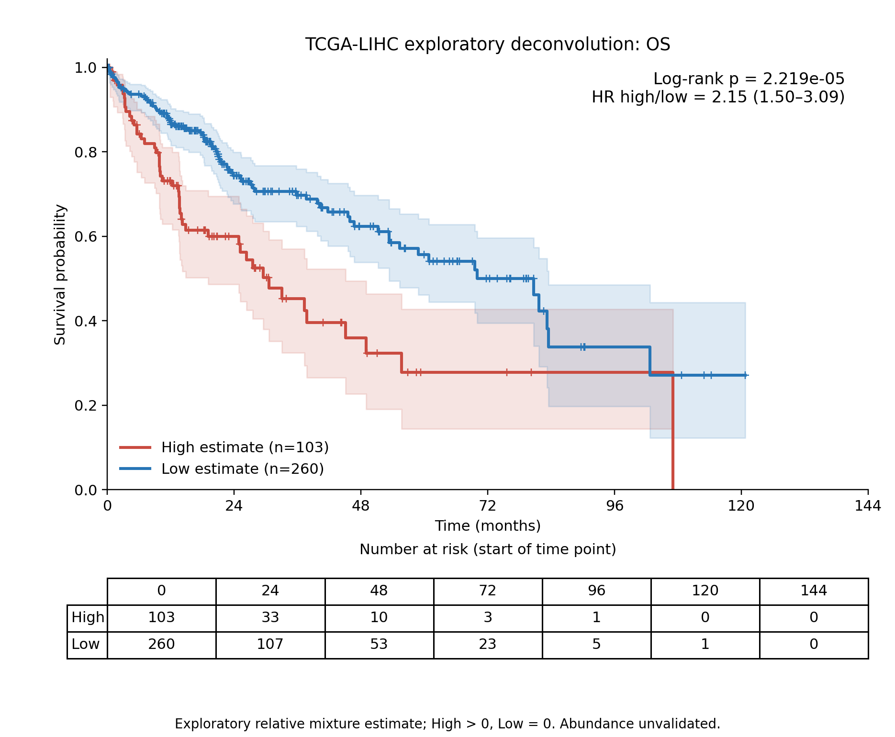
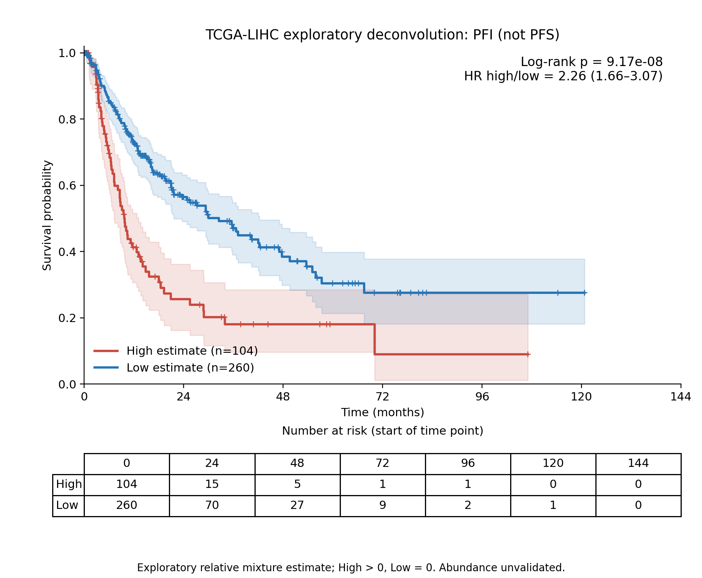

# TCGA-LIHC：探索性PGAM5 RNA检出巨噬细胞反卷积估计与生存

**已按用户要求直接应用此前未通过外部验证的探索性参考，完成OS/PFI的KM曲线与logrank检验。估计值是相对混合系数，尚不是已验证的PGAM5⁺巨噬细胞组织丰度。PFI不是PFS。**

## 方法与分组

使用同一批371例原发肿瘤患者：GSE62944中TCGA24/Rsubread2015计数镜像，每患者一个原发01 RNA aliquot；沿用之前不依赖生存结局的选择。该输入不是当前GDC STAR或TPM。完整23368基因计数总和作为CP10k分母；反卷积使用线性CP10k，不使用30/31基因评分、log表达或基因z分数。

原探索性参考850基因、17组分，实际直接符号匹配778基因（91.53%），其余72从参考/查询两端同时剔除，未当成表达0。缺失清单完整导出。测量覆盖低于此前单细胞参考验证的95%要求，故此次是用户指定的探索性应用，而非通过那个门槛的新模型。

固定NNLS，应用原训练row_scale；同时拟合全部17组分，所得非负系数除以系数总和。主估计为TAM_PGAM5_detected组分的归一化系数。它与目标在全部巨噬细胞内部的比例不同；后者仅作辅助输出。单细胞与bulk平台、RNA量和基因长度影响未校准，不能把结果直接解读为真实组织细胞百分比。

全371例目标估计中位数为0，263例估计为0。预定High>中位数、Low<=中位数得到高组108例、低组263例，实质是非零估计值与零估计值比较；没有把零值随机拆分以凑等人数，也没有按结局优化切点。估计为0不证明组织中细胞不存在。两个终点使用同一固定分组。

## 生存结果

临床沿用已核实的TCGA-CDR/Xena镜像，先检查患者不同样本别名的8项终点记录一致，然后取原发样本并一对一连接。371例中369例连接成功；各终点额外排除缺失/无效事件和非正时间。OS与PFI单位为天，图转换为月。

| 终点 | 患者数（高/低） | 事件数（高/低） | HR高/低（95%CI） | logrank p | 两终点BH q |
|---|---:|---:|---:|---:|---:|
| OS | 363（103/260） | 128（48/80） | 2.150（1.497–3.088） | 2.21946e-05 | 2.21946e-05 |
| PFI | 364（104/260） | 179（65/114） | 2.261（1.663–3.074） | 9.17026e-08 | 1.83405e-07 |

KM含95%CI、删失标记和风险人数表；logrank为双侧未加权检验。HR来自未调整Cox模型，并附PH检验。没有控制分期、肿瘤纯度、年龄等混杂，也没有独立队列生存验证。两终点均有统计关联；不能据此证明PGAM5⁺巨噬细胞浸润升高导致不良预后，也不能用显著p值反证该参考具备细胞特异性。

可用临床提供OS和PFI，没有另行定义的PFS，故没有生成名为PFS的曲线或检验。若必须报告PFS，应先取得有明确进展/死亡定义和随访规则的PFS记录。

## 输出与复现

- patient_scores.csv：每位患者的目标、总巨噬细胞、群内目标相对估计及分组。
- all_reference_component_estimates.csv：全部17组分的相对估计。
- survival_statistics.csv、OS/PFI_analysis_patients.csv：检验和纳入患者。
- KM_OS/PFI.png/pdf：可直接使用的图。
- source/USED_reference矩阵与scale、bulk匹配基因、缺失清单、CP10k/计数、拟合诊断和输入哈希。
- ridge_sensitivity_component_estimates.csv与fixed_solver_sensitivity.json：固定非负岭回归alpha=.01预测敏感性；没有根据其生存p值选择主算法。

独立解析8例患者×778个参考基因原始计数，误差0；全371例CP10k、系数归一化和分组检查通过；19例用独立有界求解器检查；两个logrank按风险集重算一致，所有分组KM乘积极限步骤重算一致。这些是实现核验，不代表参考完成生物学验证。

依次运行prepare_deconvolution.py、analyze_survival.py、audit_and_report.py。默认依赖/workspace/scratch下前一轮TCGA原始输入和/workspace/codex/results下v4参考，换机器应调整路径。环境版本记录于environment_versions.json；大型原始pan-cancer计数矩阵不随包发布。此前DE、参考失败结果和30/31基因生存结果未修改。
