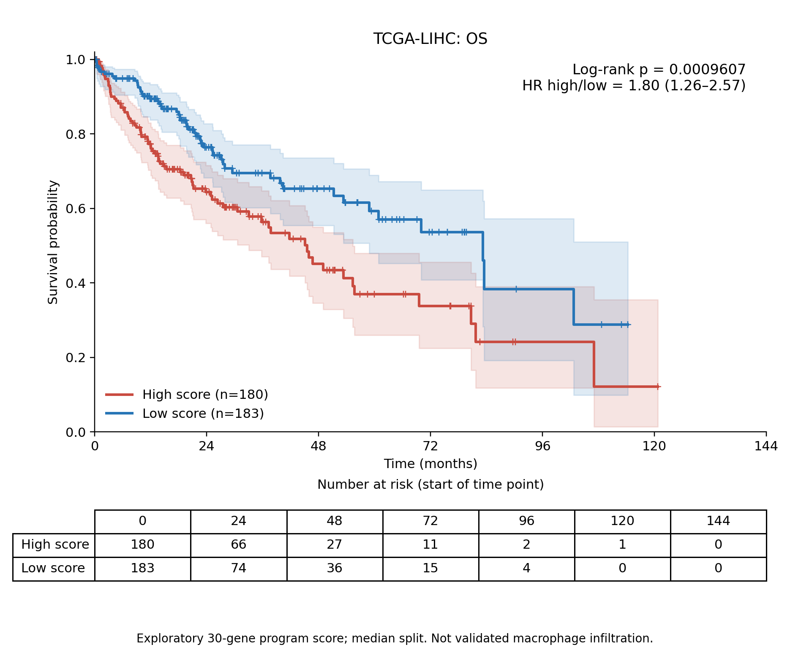
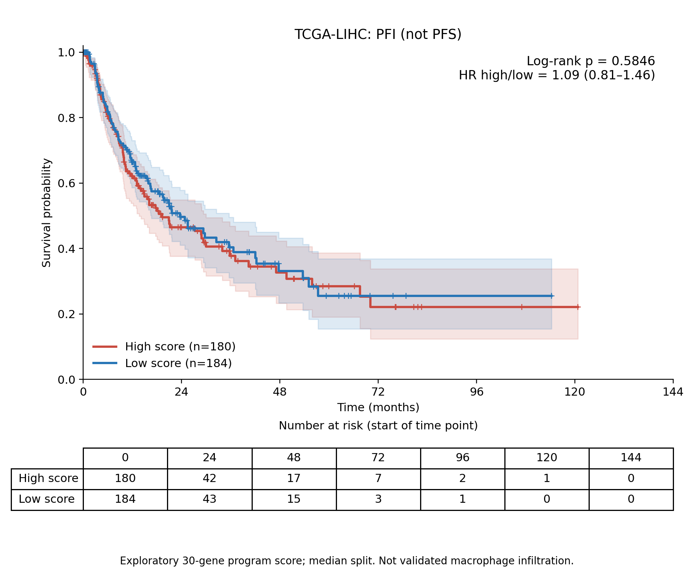

# TCGA-LIHC：30基因候选程序评分与生存的探索性分析

**结果：候选评分高组OS较差；PFI差异不显著。此次没有计算巨噬细胞浸润丰度，也不能据此证明PGAM5特异状态的预后作用。**

## 主要结果

| 终点 | 患者（事件） | 高组/低组患者 | 高组对低组HR（95%CI） | log-rank p | 两终点BH q |
|---|---:|---:|---|---:|---:|
| OS | 363（128） | 180/183 | 1.802（1.264–2.570） | 0.000960708 | 0.00192142 |
| PFI | 364（179） | 180/184 | 1.085（0.809–1.456） | 0.58458 | 0.58458 |

OS：高候选评分与较短总生存相关，在两项主要log-rank检验的BH校正后仍显著。PFI：没有发现高低组统计学差异；这不等于证明两组结局相同。HR来自未调整协变量的单变量Cox模型，不能解释为因果或独立预后效应。

**终点说明：可用表提供PFI（progression-free interval，无进展间期），不提供严格定义的PFS。PFI自诊断起衡量进展/复发等事件，包含TCGA-CDR规定的事件与删失规则；不能将这条曲线重命名为PFS。** 若研究方案必须使用PFS，需要另外取得定义明确的PFS时间与事件数据。

## 数据与评分

NCBI GSE62944/GSM1536837保存的TCGA重处理FeatureCounts矩阵，共23,368基因、9,264份泛癌肿瘤RNA样本。其中LIHC374份，样本类型01原发肿瘤371份，对应371位患者，30个候选基因全部存在。此为2015年的历史重处理数据，不是当前GDC STAR矩阵。

TCGA-CDR生存信息来自UCSCXenaShiny中Xena Toil生存数据镜像（提交e012e4a3e77702863dc639bfc8ee23c8e48e3231），其采集脚本将来源标为Liu等Cell2018，DOI:10.1016/j.cell.2018.02.052。镜像包含同一患者的正常/复发样本别名；核对所有八项终点值一致后保留原发01别名，按12字符患者ID一对一合并。369位匹配到生存表，2位未匹配。

评分采用log2(CPM+1)，每个基因在全部371位患者内标准化为z分数，再对30个基因等权求平均。bulk与单细胞表达单位不同，未直接套用单细胞CP10k标准化参数。CPM分母是完整矩阵所有基因的赋值计数总和，不是仅30个基因计数。

在查看生存统计结果前，固定使用全部评分患者的中位数-0.033754477：高组>中位数，低组≤中位数。原始评分队列高185、低186，两终点沿用同一阈值，没有寻找最佳生存切点。

OS分析排除8位患者（未匹配、时间缺失或非正值），保留363位；PFI排除7位，保留364位。各排除患者与原因列于endpoint_excluded_patients.csv。事件编码0=删失，1=事件，计算使用原始天数，图形用天数/30.4375显示月份。

候选评分与bulk PGAM5表达的Spearman相关为0.236，p=4.24e-06。这只是bulk层面的弱正相关，不能建立PGAM5特异性或定位到巨噬细胞。

## 图与统计复核

曲线含Greenwood log-log 95%置信区间、删失标记和风险人数表；风险人数为每个时间点开始时仍在风险集中的人数。随访后期人数较少，不能过度解释曲线尾部。

log-rank使用标准未加权双侧检验，另由各事件时间风险集、观察/期望事件及超几何方差独立计算，两终点结果一致。每组KM乘积限估计逐步核对。371位患者的30基因评分及分组从计数重新计算，数值一致。Cox比例风险假设检验OS p=0.38，PFI p=0.77；未检测到显著违背，但不能证明假设绝对成立。

## 使用边界

此前单细胞分析未验证这30个基因对PGAM5相关状态的特异性；其中含通用巨噬细胞/免疫表达信号。这里的高低组是候选程序评分组，不是PGAM5⁺巨噬细胞高低浸润组。OS显著也不能反过来证明签名特异或PGAM5机制。阶段、肿瘤纯度、治疗及其他混杂因素未调整，且没有独立生存验证队列。本结果可用于形成待验证假设，不能直接写成PGAM5⁺巨噬细胞高浸润导致预后差。

## 下载与复现

- KM_OS.png/pdf、KM_PFI.png/pdf：KM曲线。
- survival_statistics.csv：log-rank、HR/CI、事件人数及BH校正。
- patient_scores_survival_join.csv、OS_analysis_patients.csv、PFI_analysis_patients.csv：患者级评分、分组及实际分析数据。
- selected_patient_31_gene_counts.csv、selected_patient_log2_CPM_plus1.csv、bulk_score_parameters.csv：评分输入和参数。
- independent_logrank_risk_sets.csv、KM_curve_values.csv、KM_numbers_at_risk.csv：统计与图的可复核数值。
- source_provenance.json、input_sha256.json、source_metadata：来源、镜像版本及数据校验。

复现：Python依赖见environment_versions.json。使用prepare.py取得的文件名，将NCBI原始矩阵及癌种样本表放入脚本目录；镜像来源的生存表已打包。依次运行prepare.py、analyze_survival.py、report_and_audit.py。prepare.py中的候选清单路径默认本云仓库路径，复现时改为同目录signature_30_genes.csv。大型泛癌原始矩阵不随包发布。source_metadata中保留镜像对象和来源脚本，第三方脚本仅作为来源证据，无须执行。
