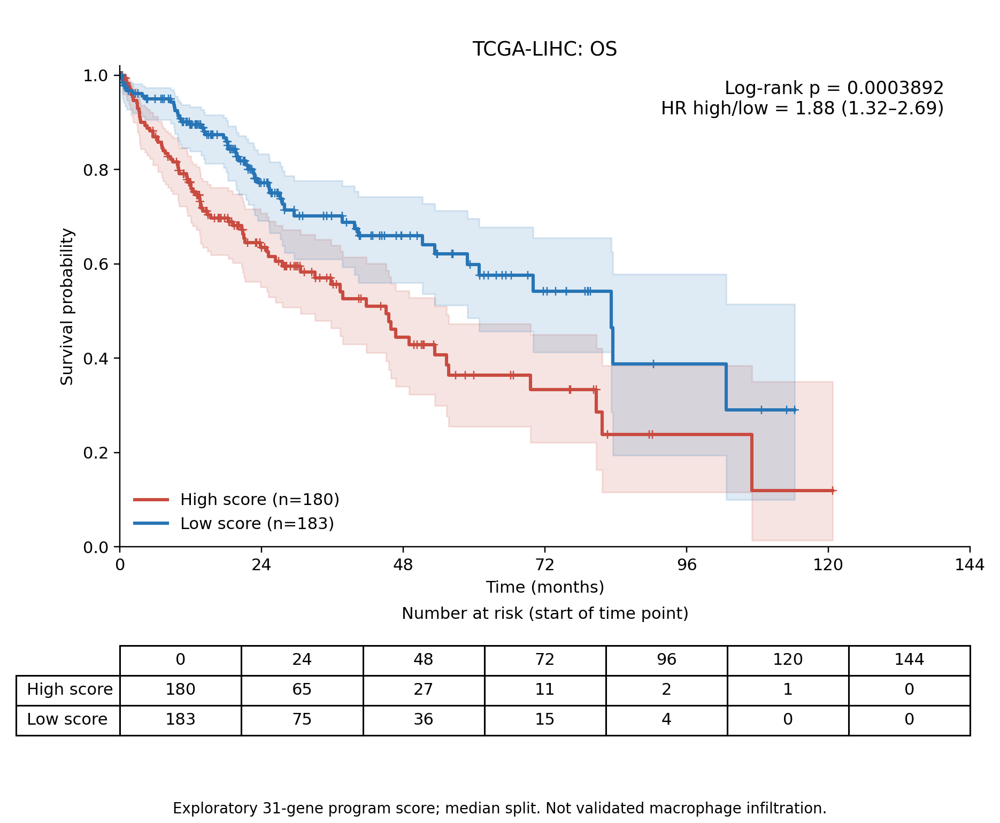
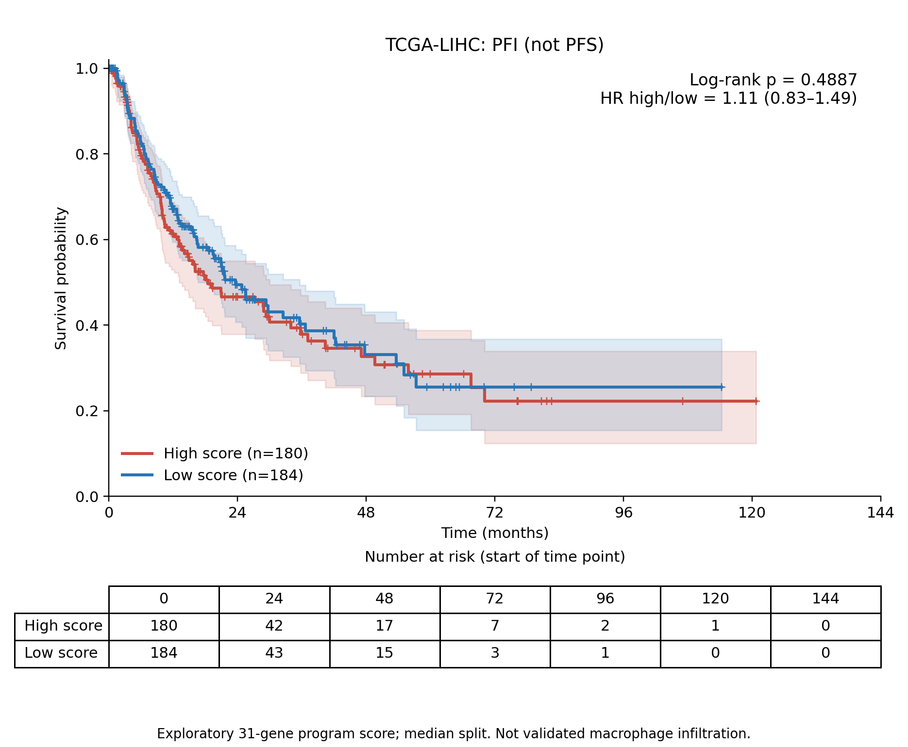

# TCGA-LIHC：加入PGAM5后的31基因候选评分生存分析

**加入PGAM5后，候选高评分组OS仍较差，PFI仍无显著差异。该评分尚未验证为PGAM5特异巨噬细胞状态或浸润丰度。**

## 与原30基因比较

| 评分 | 终点 | 患者数 | HR高/低（95%CI） | log-rank p |
|---|---|---:|---|---:|
| 30 genes | OS | 363 | 1.802（1.264–2.570） | 0.000960708 |
| 31 genes (including PGAM5) | OS | 363 | 1.884（1.320–2.690） | 0.000389169 |
| 30 genes | PFI | 364 | 1.085（0.809–1.456） | 0.58458 |
| 31 genes (including PGAM5) | PFI | 364 | 1.109（0.827–1.488） | 0.488743 |

原30基因全部保留，PGAM5作为第31个基因等权加入，每个基因权重1/31。沿用相同371位TCGA-LIHC原发肿瘤患者、历史GSE62944计数矩阵和TCGA-CDR临床镜像。CPM分母为完整基因计数总和，每个基因先log2(CPM+1)，再按全部371位患者均值/样本SD计算z分数，最后求31基因均值。未直接套用单细胞标准化参数。

新评分中位数为-0.029145569：高组>中位数，低组≤中位数。高185位，低186位；相较30基因评分有8位改变分组（高→低4位，低→高4位）。OS与PFI沿用同一新评分阈值，没有按终点优化切点。恒等式score31=(30×score30+z_PGAM5)/31已逐患者验证。

生存终点实际为OS和PFI（无进展间期），不是PFS。OS纳入363位（高180、低183，事件128）；PFI纳入364位（高180、低184，事件179）。缺失、时间≤0等排除规则及患者与此前完全一致。

新版两终点BH校正后OS q=0.000778338，PFI q=0.488743。30/31基因×两终点四项检验的探索性BH校正也另列于比较表，结论不变。HR为未调整协变量的单变量Cox估计，不能解释为因果或独立预后效应。

## KM曲线

曲线含95%置信区间、删失标记和各时间点开始时的风险人数。图形月份=天数/30.4375，检验使用原始天数。log-rank按风险集独立重算，KM乘积限估计逐步核对，371位评分从原始31基因计数独立重算。Cox比例风险检查结果列于survival_statistics.csv。

## 解释限制

加入PGAM5使评分直接包含PGAM5测量值，因此新版评分与PGAM5表达相关，不能再作为独立证明PGAM5关联的证据。OS p值更小不等于模型预测能力提高，也不能证明PGAM5⁺巨噬细胞高浸润导致预后差。候选程序的细胞状态特异性、组织组成混杂及独立队列验证仍未解决。可准确表述为“含PGAM5的31基因候选程序高评分与较差OS相关”。

## 文件与复现

- survival_statistics.csv：31基因结果；30_vs_31_survival_comparison.csv：新旧结果和多重检验对照。
- signature_31_genes.csv、bulk_score_parameters.csv：基因与评分参数。
- patient_scores_survival_join.csv、30_vs_31_patient_comparison.csv：患者级数据和分组变化。
- KM_OS/ KM_PFI的PNG和PDF：曲线；KM_curve_values.csv、KM_numbers_at_risk.csv：图形数值。
- protocol.json、source_provenance.json、independent_score_checks.json、implementation_checks.json：定义、来源与复核。

复现依赖原results/TCGA_LIHC_candidate30_survival中的计数、临床合并表及基因清单。prepare31.py默认使用云工作区仓库路径，复现机器需调整S路径。依次运行prepare31.py、analyze_survival.py、package_report.py；环境版本见environment_versions.json。原始来源及镜像版本沿用上轮记录，新包保留患者级输入。
