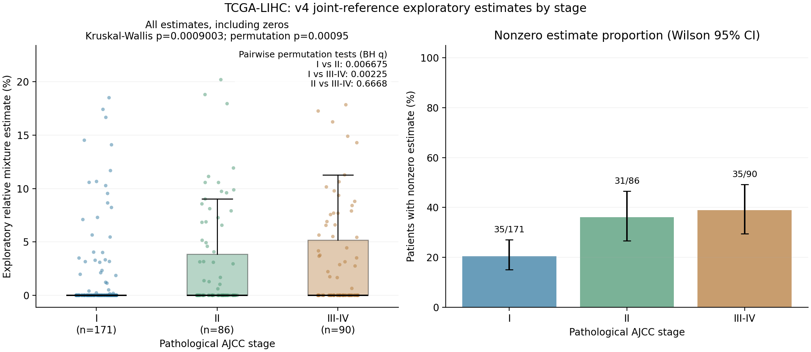

# v4联合探索性参考：TCGA-LIHC中PGAM5 RNA检出巨噬细胞估计值与分期

已按用户指定回到[PGAM5_RNA_annotation_deconvolution_v4](../PGAM5_RNA_annotation_deconvolution_v4/README.md)的850基因、17组分联合参考，重新拟合371例TCGA-LIHC原发肿瘤患者，并比较I期、II期、III–IV期。此处使用的是GSE151530+GSE149614联合训练参考；五个数据集的逐细胞注释覆盖不等于五个数据集全部参与参考训练。

**II期和III–IV期的目标相对估计值分布均高于I期，II期与III–IV期之间未发现显著差异。当前参考仍未通过外部验证，结果不能视为可靠的真实组织细胞浸润比例。**

## 反卷积复算

完整参考及原行缩放系数逐字节匹配v4文件（源提交`a7bf04f34197b3b888a59fc74bbbbfb187c99769`）。查询采用已审计的GSE62944 TCGA24/Rsubread2015计数镜像，每患者一个结局无关选择的原发01 RNA aliquot，使用全部23,368基因的assigned-count总和作CP10k分母。实际拟合778个精确符号匹配基因，72个缺失基因从参考及查询两端同时排除，未补为0；基因覆盖率91.53%，低于原单细胞验证95%的门槛，仍是用户指定的探索性应用。

固定scipy NNLS，参考和查询按原训练`row_scale`进行相同缩放，同时拟合全部17组分，将非负系数除以系数总和。目标为`TAM_PGAM5_detected`。主比较用目标在全部17组分中的归一化系数；不使用巨噬细胞群内比例、不使用30/31基因评分，也不根据分期筛选基因或改变算法。

复算371例中108例目标系数非零、263例为0。全部17组分与此前同一v4参考的TCGA应用（提交`c02cfdbf761acd913223c71588a756d75451aafe`）最大绝对差为1.11×10⁻¹⁶，属于浮点舍入范围。19例独立有界求解器核对通过。这个108/263结果与仅用GSE151530的115/256属于不同参考，不能交叉替换。

## 三组主分析

病理AJCC分期可用347例，24例因缺失或冲突排除。将亚分期先归为I/II/III/IV，再按用户要求合并III和IV；III–IV为85例III期及5例IV期。

| 分期 | 患者数 | 目标非零患者数 | 非零患者比例 | 平均相对估计值×100 | 中位相对估计值×100 |
|---|---:|---:|---:|---:|---:|
| I | 171 | 35 | 20.47% | 1.26 | 0 |
| II | 86 | 31 | 36.05% | 2.66 | 0 |
| III–IV | 90 | 35 | 38.89% | 3.04 | 0 |

平均相对估计值×100为模型混合系数的百分比刻度，**尚未校准为实际组织细胞百分比**。非零患者比例的分母为相应分期患者数，并非细胞数。估计为0不证明组织中不存在目标细胞。

总体Kruskal–Wallis H=14.02561，渐近p=0.0009003；20,000次固定随机种子置换p=**0.0009500**。所有估计值，包括0，都参与检验。

| 双侧两两比较 | U | 置换p | 三个比较BH校正q | 解释 |
|---|---:|---:|---:|---|
| I vs II | 6120.0 | 0.004450 | **0.006675** | II期分布较高 |
| I vs III–IV | 6144.0 | 0.0007500 | **0.002250** | III–IV期分布较高 |
| II vs III–IV | 3741.5 | 0.666817 | 0.666817 | 未发现显著差异 |

三组中位数均为0；均值的变化与非参数秩检验检验的对象不同。不能据此声称每升高一级分期都会出现显著增高。

次要分析：顺序分期Spearman rho=0.19656，置换p=0.0002000、BH q=0.0004000；分期与系数是否非零的3×2检验置换p=0.002200、BH q=0.002200。这两项单独组成两个检验的校正族。



左图为全部相对系数，含0；图中标注三个置换比较的BH q。右图为非零估计患者比例及Wilson 95%置信区间。两图均不是经过细胞比例校准的组织浸润量。

## 临床来源和敏感性分析

主来源为[UCSCXenaShiny的固定版本tcga_clinical.rda](https://github.com/openbiox/UCSCXenaShiny/blob/e012e4a3e77702863dc639bfc8ee23c8e48e3231/data/tcga_clinical.rda)，项目文档标为Toil Hub TCGA Clinical Data，字段`ajcc_pathologic_tumor_stage`。仅保留LIHC和原发01样本，按患者一对一连接；全部371例临床样本与选定RNA aliquot前15位一致。22例缺失、2例`[Discrepancy]`排除，不以临床分期、组织学分级或BCLC替代，不插补。

该镜像项目与前次生存分析一致，但病理分期字段不因此归于Liu TCGA-CDR生存端点表。历史快照和AJCC版本差异会影响结果解释。

敏感性来源为[GSE62944配套2015年临床表](https://ftp.ncbi.nlm.nih.gov/geo/series/GSE62nnn/GSE62944/suppl/GSE62944_06_01_15_TCGA_24_548_Clinical_Variables_9264_Samples.txt.gz)，按选定RNA aliquot精确匹配，不交叉补齐来源缺失。该表有效分期334例：I=165、II=82、III–IV=87，排除37例。总体置换p=0.0008000；I vs II、I vs III–IV的BH q为0.011849、0.0009000；II vs III–IV为0.506225，结论方向一致。这是同一TCGA队列的临床记录敏感性分析，不是独立患者队列验证。

双方均有有效主分期但冲突的患者只有TCGA-FV-A2QQ（主来源I、2015来源IVA）。全部原始标签、源间差异、纳入/排除患者均已导出，不根据显著性选择来源。2015临床表的AJCC版本不统一，不单独解读IV期。

## 完整输入与复现

ZIP包含此次需要的冻结参考、缩放系数、371例×778基因原始拟合计数、完整基因分母、原预测、两份公共临床输入和全部脚本。无须重新下载单细胞或完整pan-cancer表达矩阵。

```bash
python -m pip install -r requirements.txt
python refit_deconvolution.py
python analyze_stage.py
python audit_stage.py
```

输出写入脚本所在目录。可用`refit_deconvolution.py --input-root`指定另一个冻结输入目录，分期脚本可用`--estimate --clinical --geo`指定文件；默认读取包内`inputs`。**不要用778个基因计数之和替代全部23,368基因计数总和作归一化分母。** 原始大矩阵来源及原应用核验见[此前TCGA应用](../TCGA_LIHC_PGAM5_exploratory_deconvolution_survival/README.md)。固定20,000次置换，Monte Carlo p=(极端置换数+1)/(20,000+1)，不随p值改变次数。

- `patient_scores.csv`、`all_reference_component_estimates.csv`：此次复算的目标和全部17组分估计值。
- `all371_estimates_and_stage_sources.csv`、`*_analysis_patients.csv`、`stage_excluded_patients.csv`：逐患者分期连接和分析集合。
- `stage_descriptive_statistics.csv`：人数、均值、中位数、四分位数、非零比例和Wilson置信区间。
- `stage_overall_and_secondary_tests.csv`、`stage_pairwise_tests.csv`：渐近/置换检验、极端置换计数、效应量与BH q。
- `stage_comparison.png/pdf`：图表。
- `stage_source_discrepancies.csv`、`valid_stage_source_conflicts.csv`：临床来源差异。
- `deconvolution_refit.json`、`source_provenance.json`、`protocol.json`、`manifest.json`：版本、定义、输入/产物哈希。
- `audit.json`：独立复核53项全部通过，覆盖参考SHA256、全371例NNLS非负约束与KKT条件、临床连接、分期合并、描述统计、秩检验、置换p公式和多重校正。实现复核通过不等于参考生物学验证通过。
- `prior_reference_validation_*`：此前失败的验证结果保留，未重新选参考以追求分期差异。

所有比较均未调整年龄、肿瘤纯度等协变量，是探索性横断面关联。PGAM5 RNA检出定义为确认巨噬细胞身份后原始PGAM5计数>0；未检出不是蛋白阴性。当前参考外部零目标预测偏高等失败问题仍存在，显著分期关联不能反向证明目标群特异性或真实细胞丰度。此前单队列分期结果、生存分析和注释/验证结果均保留。
