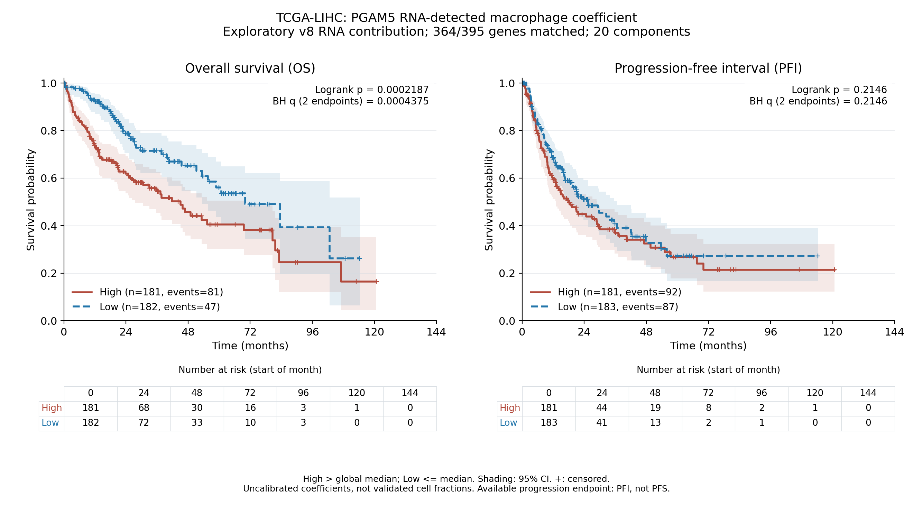

# TCGA-LIHC：v8 PGAM5 RNA检出巨噬细胞探索性参考与生存

**将395基因×20组分参考用于371例原发HCC后，高参考系数组的OS较短；PFI未发现统计学显著差异。**

高低组按全体371例目标系数中位数固定划分，高组185例、低组186例。这里的系数尚未校准为真实细胞浸润比例。现有TCGA-CDR资料提供OS和PFI，不提供严格定义的PFS；不能将PFI改称PFS。

## 主分析：RNA贡献参考

| 终点 | 有效患者（事件） | 高组患者（事件） | 低组患者（事件） | logrank p | 两终点BH q |
|---|---:|---:|---:|---:|---:|
| OS | 363（128） | 181（81） | 182（47） | 0.00021874503 | 0.00043749005 |
| PFI | 364（179） | 181（92） | 183（87） | 0.21457136 | 0.21457136 |

使用全队列中位数 **0.060562492191**：High > 中位数；Low ≤ 中位数。分组先于本次生存合并固定，两个终点沿用同一分组，不寻找最佳生存切点。OS排除8例，PFI排除7例，原因逐例保存在 `excluded_patients.csv`。

OS高系数组的生存曲线较低，logrank p=0.00021874503，对OS/PFI两项主检验进行BH校正后q=0.00043749005。PFI p=0.21457136，未达到统计学显著；不能据此证明两组结局完全相同。

KM中位OS高组45.08个月、低组70.01个月；中位PFI高组18.04个月、低组25.49个月。未随访到事件的患者按源表规则删失，曲线后期风险人数很少。



图中已标注logrank p和BH q，并包含Greenwood log-log 95%置信区间、删失标记及时间点开始时的风险人数。原始时间为天，绘图月份=天/30.4375。

## 参考与TCGA适配

- 使用已保存的v8 `POOLED_ALL_TRAINING/continuous_rank` 参考；没有重新按生存结果筛基因。PGAM5和巨噬谱系/竞争细胞基因已包含在原始参考中。
- 主分析使用`library_RNA_contribution`；选择理由是bulk测量总RNA信号。以`equalized_cell_fraction`作为敏感性分析，检验等细胞RNA量假设改变后的结果。两种参考单位均未完成真实细胞比例校准。
- 每个原始参考395基因、20组分，两者基因清单略有不同。主分析精确匹配364/395基因（92.15%）；敏感性分析363/395（91.90%）。两种参考均匹配PGAM5和49/50候选状态基因。所有不匹配基因列于各单位目录下`unmeasured_reference_genes.csv`。
- 缺失来自完整23,368基因bulk矩阵，而非小缓存遗漏。只使用已测基因交集，保留原有行权重；没有把未测基因补零，也没有自动进行不确定的旧基因别名转换。该适配是原参考的测量行投影，不是完整395行的拟合，未继承参考验证结论。
- TCGA表达来自[GSE62944](https://www.ncbi.nlm.nih.gov/geo/query/acc.cgi?acc=GSE62944)/[GSM1536837](https://www.ncbi.nlm.nih.gov/geo/query/acc.cgi?acc=GSM1536837)的历史重处理FeatureCounts read counts。全矩阵9,264份泛癌肿瘤RNA样本；本次复用结局盲态选定的371位LIHC原发肿瘤患者，每位一份类型01样本。选择规则为完整赋值计数总量最高，再按barcode字典序。
- CP10k=基因read count/完整已测文库赋值计数总量×10,000。不是TPM；分母不是395基因计数之和。bulk read count与单细胞UMI的平台和转录本长度效应尚未校准。
- 保持v8求解器不变：非负、和为1的稳健FCLS，ridge=0.001，三轮重加权，目标组分的PGAM5 RNA贡献不超过实测值；NNLS仅用于初始化，最终结果不是纯NNLS。
- 主目标是保存的`target_mask`对应`TAM_PGAM5_detected`组分系数。本次20组分中没有另一个获支持的cycling PGAM5-detected组分；该原模型的标签和支持规则保持不变。总巨噬细胞系数另存，未代替主目标进行分组。
- 主参考371/371例目标系数大于数值阈值1e-8；等细胞RNA量参考367/371例大于1e-8。没有删除零系数患者；本轮分组不是旧参考的115例非零与256例零值分组。

## 生存数据及统计

TCGA-CDR生存表复用[UCSCXenaShiny](https://github.com/openbiox/UCSCXenaShiny)的Xena Toil TCGA-CDR镜像，版本`e012e4a3e77702863dc639bfc8ee23c8e48e3231`；原始终点来源文献为[Liu等，Cell 2018](https://doi.org/10.1016/j.cell.2018.02.052)。核对同一患者不同样本别名的8项生存字段一致后，保留原发01别名，按12字符患者ID一对一合并。371例中369例匹配生存记录，2例未匹配。

每个终点仅纳入时间有限且>0天、事件编码为0/1的患者，不填补缺失值。采用标准未加权双侧logrank检验，主分析OS/PFI的两个p值进行BH校正；另保留敏感性分析两项BH及合并四项检验BH值。独立按事件时间重构风险集、观察/期望事件及超几何方差，检验结果一致。

表格同时保存未调整Cox描述性HR及比例风险诊断。主分析OS的PH检验p=0.00265112，提示风险比随时间改变；其描述性HR不能解释为恒定风险倍数。主分析PFI的PH检验p=0.280246。本轮主要结论依据KM和logrank，未声称独立预后效应，也未进行患者分期等协变量调整。

## 参考单位敏感性分析

| 单位 | 终点 | 有效患者 | logrank p | 本单位两终点BH q |
|---|---|---:|---:|---:|
| 等细胞RNA量 | OS | 363 | 9.3034728e-05 | 0.00018606946 |
| 等细胞RNA量 | PFI | 364 | 0.27632447 | 0.27632447 |

两种单位均得到高组OS较短、PFI差异未显著的结果。患者高低分组一致349/371例（94.07%），连续系数Spearman相关ρ=0.9707。这只是本批输入对参考单位的敏感性检查，不是独立验证。

## 解释边界

原始v8参考没有通过已知比例计算混合物的丰度验证。主RNA贡献参考目标缺失标准混合物预测的95分位约11.12%，等细胞RNA量参考约13.73%；没有真实混合物、匹配bulk平台或RNA量/细胞校准。本轮按用户明确请求进行探索性TCGA应用，归档v8中此前的“验证前不应用TCGA”发布门槛已由本次探索性授权替代，验证失败事实保留。

**当前可支持的表述：在TCGA-LIHC中，PGAM5 RNA检出巨噬细胞探索性参考系数较高与较短OS相关，PFI无显著组间差异。不能写成已验证的PGAM5⁺巨噬细胞真实高浸润或PGAM5特异作用导致患者预后改变。** RNA标签依然是“巨噬细胞身份＋PGAM5原始计数>0”，未检出不等于绝对阴性；不要求蛋白层面或跨队列证明。

## 文件与复现

- `KM_OS_PFI_primary.png/pdf`：主分析双图；各单位目录`KM_OS.png/pdf`、`KM_PFI.png/pdf`：独立曲线。
- `survival_statistics.csv`：四项logrank、p/q、患者/事件数、KM中位生存及描述性HR/PH诊断。
- 两个单位目录的`patient_coefficients.csv`、`patient_coefficients_survival_join.csv`、`OS_analysis_patients.csv`、`PFI_analysis_patients.csv`：患者级系数、分组和实际分析病例。
- `TCGA_reference_union_raw_counts.csv.gz`、`TCGA_reference_union_CP10k.csv.gz`、`TCGA_primary_aliquot_selection.csv`：两种参考基因并集中的425个已测基因的计数、CP10k和全部患者完整文库分母；足以重算两种参考，原始泛癌大矩阵不随包打包。
- `reference/`：两套原始395×20矩阵、模型、行权重、状态候选及定义；各单位目录`used_reference_model.npz`/`used_reference.tsv`：实际匹配投影矩阵。
- `protocol.json`、`frozen_grouping.json`、来源hash、`v8_source_*`：固定方案、切点、来源和原验证限制。
- `independent_audit.json`、`independent_audit_checks.csv`：2,750项保存结果审计；包含12个实际求解病例重算及最后固定权重QP的KKT条件。没有声称IRLS全局最优或完成新的生物学验证。
- `original_bulk_source_audit.json`：从完整GEO矩阵逐行核对425个输入计数和371例完整文库分母，并确认缺失参考基因确实不在原矩阵中。
- `KM_curve_values.csv`、`KM_numbers_at_risk.csv`、`independent_logrank_risk_sets.csv`：曲线、置信区间、风险人数和检验数值。

下载ZIP后解压，在解压目录运行：

```bash
python3 -m venv .venv
source .venv/bin/activate
python -m pip install -r requirements.txt
OPENBLAS_NUM_THREADS=1 OMP_NUM_THREADS=1 python apply_reference.py
OPENBLAS_NUM_THREADS=1 OMP_NUM_THREADS=1 python analyze_survival.py
OPENBLAS_NUM_THREADS=1 OMP_NUM_THREADS=1 python audit_saved_results.py
python write_report.py
```

上述步骤使用包内输入，覆盖生成文件以重算相同结果。`prepare_inputs.py`仅用于重新从本项目v8参考和原TCGA缓存准备输入，需通过命令行指定对应来源路径；不属于下载后必要步骤。`audit_original_bulk.py --source /path/to/TCGA24_tumor_featurecounts.txt.gz`可选，需另取得大型原始GEO矩阵。

本轮Python依赖及版本保存于`environment_versions.json`。没有执行R分析。数值审计、原始输入核对和图形目视检查均完成；这些检查验证计算实现，不等于验证细胞丰度单位。
